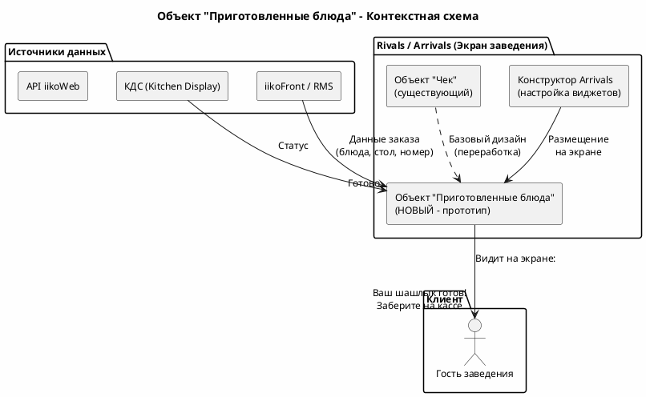
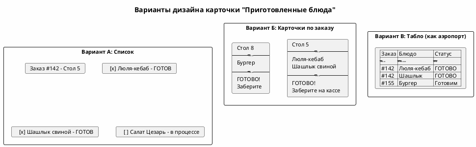

# **Подготовка к встрече с Русланом - Прототипирование**

*Подготовлено: 23.04.2026*

---

## **Контекст: о чем встреча**

По результатам анализа стенограмм за 20-22 апреля 2026 обнаружены **две активные темы прототипирования**, которые Руслан хочет обсудить с Кириллом. Обе подразумевают работу **без отдельного разработчика** - только аналитик + руководитель:

| # | Тема | Суть | Срок |
|---|------|------|------|
| **1** | **"Приготовленные блюда"** для экрана Витовского (Arrivals) | Новый объект - отображение готовых блюд на экране. Руслан + Кирилл делают прототип вдвоём | К понедельнику **25.04.2026** |

---

## **ТЕМА 1: "Приготовленные блюда" (Задача 141)**

### Что известно

- **Источник:** Встреча 21.04.2026 (`новый_спринт_и_лицензии`)
- **Инициатор:** Руслан
- **Контекст:** Для заведений, работающих с мясом (шашлыки, люля-кебаб и т.д.), нужен экран, показывающий список **готовых блюд**, чтобы клиенты вовремя забирали заказы
- **Базовый объект:** На основе существующего объекта "Чек" (переработка, передизайн)
- **Исполнители:** Кирилл + Руслан (прототип), затем передача фронтенд-разработчикам
- **Платформа:** Rivals / Arrivals (Digital Signage)

### Прямая цитата Руслана (21.04)

> "Это приготовленные блюда. Это нужно для различного рода заведений, особенно которые работают с мясом, для того, чтобы люди могли вовремя получать информацию о том, что там какой-то люля-кебаб или какой-то шашлык готов, и вы, пожалуйста, придите, заберите и начните его кушать, пока готовятся ваши какие-то другие блюда."

> "Это мы вместе с ишкой, вместе с Кириллом этот вариант этих объектов мы вам предложим. Сделаем прототип, да. И обсудим потом на неделе."

### Что нужно прототипировать

1. **UI-объект "Приготовленные блюда"** - новый виджет/карточка для экрана Arrivals
2. **Отображение:** список готовых блюд с привязкой к заказу/столу
3. **Базовый дизайн:** на основе объекта "Чек", но переработанный
4. **Механизм обновления:** как блюда попадают в статус "готово" (из КДС?)

### Архитектура объекта

### Варианты UI (для обсуждения)

