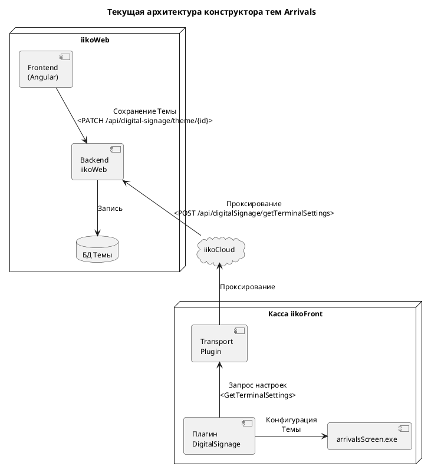
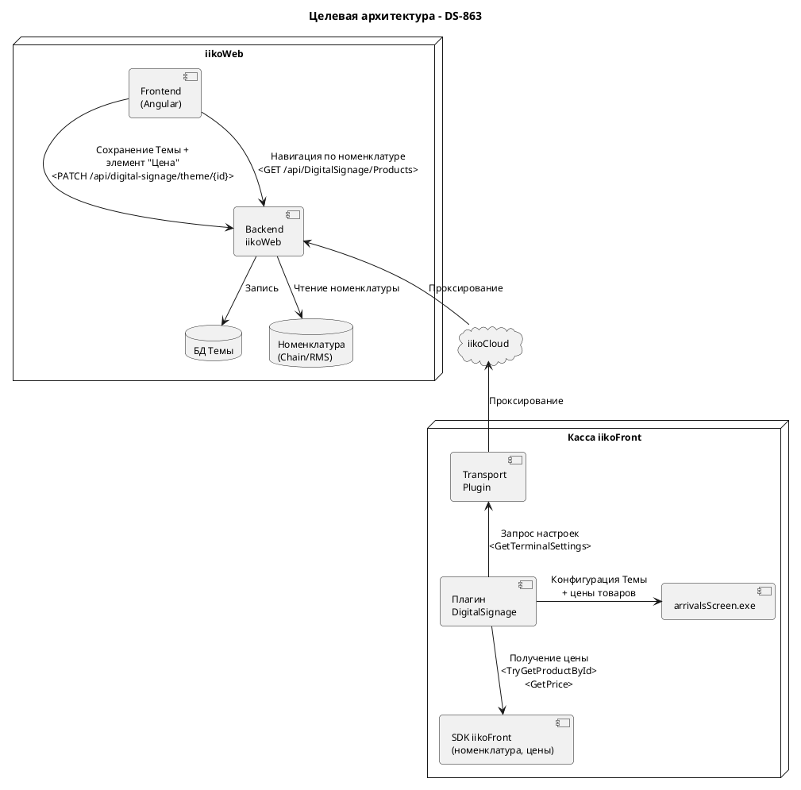
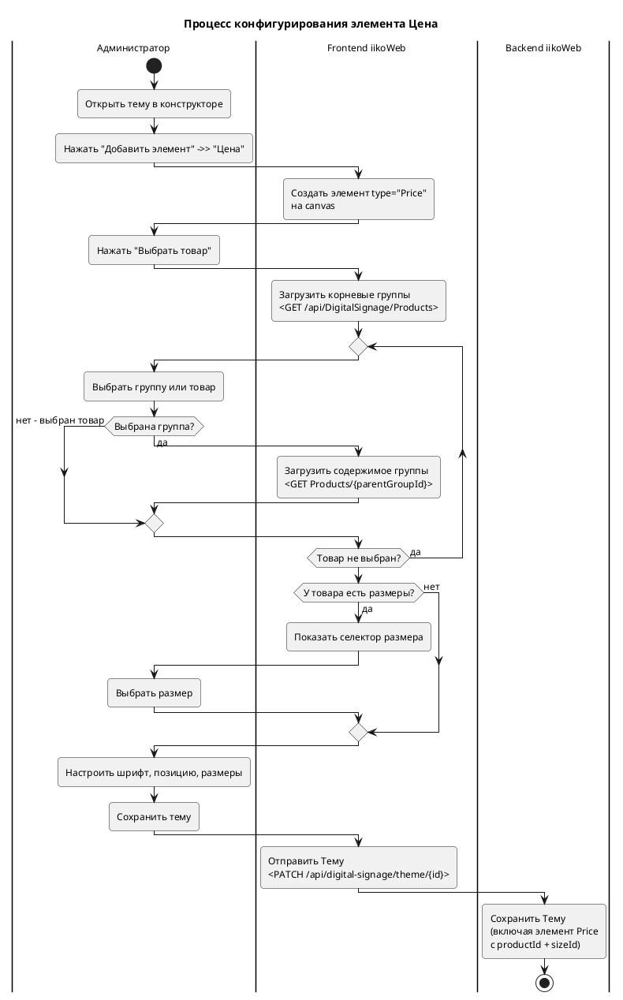
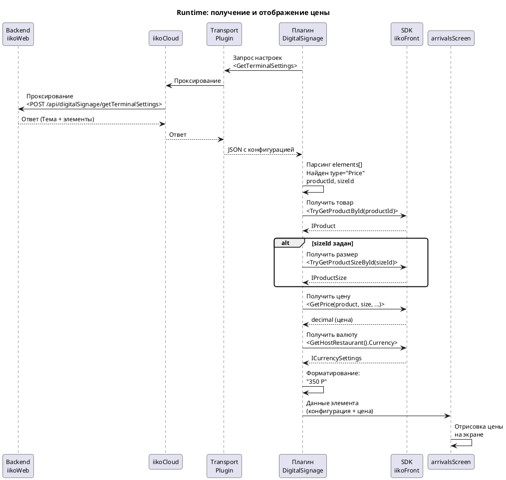
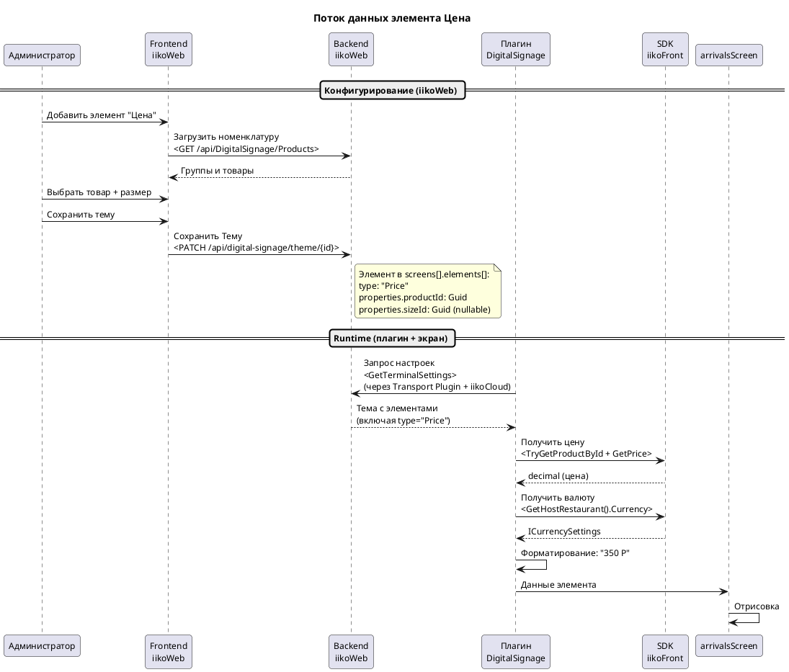
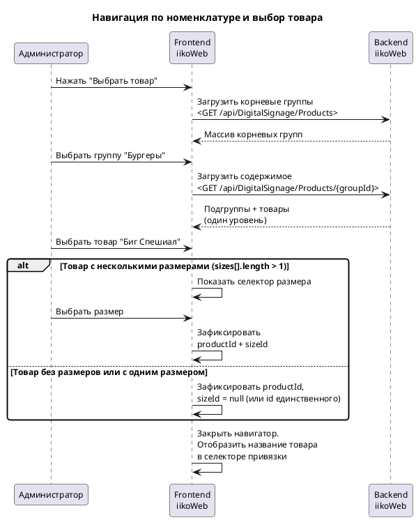
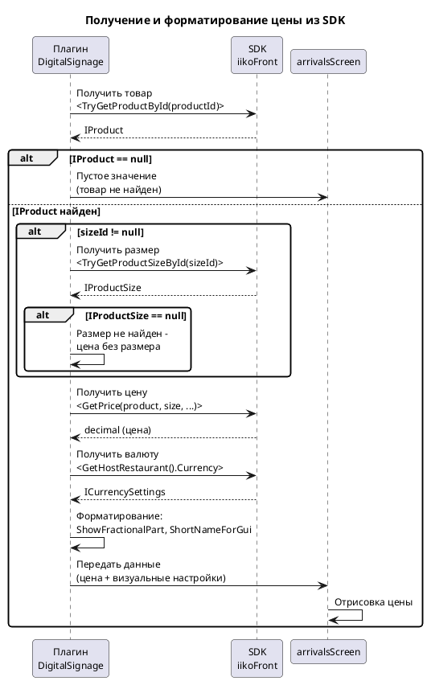

# DS-863: Элемент "Цена" в конструкторе тем Arrivals - Спецификация

| Связанные документы | |
|------|---|
| API-справочник изменений | [DS-863-Элемент-цены-API-справочник.md](DS-863-Элемент-цены-API-справочник.md) |
| API-справочник Arrivals AS IS | [API-справочник-Arrivals-настройка-экранов.md](../../03_Рабочие_материалы/Arrivals/API-справочник-Arrivals-настройка-экранов.md) |
| Открытые вопросы | [Открытые-вопросы.md](../../03_Рабочие_материалы/Вопросы/Открытые-вопросы.md) |
| Метаданные | [DS-863-Элемент-цены-метаданные.md](DS-863-Элемент-цены-метаданные.md) |

---

## 1. Введение и цель проекта

### 1.1. Назначение документа

Настоящая спецификация описывает требования к доработке плагина iikoArrivals (Jira: DS-863) - добавление нового элемента "Цена" (Price) в конструктор тем раздела "Электронная очередь" iikoWeb. Элемент позволяет отображать цену выбранного блюда из номенклатуры на экране mini-board. Плагин работает на платформе iikoFront, API V9.

### 1.2. Бизнес-цель

iikoArrivals - приложение электронной очереди: экраны ресторана отображают статусы готовности заказов. Помимо очереди заказов, экраны могут использоваться как электронное меню (mini-board) - администратор размещает на экране изображения блюд, названия и цены. В текущей реализации элемент для отображения цены блюда отсутствует - администратор может вручную набрать цену текстом, но она не обновляется при изменении в RMS.

- Добавить новый тип элемента "Цена" в конструктор тем Arrivals для отображения актуальной цены блюда из номенклатуры
- Обеспечить привязку элемента к конкретному товару (и размеру, если есть) через навигатор номенклатуры
- Обеспечить автоматическое получение и периодическое обновление цены плагином из SDK iikoFront

> [!NOTE]
> Задача DS-863 является **прототипом** для демонстрации руководству возможности показа цен на mini-board. Не является продакшен-решением.

### 1.3. Объем работ

#### MVP

| # | Функция / доработка | Описание |
|---|---------------------|----------|
| 1 | Элемент "Цена" в конструкторе тем | Новый тип элемента Темы (type: "Price") с привязкой к товару из номенклатуры |
| 2 | Навигатор номенклатуры | Папочная навигация по группам товаров для выбора позиции (одноуровневая загрузка) |
| 3 | Селектор размера товара | Дополнительный селектор при наличии нескольких размеров у товара |
| 4 | Получение цены в runtime | Плагин получает привязку из конфигурации Темы и разрешает цену через SDK iikoFront |
| 5 | Периодическое обновление цены | Плагин периодически пересчитывает цену для актуальности отображения |
| 6 | Отрисовка цены на экране | arrivalsScreen.exe отображает цену в элементе с настраиваемым форматированием (шрифт, фон, рамка) |

#### Вне scope

| # | Функция / доработка | Причина |
|---|---------------------|---------|
| 1 | Реализация API Products (backend) | Отдельная задача DS-875, исполнитель - Роман Иванов |
| 2 | Кросс-групповой поиск по товарам | Не реализуется в прототипе - каждая группа загружается отдельным запросом |
| 3 | Массовое добавление элементов "Цена" | Прототип предполагает ручное добавление каждого элемента |
| 4 | Редизайн существующих элементов mini-board | Изображение и Текст работают без изменений |
| 5 | Настраиваемый формат числа (символ валюты, десятичные знаки) на уровне элемента | Формат определяется глобально из настроек валюты RMS |

---

## 2. Глоссарий

Термины, специфичные для задачи DS-863.

| Термин | Определение |
|--------|------------|
| Элемент "Цена" (Price Element) | Новый тип элемента Темы Arrivals (type: "Price"), отображающий актуальную цену товара из номенклатуры. Привязывается к конкретному товару и (опционально) размеру |
| Mini-board | Режим использования экрана Arrivals в качестве электронного меню: статические изображения блюд, названия и цены |
| Навигатор номенклатуры | Компонент UI в iikoWeb для выбора товара из номенклатуры. Папочная навигация: отображает один уровень иерархии за раз, при клике на группу загружает ее содержимое |
| Привязка к товару | Жесткая связь элемента "Цена" с конкретным товаром из номенклатуры, определяемая парой `productId` + `sizeId` (nullable). Фиксируется при настройке элемента в конструкторе |
| Размер товара (Size) | Вариация товара по размеру (напр. "Маленький", "Средний", "Большой"). В SDK представлена интерфейсом `IProductSize`. Каждый размер имеет собственную цену и идентификатор (Guid) |
| API Products (DS-875) | Новый endpoint `GET /api/DigitalSignage/Products[/{parentGroupId}]`, реализуемый в рамках задачи DS-875. Используется только в iikoWeb для навигации по номенклатуре, не в runtime |

---

## 3. Текущее состояние

Раздел описывает текущую архитектуру конструктора тем Arrivals и набор существующих элементов до внедрения элемента "Цена".

### 3.1. Текущая архитектура

Конструктор тем Arrivals - визуальный редактор в iikoWeb, позволяющий администратору создавать и настраивать макеты экранов. Конфигурация Темы (включая все элементы) сохраняется в Backend iikoWeb и доставляется в плагин через транспортный механизм GetTerminalSettings.

| Компонент | Роль |
|-----------|------|
| Frontend iikoWeb (Angular) | Визуальный редактор тем: canvas, боковая панель "Добавить элемент", панель свойств элемента |
| Backend iikoWeb | Хранение и обработка тем. API: `PATCH /api/digital-signage/theme/{themeId}` для сохранения |
| Transport Plugin + iikoCloud | Доставка конфигурации Темы: `POST /api/digitalSignage/getTerminalSettings` |
| Плагин DigitalSignage (iikoFront) | Получение Темы через GetTerminalSettings (polling каждые 5 мин), передача в arrivalsScreen |
| arrivalsScreen.exe | Отрисовка элементов Темы на экране |

##### UML-диаграмма



### 3.2. Текущие типы элементов Темы

Администратор добавляет элементы на canvas через панель "Добавить элемент" в боковом меню конструктора. Каждый элемент хранится в массиве `screens[].elements[]` объекта Темы.

| # | Элемент (UI) | type (API) | Описание |
|---|-------------|------------|----------|
| 1 | Область | ControlArea | Контейнер для контрола заказов. Режимы: "Лист" и "Динамически заполняемая область" |
| 2 | Всплывающее окно | Popup | Окно поверх остальной информации с таймаутом показа |
| 3 | Рекламный блок | CampaignBlock | Область для показа контента рекламной кампании |
| 4 | Текст | Text | Произвольный текст с настройками шрифта |
| 5 | Изображение | Image | Статическое изображение |
| 6 | Прямоугольник | Rectangle | Декоративная фигура (фон, рамка) |
| 7 | Счетчик | Counter | Числовое значение из внешнего REST API по JSONPath |

Элемент для отображения цены товара из номенклатуры **отсутствует**. Для размещения ценовой информации на mini-board администратор использует элемент "Текст" с ручным вводом значения, которое не обновляется автоматически при изменении цены в RMS.

### 3.3. Текущий процесс настройки mini-board

| Шаг | Участник | Действие |
|:---:|----------|----------|
| 1 | Администратор | Открывает раздел "Электронная очередь" ->> "Темы" в iikoWeb |
| 2 | Администратор | Создает или редактирует тему |
| 3 | Администратор | Добавляет элемент "Изображение" - загружает фото блюда |
| 4 | Администратор | Добавляет элемент "Текст" - набирает название блюда |
| 5 | Администратор | Добавляет элемент "Текст" - **вручную набирает цену** (напр. "350 Р") |
| 6 | Администратор | Настраивает шрифт, позицию, размеры каждого элемента |
| 7 | Администратор | Сохраняет тему |

Проблема: при изменении цены блюда в RMS администратор должен вручную обновить текстовый элемент в каждой теме, где используется эта позиция.

---

## 4. Сводка изменений

Сравнение текущего и целевого состояния по каждому затронутому компоненту.

| Компонент | Было | Стало |
|-----------|------|-------|
| Конструктор тем (Frontend iikoWeb) | 7 типов элементов (Текст, Изображение, Область, Прямоугольник, Рекламный блок, Всплывающее окно, Счетчик) | 8 типов: добавлен элемент "Цена" (type: "Price") с селектором привязки к товару |
| Боковая панель элемента | Стандартные вкладки: Макет, Граница, Шрифт | Добавлен селектор привязки к товару (навигатор номенклатуры + селектор размера) |
| Backend iikoWeb (модель Темы) | Элементы: Text, ControlArea, Image, etc. | Новый type "Price" с полями productId, sizeId в properties |
| API Products | Отсутствует | Новый endpoint `GET /api/DigitalSignage/Products[/{parentGroupId}]` (DS-875, вне scope) |
| Плагин DigitalSignage | Обрабатывает элементы Text, ControlArea | Дополнительно обрабатывает type "Price": получает цену из SDK по productId/sizeId |
| arrivalsScreen.exe | Отрисовывает текст, изображения, контролы | Дополнительно отрисовывает элемент "Цена" с форматированием |
| Конфигурация плагина | Без изменений | Без изменений (привязки приходят через GetTerminalSettings в составе Темы) |
| Цена на mini-board | Ручной ввод текстом, не обновляется | Автоматическая, привязана к номенклатуре, периодическое обновление из SDK |

---

## 5. Целевое решение

Раздел описывает целевую архитектуру и процессы работы системы после внедрения элемента "Цена".

### 5.1. Целевая архитектура

Изменения затрагивают четыре компонента: Frontend iikoWeb (новый элемент в конструкторе), Backend iikoWeb (расширение модели Темы, API Products), плагин DigitalSignage (получение цены из SDK), arrivalsScreen.exe (отрисовка). Транспортный механизм GetTerminalSettings не изменяется - новые свойства элемента проходят автоматически.

##### UML-диаграмма



#### Взаимодействие компонентов

| Направление | Протокол | Описание |
|-------------|----------|----------|
| Frontend ->> Backend iikoWeb | HTTPS REST | Сохранение Темы с элементом "Цена" (`PATCH theme`), навигация по номенклатуре (`GET Products`) |
| Backend iikoWeb ->> Плагин | Transport (polling) | Доставка конфигурации Темы через GetTerminalSettings (каждые 5 мин) |
| Плагин ->> SDK iikoFront | IPC (SDK V9) | Получение цены: `TryGetProductById()`, `GetPrice()` |
| Плагин ->> arrivalsScreen | IPC | Передача данных для отрисовки (конфигурация элементов + разрешенные цены) |

### 5.2. Целевой процесс конфигурирования элемента "Цена"

Администратор настраивает элемент "Цена" в конструкторе тем Arrivals (iikoWeb). Процесс включает добавление элемента на canvas, выбор товара через навигатор номенклатуры и (при необходимости) выбор размера.

| Шаг | Действие администратора | Реакция системы | API-метод |
|:---:|------------------------|-----------------|-----------|
| 1 | Открывает тему в конструкторе | Загружается canvas с текущими элементами | - |
| 2 | Нажимает "Добавить элемент" ->> "Цена" | Элемент "Цена" появляется на canvas. В боковой панели: вкладки Макет, Граница, Шрифт + селектор привязки к товару | - |
| 3 | Нажимает "Выбрать товар" в селекторе привязки | Открывается навигатор номенклатуры: список корневых групп | `GET /api/DigitalSignage/Products` |
| 4 | Переходит в группу (двойной клик) | Загружается содержимое группы: подгруппы + товары | `GET /api/DigitalSignage/Products/{parentGroupId}` |
| 5 | Выбирает товар (клик) | Товар выбран. Если есть размеры - появляется селектор "Укажите размер" | - |
| 6 | Выбирает размер (если есть) | Размер выбран. Привязка зафиксирована: productId + sizeId | - |
| 7 | Настраивает шрифт, позицию, размеры | Элемент обновляется на canvas | - |
| 8 | Сохраняет тему | Тема сохраняется с элементом type "Price" и привязкой в properties | `PATCH /api/digital-signage/theme/{themeId}` |

##### UML-диаграмма



### 5.3. Целевой процесс получения и отображения цены (runtime)

Плагин DigitalSignage получает конфигурацию Темы через GetTerminalSettings, обнаруживает элементы type="Price", разрешает цены через SDK iikoFront и передает данные в arrivalsScreen для отображения. Цена обновляется периодически для актуальности.

| Шаг | Компонент | Действие | Результат |
|:---:|-----------|----------|-----------|
| 1 | Плагин | Запрос GetTerminalSettings (polling каждые 5 мин) | Получена конфигурация Темы |
| 2 | Плагин | Парсинг `data.theme.screens[].elements[]` | Найдены элементы type="Price" с productId/sizeId |
| 3 | Плагин | Для каждого элемента Price: `TryGetProductById(productId)` | Получен объект `IProduct` (или null) |
| 4 | Плагин | Если sizeId задан: `TryGetProductSizeById(sizeId)` | Получен объект `IProductSize` (или null) |
| 5 | Плагин | `GetPrice(product, size, priceCategory, pricingTime)` | Получена цена (decimal) |
| 6 | Плагин | Форматирование цены через `ICurrencySettings` | Строка: "350 Р" |
| 7 | Плагин | Передача данных в arrivalsScreen | Элемент с разрешенной ценой |
| 8 | arrivalsScreen | Отрисовка цены с настройками шрифта/фона/рамки из properties | Цена отображается на экране |

##### UML-диаграмма



### 5.4. Изменения по сравнению с текущим состоянием

| Аспект | Было | Стало | Влияние |
|--------|------|-------|---------|
| Типы элементов Темы | 7 типов (Text, ControlArea, Image, Popup, CampaignBlock, Rectangle, Counter) | 8 типов: добавлен "Price" | Frontend + Backend iikoWeb |
| Отображение цены на mini-board | Ручной ввод через элемент "Текст", не обновляется | Автоматическое - привязка к номенклатуре, цена из SDK | Все компоненты |
| Навигация по номенклатуре | Отсутствует в конструкторе тем | Навигатор номенклатуры с папочной навигацией | Frontend + Backend iikoWeb |
| Properties элемента | Стандартные: font, background, border | Дополнительно: productId, sizeId для type "Price" | Backend iikoWeb (модель) |
| GetTerminalSettings | Передает Тему с текущими типами элементов | Без изменений в механизме - новый type "Price" проходит автоматически | Без изменений |
| Конфигурация плагина | appsettings.json с текущими параметрами | Без изменений - привязки приходят в составе Темы | Без изменений |

---

## 6. Архитектура решения

Раздел описывает компоненты решения и поток данных элемента "Цена". Manifest.xml плагина DigitalSignage не изменяется - элемент "Цена" реализуется в рамках существующего плагина.

### 6.1. Компоненты

| Компонент | Описание | Изменения в DS-863 |
|-----------|----------|-------------------|
| iikoFront | Кассовый терминал, хост для плагина (минимальная версия: определяется DS-875) | Без изменений |
| Плагин DigitalSignage (`Resto.Front.Api.DigitalSignage`) | Плагин iikoFront: получает конфигурацию Темы, управляет отображением на экранах | Добавлена обработка type "Price": разрешение цены через SDK |
| arrivalsScreen.exe | Приложение отрисовки экранов Arrivals, запускается плагином | Добавлена отрисовка элемента "Цена" |
| Frontend iikoWeb (Angular) | Визуальный редактор тем в Admin-панели iikoWeb | Новый элемент "Цена", навигатор номенклатуры, селектор размера |
| Backend iikoWeb | API и хранение данных тем | Расширение модели: type "Price" с productId/sizeId; API Products (DS-875) |
| Transport Plugin + iikoCloud | Транспорт: доставка конфигурации Темы плагину (GetTerminalSettings) | Без изменений - свойства проходят автоматически |
| SDK iikoFront (V9) | API кассового терминала: номенклатура, цены, валютные настройки | Без изменений - используются существующие методы |

### 6.2. Manifest.xml

Элемент "Цена" реализуется в рамках существующего плагина `Resto.Front.Api.DigitalSignage`. Manifest.xml не изменяется.

```xml
<?xml version="1.0" encoding="utf-8"?>
<ManifestAttributes xmlns:xsi="http://www.w3.org/2001/XMLSchema-instance"
                    xmlns:xsd="http://www.w3.org/2001/XMLSchema">
  <FileName>Resto.Front.Api.DigitalSignage</FileName>
  <ApiVersion>V9</ApiVersion>
  <LicenseModuleId>21043905</LicenseModuleId>
</ManifestAttributes>
```

### 6.3. Поток данных элемента "Цена"

Элемент "Цена" участвует в двух потоках данных: конфигурирование (iikoWeb) и runtime (плагин + экран).

| Этап | Поток | Данные | Источник ->> Назначение |
|------|-------|--------|------------------------|
| Конфигурирование | Загрузка номенклатуры | Группы и товары (id, name, sizes) | Backend iikoWeb (NomDB) ->> Frontend |
| Конфигурирование | Сохранение привязки | type="Price", productId, sizeId в properties | Frontend ->> Backend iikoWeb (БД Темы) |
| Runtime | Доставка конфигурации | Полная Тема (включая element type="Price" с productId/sizeId) | Backend iikoWeb ->> GetTerminalSettings ->> Плагин |
| Runtime | Разрешение цены | productId + sizeId ->> IProduct ->> decimal (цена) | Плагин ->> SDK iikoFront |
| Runtime | Форматирование | decimal + ICurrencySettings ->> строка ("350 Р") | Плагин (локально) |
| Runtime | Отрисовка | Строка цены + визуальные настройки (font, bg, border) | Плагин ->> arrivalsScreen |

##### UML-диаграмма



---

## 7. Функциональные требования

Требования разделены на две части по компонентам: Часть 1 описывает изменения в iikoWeb (конфигурирование элемента "Цена"), Часть 2 - изменения в плагине и arrivalsScreen (runtime-отображение цены). Приоритеты: Must - обязательно для работы прототипа, Should - желательно, Could - можно отложить.

### Часть 1. iikoWeb (конфигурирование)

### 7.1. Backend iikoWeb: расширение модели Темы

Backend iikoWeb расширяется для поддержки нового типа элемента "Цена" (type: "Price") в структуре Темы. Элемент хранится в массиве `screens[].elements[]` с дополнительными свойствами привязки к товару в `properties`.

#### Требования

| # | Требование | Приоритет | Источник | Используется в |
|:---:|-----------|:--------:|----------|----------------|
| 1 | Backend должен поддерживать новый тип элемента `type: "Price"` в массиве `screens[].elements[]` при обработке `PATCH /api/digital-signage/theme/{themeId}` и `GET /api/digital-signage/theme/{themeId}` | Must | И-6 | Раздел 9, 10 |
| 2 | Элемент type "Price" должен содержать в `properties` специфичные свойства привязки: `productId` (string/Guid, обязательное) и `sizeId` (string/Guid, nullable) | Must | И-8 | Раздел 10 |
| 3 | Элемент type "Price" должен содержать стандартные свойства `properties`: `font`, `border`, `background`, `uuid` - аналогично элементу Text | Must | HAR-файл (этап 0.4) | Раздел 10 |
| 4 | Backend должен сохранять и возвращать элемент "Цена" в составе Темы через существующий API (PATCH / GET theme). Отдельный endpoint для элемента "Цена" не создается | Must | И-8 | Раздел 9 |
| 5 | Элемент type "Price" (включая productId/sizeId в properties) должен автоматически включаться в ответ GetTerminalSettings для плагина в составе объекта Темы | Must | Г-2 | Раздел 7.6 |
| 6 | Backend должен валидировать: если `type = "Price"`, то `productId` обязателен (не null, непустая строка) [ДОПУЩЕНИЕ] | Should | [ДОПУЩЕНИЕ] | Раздел 12 |

##### Сценарий 7.1.1: Сохранение темы с элементом "Цена" (happy path)

| Параметр | Значение |
|----------|----------|
| Предусловия | Администратор настроил элемент "Цена" в конструкторе: выбрал товар (productId) и размер (sizeId, при наличии). Тема содержит хотя бы один экран |
| Актор | Frontend iikoWeb |

| Шаг | Действие | Ожидаемый результат |
|:---:|----------|---------------------|
| 1 | Frontend отправляет `PATCH /api/digital-signage/theme/{themeId}` с элементом `type: "Price"` в `screens[].elements[]`. Элемент содержит `properties.productId` и `properties.sizeId` | Backend принимает запрос |
| 2 | Backend валидирует элемент: type = "Price", productId заполнен | Валидация пройдена |
| 3 | Backend сохраняет Тему (включая элемент "Цена" с привязкой) в БД | Запись успешна |
| 4 | Backend возвращает HTTP 200 | Frontend получает подтверждение сохранения |

| Постусловия | Тема сохранена. Элемент type "Price" с привязкой productId/sizeId доступен при `GET theme` и в ответе GetTerminalSettings |

---

### 7.2. Backend iikoWeb: использование API Products (DS-875)

Frontend iikoWeb использует новый endpoint API Products для навигации по номенклатуре при конфигурировании элемента "Цена". Реализация endpoint выполняется в рамках задачи DS-875 (исполнитель: Роман Иванов) и находится вне scope DS-863. В данном разделе описывается контракт использования.

> [!WARNING]
> Формат ответа API Products (DS-875) не задокументирован. Контракт ниже является предлагаемым на основе решений встречи 16.04.2026. Согласование с разработчиком DS-875 обязательно перед началом реализации.

#### Требования

| # | Требование | Приоритет | Источник | Используется в |
|:---:|-----------|:--------:|----------|----------------|
| 1 | Endpoint `GET /api/DigitalSignage/Products` (без параметра) должен возвращать корневые группы номенклатуры | Must | Постановка (секция 3.4) | Раздел 7.4 |
| 2 | Endpoint `GET /api/DigitalSignage/Products/{parentGroupId}` должен возвращать содержимое указанной группы (подгруппы + товары) | Must | Постановка (секция 3.4) | Раздел 7.4 |
| 3 | Каждый запрос должен возвращать только один уровень иерархии без рекурсивной вложенности | Must | Постановка (секция 3.3) | Раздел 7.4 |
| 4 | Ответ должен содержать признак, различающий группу и товар (поле `isGroup` или аналог) | Must | Постановка (секция 3.4) | Раздел 7.4, 10 |
| 5 | Для товаров с размерами ответ должен содержать массив `sizes[]` с `id` и `name` каждого размера | Must | Постановка (секция 3.5) | Раздел 7.5, 10 |
| 6 | Цена товара в ответе API Products не возвращается - цена получается плагином из SDK iikoFront в runtime | Must | И-9 | Раздел 7.7 |
| 7 | Модификаторы блюд не включаются в ответ | Must | Постановка (секция 3.4) | - |
| 8 | Endpoint должен определять контекст (Chain или RMS) на основе сессии пользователя | Must | DS-875 (Jira) | - |

#### Предлагаемый контракт ответа

Минимальный контракт, необходимый навигатору номенклатуры. Согласование с DS-875 обязательно.

**Группа**

| Поле | Тип | Описание |
|------|-----|----------|
| `id` | Guid | Уникальный идентификатор группы |
| `name` | string | Название группы |
| `isGroup` | bool | `true` |
| `hasChildren` | bool | Есть ли подгруппы/товары внутри |

**Товар**

| Поле | Тип | Описание |
|------|-----|----------|
| `id` | Guid | Уникальный идентификатор товара (productId для привязки) |
| `name` | string | Название товара |
| `isGroup` | bool | `false` |
| `sizes` | array | Массив размеров (пустой, если без размеров) |
| `sizes[].id` | Guid | Уникальный идентификатор размера (sizeId для привязки) |
| `sizes[].name` | string | Название размера |

##### Сценарий 7.2.1: Загрузка корневых групп (happy path)

| Параметр | Значение |
|----------|----------|
| Предусловия | Администратор нажал "Выбрать товар" в селекторе привязки элемента "Цена". Backend доступен, номенклатура загружена |
| Актор | Frontend iikoWeb |

| Шаг | Действие | Ожидаемый результат |
|:---:|----------|---------------------|
| 1 | Frontend отправляет `GET /api/DigitalSignage/Products` | Backend принимает запрос |
| 2 | Backend определяет контекст (Chain/RMS) по сессии пользователя | Контекст определен |
| 3 | Backend загружает корневые группы номенклатуры | Массив объектов с `isGroup = true` |
| 4 | Backend возвращает JSON-массив корневых групп | Frontend получает список для навигатора |

| Постусловия | Навигатор номенклатуры отображает корневые группы |

##### Сценарий 7.2.2: Загрузка содержимого группы (happy path)

| Параметр | Значение |
|----------|----------|
| Предусловия | Навигатор номенклатуры отображает текущий уровень. Администратор выбрал группу для входа |
| Актор | Frontend iikoWeb |

| Шаг | Действие | Ожидаемый результат |
|:---:|----------|---------------------|
| 1 | Frontend отправляет `GET /api/DigitalSignage/Products/{parentGroupId}` | Backend принимает запрос |
| 2 | Backend загружает содержимое группы: подгруппы + товары (один уровень) | Массив объектов: группы (`isGroup=true`) и товары (`isGroup=false`) |
| 3 | Backend возвращает JSON-массив | Frontend получает содержимое группы |
| 4 | Для товаров с размерами Backend включает массив `sizes[]` в объект товара | Frontend может определить, нужен ли селектор размера |

| Постусловия | Навигатор отображает содержимое выбранной группы: подгруппы и товары |

#### Открытые вопросы

| # | Уточнение | К чему относится |
|---|-----------|-----------------|
| И-7 | Формат ответа API Products (DS-875) не задокументирован. Предлагаемый контракт требует согласования с Романом Ивановым (DS-875) | Требования 1-5, предлагаемый контракт, раздел 10 |

---

### 7.3. Frontend iikoWeb: элемент "Цена" в конструкторе тем

Frontend iikoWeb расширяется новым элементом "Цена" в конструкторе тем Arrivals. Элемент добавляется через панель "Добавить элемент" и имеет стандартные вкладки настроек (Макет, Граница, Шрифт) с дополнительным компонентом - селектором привязки к товару.

#### Требования

| # | Требование | Приоритет | Источник | Используется в |
|:---:|-----------|:--------:|----------|----------------|
| 1 | В панели "Добавить элемент" бокового меню конструктора должен быть добавлен пункт "Цена" | Must | И-11 | Раздел 8 |
| 2 | При добавлении элемента "Цена" на canvas Frontend должен создать объект с `type: "Price"`, `id: -1` и стандартными свойствами в `properties` (font, border, background, uuid) | Must | HAR-файл (этап 0.4) | Раздел 10 |
| 3 | Боковая панель элемента "Цена" должна содержать стандартные вкладки: "Макет", "Граница", "Шрифт" | Must | И-12 | Раздел 8 |
| 4 | Боковая панель должна содержать дополнительный компонент: селектор привязки к товару с кнопкой "Выбрать товар" | Must | Постановка (секция 3.2) | Раздел 7.4, 8 |
| 5 | После выбора товара селектор привязки должен отображать название выбранного товара (и размер, если выбран) вместо кнопки "Выбрать товар" [ДОПУЩЕНИЕ] | Should | [ДОПУЩЕНИЕ] | Раздел 8 |
| 6 | Frontend должен сохранять привязку (productId, sizeId) в `properties` элемента при сохранении Темы | Must | И-8 | Раздел 7.1, 10 |
| 7 | Элемент на canvas должен визуально отличаться от элемента "Текст" (иконка, плейсхолдер "Цена" или название товара) [ДОПУЩЕНИЕ] | Should | [ДОПУЩЕНИЕ] | Раздел 8 |

##### Сценарий 7.3.1: Добавление элемента "Цена" на canvas (happy path)

| Параметр | Значение |
|----------|----------|
| Предусловия | Администратор открыл тему в конструкторе. Тема содержит хотя бы один экран |
| Актор | Администратор |

| Шаг | Действие | Ожидаемый результат |
|:---:|----------|---------------------|
| 1 | Администратор нажимает "Добавить элемент" в боковом меню | Открывается список доступных типов элементов |
| 2 | Администратор выбирает "Цена" | Элемент "Цена" появляется на canvas с размерами по умолчанию. В боковой панели: вкладки "Макет", "Граница", "Шрифт" + селектор привязки к товару |
| 3 | Администратор нажимает "Выбрать товар" в селекторе привязки | Открывается навигатор номенклатуры (см. сценарий 7.4.1) |
| 4 | Администратор выбирает товар и размер (см. сценарии 7.4.1 и 7.5.1/7.5.2) | Привязка зафиксирована: productId (+ sizeId). Название товара отображается в селекторе. На canvas элемент отображает плейсхолдер |
| 5 | Администратор настраивает шрифт, позицию, размеры элемента | Элемент обновляется на canvas в реальном времени |
| 6 | Администратор нажимает "Сохранить" | Тема сохраняется с элементом type "Price" и привязкой в properties (см. сценарий 7.1.1) |

| Постусловия | Тема содержит элемент type "Price" с productId, sizeId и стандартными настройками шрифта/позиции |

---

### 7.4. Frontend iikoWeb: навигатор номенклатуры

Навигатор номенклатуры - компонент UI для выбора товара из номенклатуры iiko. Реализует навигацию "папками": отображает один уровень иерархии за раз, при клике на группу загружает ее содержимое отдельным запросом. Выбран вместо варианта "дерево" из-за экономии RAM при 25 000+ позиций у крупных клиентов.

#### Требования

| # | Требование | Приоритет | Источник | Используется в |
|:---:|-----------|:--------:|----------|----------------|
| 1 | Навигатор должен отображать один уровень иерархии за раз (навигация "папками") | Must | Постановка (секция 3.3) | Раздел 8 |
| 2 | При открытии навигатора должен загружаться корневой уровень: `GET /api/DigitalSignage/Products` | Must | Постановка (секция 3.4) | Раздел 7.2 |
| 3 | При клике на группу навигатор должен загрузить содержимое группы: `GET /api/DigitalSignage/Products/{parentGroupId}` | Must | Постановка (секция 3.4) | Раздел 7.2 |
| 4 | Навигатор должен визуально разделять группы (иконка папки) и товары (иконка товара) [ДОПУЩЕНИЕ] | Should | [ДОПУЩЕНИЕ] | Раздел 8 |
| 5 | При выборе (клике на) товара навигатор должен зафиксировать привязку: `productId` = `id` выбранного товара | Must | Постановка (секция 3.2) | Раздел 7.3 |
| 6 | Навигатор должен предоставить возможность перехода на уровень выше (кнопка "Назад") [ДОПУЩЕНИЕ] | Must | [ДОПУЩЕНИЕ] | Раздел 8 |
| 7 | При загрузке каждого уровня Frontend должен показывать индикатор загрузки [ДОПУЩЕНИЕ] | Should | [ДОПУЩЕНИЕ] | Раздел 8 |

##### Сценарий 7.4.1: Навигация и выбор товара (happy path)

| Параметр | Значение |
|----------|----------|
| Предусловия | Администратор нажал "Выбрать товар" в селекторе привязки элемента "Цена". Backend доступен |
| Актор | Администратор |

| Шаг | Действие | Ожидаемый результат |
|:---:|----------|---------------------|
| 1 | Frontend загружает корневые группы: `GET /api/DigitalSignage/Products` (см. сценарий 7.2.1) | Навигатор отображает список корневых групп |
| 2 | Администратор кликает на группу "Бургеры" | Frontend загружает содержимое: `GET /api/DigitalSignage/Products/{groupId}` (см. сценарий 7.2.2). Навигатор показывает подгруппы и товары |
| 3 | Администратор кликает на товар "Биг Спешиал" | Товар выбран. Если у товара `sizes[]` содержит более одного элемента - переход к селектору размера (раздел 7.5). Если нет - привязка зафиксирована: productId = id товара, sizeId = null (или id единственного размера) |
| 4 | Навигатор закрывается | Селектор привязки отображает название выбранного товара |

| Постусловия | productId зафиксирован в properties элемента. sizeId определяется селектором размера (раздел 7.5) |

##### Сценарий 7.4.2: Пустая группа (edge case)

| Параметр | Значение |
|----------|----------|
| Предусловия | Администратор перешел в группу, не содержащую ни подгрупп, ни товаров |
| Актор | Администратор |

| Шаг | Действие | Ожидаемый результат |
|:---:|----------|---------------------|
| 1 | Frontend загружает содержимое группы: `GET /api/DigitalSignage/Products/{groupId}` | Backend возвращает пустой массив |
| 2 | Навигатор отображает пустое состояние | Сообщение "Нет элементов" (или аналогичное). Доступна кнопка "Назад" |

| Постусловия | Администратор может вернуться на уровень выше |

##### UML-диаграмма



---

### 7.5. Frontend iikoWeb: селектор размера

Селектор размера - дополнительный UI-компонент, отображаемый при выборе товара с несколькими размерами. Позволяет администратору указать конкретный размер для получения цены в runtime.

#### Требования

| # | Требование | Приоритет | Источник | Используется в |
|:---:|-----------|:--------:|----------|----------------|
| 1 | Если выбранный товар имеет несколько размеров (`sizes[]` содержит более одного элемента), Frontend должен показать селектор "Укажите размер" | Must | И-10 | Раздел 8 |
| 2 | Селектор должен содержать список доступных размеров (name из массива `sizes[]`) | Must | Постановка (секция 3.5) | Раздел 8 |
| 3 | При выборе размера Frontend должен зафиксировать `sizeId` = `id` выбранного размера в properties элемента | Must | Постановка (секция 3.5) | Раздел 7.3, 10 |
| 4 | Если товар без размеров (`sizes[]` пуст), селектор не показывается, `sizeId` = null | Must | Постановка (секция 3.5) | Раздел 10 |
| 5 | Если товар имеет ровно один размер, селектор не показывается, `sizeId` = id единственного размера [ДОПУЩЕНИЕ] | Should | [ДОПУЩЕНИЕ] | Раздел 10 |

##### Сценарий 7.5.1: Товар с несколькими размерами (happy path)

| Параметр | Значение |
|----------|----------|
| Предусловия | Администратор выбрал товар "Капучино" в навигаторе. Товар имеет размеры: "Маленький", "Средний", "Большой" |
| Актор | Администратор |

| Шаг | Действие | Ожидаемый результат |
|:---:|----------|---------------------|
| 1 | Frontend обнаруживает, что у товара `sizes[]` содержит более одного элемента | Отображается селектор "Укажите размер" со списком: "Маленький", "Средний", "Большой" |
| 2 | Администратор выбирает "Средний" | `sizeId` = id размера "Средний" |
| 3 | Привязка зафиксирована: productId + sizeId | Навигатор закрывается. В селекторе привязки: "Капучино (Средний)" |

| Постусловия | productId и sizeId зафиксированы в properties элемента |

##### Сценарий 7.5.2: Товар без размеров (happy path)

| Параметр | Значение |
|----------|----------|
| Предусловия | Администратор выбрал товар "Биг Спешиал" в навигаторе. Товар не имеет размеров (`sizes[]` пуст) |
| Актор | Администратор |

| Шаг | Действие | Ожидаемый результат |
|:---:|----------|---------------------|
| 1 | Frontend обнаруживает, что у товара `sizes[]` пуст | Селектор размера не отображается |
| 2 | Привязка зафиксирована: productId, sizeId = null | Навигатор закрывается. В селекторе привязки: "Биг Спешиал" |

| Постусловия | productId зафиксирован в properties элемента, sizeId = null |

---

### Часть 2. Плагин и arrivalsScreen (runtime)

### 7.6. Плагин: получение привязки из конфигурации Темы

Плагин DigitalSignage получает конфигурацию Темы через транспортный канал GetTerminalSettings (polling каждые 5 минут). При обнаружении элементов type="Price" в массиве `screens[].elements[]` плагин извлекает привязки productId/sizeId для последующего разрешения цены через SDK.

#### Требования

| # | Требование | Приоритет | Источник | Используется в |
|:---:|-----------|:--------:|----------|----------------|
| 1 | Плагин должен при получении ответа GetTerminalSettings выполнять парсинг массива `data.theme.screens[].elements[]` и определять элементы с `type: "Price"` | Must | Постановка (секция 3.7); Г-2 | Раздел 9, 10 |
| 2 | Для каждого элемента type "Price" плагин должен извлекать из `properties` поля `productId` (Guid, обязательное) и `sizeId` (Guid, nullable) | Must | Постановка (секция 3.7); И-8 | Раздел 10 |
| 3 | Плагин должен запрашивать GetTerminalSettings периодически (интервал `UpdateFrequencyInSeconds`, по умолчанию 5 минут) и применять обновленную конфигурацию элементов type "Price" без перезапуска | Must | DS-862 (секция 7.3, #3) | Раздел 11 |
| 4 | Если элемент type "Price" не содержит обязательного поля `productId` в properties, плагин должен игнорировать этот элемент | Should | [ДОПУЩЕНИЕ] | Раздел 12 |
| 5 | Плагин должен поддерживать несколько элементов type "Price" на одном экране, каждый с независимой привязкой к товару | Must | Постановка (секция 4, Д-2) | - |

##### Сценарий 7.6.1: Получение настроек с элементом "Цена" (happy path)

| Параметр | Значение |
|----------|----------|
| Предусловия | Плагин запущен на терминале. Администратор ранее настроил Тему с элементом type="Price" (productId привязан к товару "Биг Спешиал", sizeId = null). Transport Plugin доступен |
| Актор | Плагин DigitalSignage |

| Шаг | Действие | Ожидаемый результат |
|:---:|----------|---------------------|
| 1 | Плагин отправляет запрос через Transport Plugin по пути `DigitalSignage/GetTerminalSettings` | Transport Plugin проксирует на iikoCloud |
| 2 | Backend iikoWeb возвращает JSON с конфигурацией Темы | Плагин получает ответ с `data.theme.screens[].elements[]` |
| 3 | Плагин выполняет парсинг массива elements[] | Обнаружен элемент с `type: "Price"` |
| 4 | Плагин извлекает из properties элемента: `productId = "d290f1ee-..."`, `sizeId = null` | Привязка зафиксирована в памяти плагина |
| 5 | Плагин передает привязку в модуль разрешения цены (см. раздел 7.7) | Запущен процесс получения цены |

| Постусловия | Плагин знает привязки всех элементов type="Price" и готов разрешить цены. Через 5 минут повторяет запрос GetTerminalSettings |

---

### 7.7. Плагин: получение цены из SDK iikoFront

Плагин разрешает цену каждого товара локально через SDK iikoFront на кассовом терминале. Цена запрашивается по productId (+ sizeId, если задан) и форматируется с использованием валютных настроек ресторана (`ICurrencySettings`).

#### Требования

| # | Требование | Приоритет | Источник | Используется в |
|:---:|-----------|:--------:|----------|----------------|
| 1 | Плагин должен для каждого элемента type "Price" получать объект товара через `TryGetProductById(productId)` | Must | И-9; Исследование (секция 0.1) | Раздел 10 |
| 2 | Если `sizeId` задан (не null), плагин должен получить объект размера через `TryGetProductSizeById(sizeId)` | Must | И-10; Исследование (секция 0.2) | Раздел 10 |
| 3 | Плагин должен получать цену через `GetPrice(product, productSize, priceCategory, pricingTime)`, где `productSize` = null для товара без размера | Must | Исследование (секция 0.1) | Раздел 10 |
| 4 | Для параметра `priceCategory` плагин должен использовать базовую ценовую категорию, для `pricingTime` - текущее время [ДОПУЩЕНИЕ] | Must | [ДОПУЩЕНИЕ] | - |
| 5 | Плагин должен форматировать цену с использованием `ICurrencySettings`, полученных через `GetHostRestaurant().Currency`: символ валюты (`ShortNameForGui`), дробная часть (`ShowFractionalPart`, `FractionalPartLength`), форматирование числа (`FormatInfo`) | Must | И-12; Исследование (секция 0.6) | Раздел 10 |
| 6 | Плагин должен периодически обновлять отображаемые цены для актуальности при изменении в RMS [ДОПУЩЕНИЕ: частота обновления - проектное решение, не привязана к 5-минутному polling-у GetTerminalSettings] | Must | Г-4; Постановка (секция 4, Д-3) | Раздел 11 |
| 7 | Если `TryGetProductById` возвращает null (товар удален или не найден в номенклатуре), плагин должен передать пустое значение для элемента | Should | Постановка (секция 4, Д-1) | Раздел 12 |
| 8 | Если `TryGetProductSizeById` возвращает null (размер не найден), плагин должен получить цену без размера: `GetPrice(product, null, ...)` | Should | [ДОПУЩЕНИЕ] | Раздел 12 |

#### Цепочка вызовов SDK

| Этап | Действие | SDK-вызов | Результат при неудаче |
|:----:|---------|-----------|----------------------|
| 1 | Получить товар по productId | `<TryGetProductById(productId)>` | Элемент показывает пустое значение |
| 2 | Если sizeId задан - получить размер | `<TryGetProductSizeById(sizeId)>` | Получить цену без размера (этап 3 с size=null) |
| 3 | Получить цену с учетом размера и ценовой категории | `<GetPrice(product, size, priceCategory, pricingTime)>` | Элемент показывает пустое значение |
| 4 | Получить валютные настройки | `<GetHostRestaurant().Currency>` | Отобразить число без форматирования [ДОПУЩЕНИЕ] |
| 5 | Форматировать цену | Применить `ICurrencySettings` (ShortNameForGui, FormatInfo) | - |

##### Сценарий 7.7.1: Получение цены товара с размером (happy path)

| Параметр | Значение |
|----------|----------|
| Предусловия | Плагин получил привязку: productId = "d290f1ee-..." (товар "Капучино"), sizeId = "e450a2ff-..." (размер "Средний"). Товар и размер активны в номенклатуре iikoFront. ICurrencySettings: ShortNameForGui = "Р", ShowFractionalPart = false |
| Актор | Плагин DigitalSignage |

| Шаг | Действие | Ожидаемый результат |
|:---:|----------|---------------------|
| 1 | Плагин вызывает `<TryGetProductById("d290f1ee-...")>` | Получен объект `IProduct` ("Капучино") |
| 2 | Плагин проверяет: sizeId != null | sizeId задан - необходимо получить размер |
| 3 | Плагин вызывает `<TryGetProductSizeById("e450a2ff-...")>` | Получен объект `IProductSize` ("Средний") |
| 4 | Плагин вызывает `<GetPrice(product, size, priceCategory, DateTime.Now)>` | Получена цена: 250.00 (decimal) |
| 5 | Плагин вызывает `<GetHostRestaurant().Currency>` | Получены `ICurrencySettings` |
| 6 | Плагин форматирует цену: ShowFractionalPart=false, ShortNameForGui="Р" | Строка: "250 Р" |
| 7 | Плагин передает строку "250 Р" и визуальные настройки (font, bg, border) в arrivalsScreen | Данные переданы |

| Постусловия | arrivalsScreen отображает "250 Р" в элементе "Цена". Плагин через установленный интервал повторит получение цены |

##### Сценарий 7.7.2: Товар не найден в номенклатуре (error path)

| Параметр | Значение |
|----------|----------|
| Предусловия | Плагин получил привязку: productId = "aaa-bbb-...". Товар был удален из номенклатуры RMS |
| Актор | Плагин DigitalSignage |

| Шаг | Действие | Ожидаемый результат |
|:---:|----------|---------------------|
| 1 | Плагин вызывает `<TryGetProductById("aaa-bbb-...")>` | Возвращено null |
| 2 | Плагин определяет, что товар не найден | Цена не может быть разрешена |
| 3 | Плагин передает в arrivalsScreen пустое значение для элемента | Элемент "Цена" отображается без текста |

| Постусловия | Элемент отображает пустое значение. Плагин через установленный интервал повторит попытку (товар мог быть восстановлен). Администратору рекомендуется перенастроить привязку |

##### UML-диаграмма



---

### 7.8. arrivalsScreen: отрисовка элемента "Цена"

Приложение arrivalsScreen.exe отрисовывает элемент "Цена" на экране mini-board аналогично элементу "Текст" - с применением визуальных настроек (шрифт, фон, рамка) из properties и позиционированием из layouts.

#### Требования

| # | Требование | Приоритет | Источник | Используется в |
|:---:|-----------|:--------:|----------|----------------|
| 1 | arrivalsScreen должен поддерживать отрисовку элемента type "Price" с позиционированием и размерами из `layouts[]` (xCoordinate, yCoordinate, width, height) | Must | И-6; Постановка (секция 3.7) | Раздел 10 |
| 2 | Визуальное оформление элемента (шрифт, фон, рамка) должно определяться из `properties` (font, background, backgroundTransparency, border) - аналогично элементу "Текст" | Must | И-12; HAR-файл (этап 0.4) | Раздел 10 |
| 3 | Содержимое элемента - отформатированная строка цены, полученная от плагина (например, "350 Р") | Must | И-9; Исследование (секция 0.6) | - |
| 4 | Если плагин передал пустое значение (товар не найден), элемент должен отображаться с пустым содержимым, сохраняя позицию и визуальное оформление | Should | Постановка (секция 4, Д-1) | Раздел 12 |
| 5 | При изменении цены (новые данные от плагина) элемент должен обновить отображаемое значение без перерисовки всего экрана | Should | Г-4 | - |

##### Сценарий 7.8.1: Отрисовка цены на экране (happy path)

| Параметр | Значение |
|----------|----------|
| Предусловия | Плагин передал в arrivalsScreen данные элемента type "Price": строка цены "350 Р", визуальные настройки (font: system-ui, 24px, bold, center, black; background: #ffffff; border: none), позиция (x: 200, y: 350, w: 80, h: 40) |
| Актор | arrivalsScreen.exe |

| Шаг | Действие | Ожидаемый результат |
|:---:|----------|---------------------|
| 1 | arrivalsScreen получает данные элемента type "Price" от плагина | Данные приняты |
| 2 | arrivalsScreen определяет позицию и размеры элемента из layouts | Элемент размещен: x=200, y=350, w=80, h=40 |
| 3 | arrivalsScreen применяет визуальные настройки из properties: шрифт, фон, рамку | Элемент оформлен в соответствии с настройками Темы |
| 4 | arrivalsScreen отображает строку "350 Р" внутри элемента | Цена видна на экране mini-board |

| Постусловия | Элемент "Цена" отображается на экране с текстом "350 Р" и заданным оформлением. При обновлении цены от плагина - значение обновится |

---

## 8. Интерфейс плагина (UI)

DS-863 не добавляет новых страниц в iikoWeb. Все изменения UI затрагивают существующий конструктор тем Arrivals: добавляется новый тип элемента "Цена" с компонентами выбора товара. На стороне arrivalsScreen.exe добавляется отрисовка элемента type "Price".

### 8.1. Точка входа

| Параметр | Значение |
|----------|----------|
| Приложение | iikoWeb (Admin-панель) |
| Путь пользователя | Настройки и обслуживание системы ->> iikoArrivals ->> Темы ->> создание/редактирование темы |
| Условие доступности | Пользователь авторизован, ресторан выбран, право `APP_ARRIVALS` |
| Документация | [iikoHelp: Настройка тем](https://ru.iiko.help/articles/#!iikoweb/arrivals-setting-up-a-theme) |

### 8.2. Конструктор тем: изменения DS-863

Конструктор тем Arrivals позволяет размещать элементы на canvas экрана и настраивать их свойства в боковой панели. DS-863 добавляет новый тип элемента "Цена" и два вспомогательных UI-компонента: навигатор номенклатуры и селектор размера.

#### 8.2.1. Новые элементы интерфейса

| # | Элемент | Тип | Расположение | Описание | Источник данных (API) | ФТ |
|---|---------|-----|-------------|----------|----------------------|-----|
| 1 | Пункт "Цена" в панели элементов | Пункт списка | Боковое меню "Добавить элемент", рядом с "Текст", "Изображение", "Счетчик" | Добавляет элемент type "Price" на canvas | - | 7.3 #1 |
| 2 | Элемент "Цена" на canvas | Визуальный блок | Canvas конструктора | Отображает плейсхолдер "Цена" или название привязанного товара. Визуально отличается от "Текста" [ДОПУЩЕНИЕ] | - | 7.3 #2, #7 |
| 3 | Вкладки настроек (Макет, Граница, Шрифт) | Стандартные вкладки | Боковая панель (справа), при клике на элемент "Цена" | Стандартные настройки позиции, рамки и шрифта - аналогичны элементу "Текст" | - | 7.3 #3 |
| 4 | Селектор привязки к товару | Кнопка + текст | Боковая панель (справа), ниже стандартных вкладок | Кнопка "Выбрать товар". После выбора - название товара (и размер). Открывает навигатор номенклатуры | - | 7.3 #4, #5 |
| 5 | Навигатор номенклатуры | Модальный компонент (список) | Открывается при нажатии "Выбрать товар" | Папочная навигация по группам номенклатуры. Иконка папки - группы, иконка товара - товары [ДОПУЩЕНИЕ]. Кнопка "Назад" [ДОПУЩЕНИЕ]. Индикатор загрузки [ДОПУЩЕНИЕ] | Корень: `GET /api/DigitalSignage/Products`. Содержимое группы: `GET /api/DigitalSignage/Products/{parentGroupId}` | 7.4 #1-#7 |
| 6 | Селектор размера | Выпадающий список | Отображается после выбора товара с несколькими размерами | Список доступных размеров (name из `sizes[]`). Скрыт, если у товара нет размеров или один размер | Данные из ответа `GET /api/DigitalSignage/Products` (поле `sizes[]` выбранного товара) | 7.5 #1-#5 |

#### 8.2.2. Поведение навигатора номенклатуры

**Источник данных**

Навигатор загружает данные из endpoint `GET /api/DigitalSignage/Products[/{parentGroupId}]` (DS-875). Каждый уровень иерархии загружается отдельным запросом: без параметра - корневые группы, с `parentGroupId` - содержимое группы (ФТ 7.2 #1-#3, 7.4 #1-#3).

**Отображение элементов**

Навигатор показывает один уровень за раз (навигация "папками", решение из встречи 16.04, секция 3.3). Группы визуально отделены от товаров иконками [ДОПУЩЕНИЕ] (ФТ 7.4 #4). Каждый элемент отображает поле `name` из ответа API.

**Выбор товара**

При клике на товар навигатор фиксирует `productId` = `id` товара (ФТ 7.4 #5). Если товар имеет несколько размеров (`sizes[].length > 1`) - отображается селектор размера (ФТ 7.5 #1). Если размеров нет или один - привязка фиксируется сразу (ФТ 7.5 #4-#5).

**Пустая группа**

Если группа не содержит ни подгрупп, ни товаров (пустой массив в ответе API), навигатор отображает сообщение "Нет элементов" [ДОПУЩЕНИЕ]. Кнопка "Назад" доступна (ФТ 7.4 #6; сценарий 7.4.2).

#### 8.2.3. Кнопки и действия

| Элемент | Действие пользователя | Результат | API-метод | ФТ |
|---------|----------------------|-----------|-----------|-----|
| "Добавить элемент" ->> "Цена" | Выбор пункта "Цена" в списке | Элемент type "Price" появляется на canvas с размерами по умолчанию. Боковая панель: вкладки + селектор привязки | - | 7.3 #1-#2 |
| "Выбрать товар" | Нажать кнопку в селекторе привязки | Открывается навигатор номенклатуры, загружаются корневые группы | `GET /api/DigitalSignage/Products` | 7.3 #4, 7.4 #2 |
| Группа в навигаторе | Клик на группу | Загружается содержимое группы | `GET /api/DigitalSignage/Products/{groupId}` | 7.4 #3 |
| "Назад" в навигаторе | Нажать кнопку | Возврат на предыдущий уровень иерархии | - (кэш или повторный запрос) | 7.4 #6 |
| Товар в навигаторе | Клик на товар | Привязка зафиксирована (productId). Селектор размера - если нужен | - | 7.4 #5, 7.5 #1-#5 |
| Размер в селекторе | Выбор размера | sizeId = id выбранного размера. Навигатор закрывается. Название товара (+ размер) в селекторе привязки | - | 7.5 #3 |
| "Сохранить" (тема) | Нажать кнопку | Тема сохраняется со всеми элементами, включая type "Price" с productId/sizeId в properties | `PATCH /api/digital-signage/theme/{themeId}` | 7.1 #1-#6, 7.3 #6 |

#### 8.2.4. Состояния элемента "Цена"

| Состояние | Описание | Отображение на canvas |
|-----------|----------|-----------------------|
| Без привязки | Элемент добавлен, товар не выбран | Плейсхолдер "Цена" [ДОПУЩЕНИЕ] |
| С привязкой | Товар (+ размер) выбран | Название товара или плейсхолдер "Цена: Капучино (Средний)" [ДОПУЩЕНИЕ] |
| Стандартные настройки | Шрифт, позиция, размеры | Настраиваются через вкладки Макет/Граница/Шрифт (аналогично "Текст") |

### 8.3. arrivalsScreen: отрисовка элемента "Цена"

Приложение arrivalsScreen.exe отрисовывает элемент "Цена" аналогично элементу "Текст": позиционирование из `layouts[]`, визуальные настройки из `properties` (font, background, border).

| Параметр | Значение |
|----------|----------|
| Содержимое | Отформатированная строка цены от плагина (например, "350 Р") |
| Позиция и размеры | Из `layouts[]`: xCoordinate, yCoordinate, width, height |
| Шрифт | Из `properties.font`: семейство, размер, толщина, выравнивание, цвет |
| Фон и рамка | Из `properties`: background, backgroundTransparency, border |
| Обновление | При получении новых данных от плагина - обновление значения без перерисовки экрана |
| Пустое значение | Если товар не найден - элемент отображается с пустым содержимым, визуальное оформление сохраняется |

Подробные требования: ФТ 7.8 #1-#5.

### 8.4. Сверка UI <-> ФТ <-> API

| UI-элемент (секция 8) | ФТ (секция 7) | API-метод (секция 9) | Статус |
|------------------------|---------------|---------------------|--------|
| Пункт "Цена" в панели элементов | 7.3 #1 | - | Покрыт |
| Элемент "Цена" на canvas | 7.3 #2, #7 | - | Покрыт |
| Вкладки настроек (Макет, Граница, Шрифт) | 7.3 #3 | - | Покрыт |
| Селектор привязки к товару | 7.3 #4, #5 | - | Покрыт |
| Навигатор номенклатуры (корневые группы) | 7.4 #1-#4, #7 | `GET /api/DigitalSignage/Products` | Покрыт |
| Навигатор (содержимое группы) | 7.4 #3 | `GET /api/DigitalSignage/Products/{parentGroupId}` | Покрыт |
| Навигатор (кнопка "Назад") | 7.4 #6 | - | Покрыт |
| Навигатор (пустая группа) | 7.4 сценарий 7.4.2 | `GET Products` ->> `[]` | Покрыт |
| Селектор размера | 7.5 #1-#3 | Данные из `sizes[]` ответа GET Products | Покрыт |
| Скрытие селектора размера | 7.5 #4-#5 | - | Покрыт |
| Сохранение привязки | 7.3 #6, 7.1 #1-#6 | `PATCH /api/digital-signage/theme/{themeId}` | Покрыт |
| Отрисовка цены на экране | 7.8 #1-#3 | - (данные от плагина) | Покрыт |
| Пустое значение (товар не найден) | 7.8 #4 | - | Покрыт |
| Обновление цены | 7.8 #5 | - | Покрыт |

Осиротевших элементов нет: каждый UI-элемент имеет ФТ и, при необходимости, связан с API-методом.

---

## 9. Обзор API

Подробное описание каждого метода - в отдельном [API-справочнике изменений](DS-863-Элемент-цены-API-справочник.md). Полное описание текущего API Arrivals (AS IS) - в [API-справочнике Arrivals "Настройка экранов"](../../03_Рабочие_материалы/Arrivals/API-справочник-Arrivals-настройка-экранов.md).

### 9.1. Сводная таблица методов

| # | Метод | Endpoint | Статус DS-863 | Компонент | Связь с ФТ |
|---|-------|----------|:-------------:|-----------|-----------|
| 1 | PATCH | `/api/digital-signage/theme/{themeId}` | ИЗМЕНЁН | Backend iikoWeb | 7.1 #1-#6, 7.3 #6 |
| 2 | GET | `/api/DigitalSignage/Products[/{parentGroupId}]` | НОВЫЙ (DS-875) | Backend iikoWeb | 7.2 #1-#8, 7.4 #2-#3 |
| 3 | POST | `DigitalSignage/GetTerminalSettings` | ИЗМЕНЁН | Transport | 7.1 #5, 7.6 #1-#5 |
| 4 | GET | `/api/customer-screen/theme` | БЕЗ ИЗМЕНЕНИЙ | Backend iikoWeb | - |
| 5 | GET | `/api/digital-signage/control/arrivals` | БЕЗ ИЗМЕНЕНИЙ | Backend iikoWeb | - |
| 6 | GET | `/api/auth` | БЕЗ ИЗМЕНЕНИЙ | Backend iikoWeb | - |
| 7 | GET | `/api/permissions/my` | БЕЗ ИЗМЕНЕНИЙ | Backend iikoWeb | - |

### 9.2. SDK-вызовы плагина

Плагин Arrivals получает цену товара локально через SDK iikoFront, без обращения к API iikoWeb в runtime.

| # | SDK-вызов | Назначение | Связь с ФТ |
|---|-----------|-----------|-----------|
| 1 | `TryGetProductById(productId)` | Получение объекта товара по ID | 7.7 #1-#2 |
| 2 | `TryGetProductSizeById(sizeId)` | Получение объекта размера по ID | 7.7 #3 |
| 3 | `GetPrice(product, size, priceCategory, time)` | Получение цены с учетом размера | 7.7 #4 |
| 4 | `GetHostRestaurant().Currency` | Настройки валюты для форматирования | 7.7 #5-#6 |

---

## 10. Модель данных

В этой секции описаны ключевые структуры данных, используемые в DS-863: элемент "Цена" в Теме, модель Product/Group из API Products (DS-875), интерфейсы iiko SDK для получения цены и форматирования.

### 10.1. Элемент "Цена" в Теме (screens[].elements[])

Элемент "Цена" хранится в массиве `screens[].elements[]` объекта Темы наравне с элементами Text, ControlArea, Image и др. Структура следует общему формату элементов Темы (подтверждено HAR-файлом).

#### Общие поля элемента

| Поле | Тип | Описание | Значение для "Цена" |
|------|-----|----------|---------------------|
| `id` | number | ID элемента | `-1` для нового, положительное число для существующего |
| `hidden` | bool | Видимость элемента | `false` |
| `name` | string | Отображаемое имя в конструкторе | "Цена" или название товара |
| `type` | string | Тип элемента | `"Price"` |
| `zIndex` | number | Порядок слоя | Определяется конструктором |
| `children` | array | Дочерние элементы | `[]` (пустой массив) |
| `layouts` | array | Позиция и размеры по разрешениям | См. 10.2 |
| `resource` | object/null | Ссылка на медиаресурс | `null` |
| `control` | object/null | Привязка к контролу | `null` (не контрол) |

#### Специфичные свойства в properties

| Свойство | Тип | Описание | Обязательность | ФТ |
|----------|-----|----------|:--------------:|-----|
| `productId` | Guid (string) | ID товара из номенклатуры iiko | Да | 7.1 #2, 7.3 #6 |
| `sizeId` | Guid (string) / null | ID размера товара. null для товаров без размеров | Нет | 7.1 #2, 7.5 #3-#5 |

#### Стандартные свойства в properties (общие для всех типов элементов)

| Свойство | Тип | Описание | ФТ |
|----------|-----|----------|-----|
| `uuid` | string | Уникальный идентификатор (генерируется Frontend) | 7.3 #2 |
| `font` | object | Настройки шрифта: fontFamily, fontSize, fontWeight, fontStyle, textAlignment, color, isAutoFontResize, fontResizeStep, fontMinSize, isClipOverflow | 7.3 #3, 7.8 #2 |
| `background` | string (hex) | Цвет фона | 7.3 #3, 7.8 #2 |
| `backgroundTransparency` | number | Прозрачность фона (0-100) | 7.3 #3 |
| `border` | object | Рамка: color, width, borderStyle, radius | 7.3 #3, 7.8 #2 |
| `padding` | number | Внутренний отступ (px) | 7.3 #3 |
| `rotate` | number | Угол поворота (градусы) | 7.3 #3 |

### 10.2. Структура layouts[]

Каждый элемент имеет массив `layouts[]` - позиция и размеры элемента для каждого поддерживаемого разрешения экрана.

| Поле | Тип | Описание | ФТ |
|------|-----|----------|-----|
| `layouts[].id` | number | ID лейаута (-1 для нового) | - |
| `layouts[].resolution.width` | number | Ширина разрешения экрана (px) | - |
| `layouts[].resolution.height` | number | Высота разрешения экрана (px) | - |
| `layouts[].properties.width` | number | Ширина элемента (px) | 7.8 #1 |
| `layouts[].properties.height` | number | Высота элемента (px) | 7.8 #1 |
| `layouts[].properties.xCoordinate` | number | Позиция X (px) | 7.8 #1 |
| `layouts[].properties.yCoordinate` | number | Позиция Y (px) | 7.8 #1 |

### 10.3. Модель Product/Group (API Products, DS-875)

Предлагаемый контракт ответа `GET /api/DigitalSignage/Products[/{parentGroupId}]` (DS-875). Единый формат для групп и товаров.

> [!WARNING]
> Контракт API Products является [ПРЕДЛАГАЕМЫМ] - код DS-875 ещё не написан. Необходимо согласование с Романом Ивановым (см. И-7).

#### Поля ответа (data[])

| Поле | Тип | Описание | Для Group | Для Product | ФТ |
|------|-----|----------|:---------:|:-----------:|-----|
| `id` | Guid | Уникальный идентификатор | Да | Да | 7.4 #5 |
| `name` | string | Название | Да | Да | 7.4 #4 |
| `isGroup` | bool | true = группа, false = товар | `true` | `false` | 7.4 #4 |
| `hasChildren` | bool | Есть ли вложенные элементы | Да | - | 7.4 #3 |
| `sizes` | array | Массив размеров товара | - | Да (пустой, если без размеров) | 7.5 #1-#2 |
| `sizes[].id` | Guid | ID размера (sizeId) | - | Да | 7.5 #3 |
| `sizes[].name` | string | Название размера | - | Да | 7.5 #2 |

### 10.4. IProduct и IProductSize (SDK V9)

Интерфейсы SDK, используемые плагином для получения цены в runtime.

#### IProduct (Resto.Front.Api.Data.Assortment)

| Свойство | Тип | Используется в DS-863 | ФТ |
|----------|-----|:---------------------:|-----|
| `Id` | Guid | Да - сопоставление с `productId` из properties | 7.7 #1 |
| `Name` | string | Нет | - |
| `Price` | decimal | Нет (используется GetPrice) | - |
| `Scale` | IProductScale | Да - проверка наличия размеров | 7.7 #3 |
| `IsActive` | bool | Нет | - |

#### IProductSize (Resto.Front.Api.Data.Assortment)

| Свойство | Тип | Используется в DS-863 | ФТ |
|----------|-----|:---------------------:|-----|
| `Id` | Guid | Да - сопоставление с `sizeId` из properties | 7.7 #3 |
| `Name` | string | Нет | - |
| `KitchenName` | string | Нет | - |
| `MenuIndex` | int | Нет | - |

> [!NOTE]
> У `IProductSize` нет свойства `Price`. Цена для конкретного размера получается через `IOperationService.GetPrice(product, size, priceCategory, time)`.

#### Связанные методы IOperationService

| Метод | Возвращает | Назначение в DS-863 | ФТ |
|-------|-----------|---------------------|-----|
| `TryGetProductById(Guid id)` | IProduct / null | Получить товар по productId | 7.7 #1-#2 |
| `TryGetProductSizeById(Guid id)` | IProductSize / null | Получить размер по sizeId | 7.7 #3 |
| `GetPrice(product, size, priceCategory, time)` | decimal | Цена с учетом размера | 7.7 #4 |

### 10.5. ICurrencySettings (SDK V9)

Настройки валюты для форматирования цены на экране. Доступ: `GetHostRestaurant().Currency`.

| Свойство | Тип | Описание | ФТ |
|----------|-----|----------|-----|
| `ShortNameForGui` | string | Символ валюты для отображения (напр. "Р") | 7.7 #5 |
| `ShowFractionalPart` | bool | Показывать ли дробную часть | 7.7 #5 |
| `FractionalPartLength` | int | Количество знаков после запятой (если показывается) | 7.7 #5 |
| `FormatInfo` | NumberFormatInfo | Разделитель, группировка цифр | 7.7 #5 |

Формат цены на экране определяется настройками валюты из RMS (глобальные для ресторана), а не конфигурацией элемента или темы.

### 10.6. Маппинг: элемент Темы ->> SDK

Плагин извлекает привязку товара из конфигурации Темы (GetTerminalSettings) и разрешает цену через SDK.

| Поле элемента Темы | Объект SDK | Метод получения | Результат |
|---------------------|-----------|-----------------|-----------|
| `properties.productId` | `IProduct` | `TryGetProductById(productId)` | Объект товара или null |
| `properties.sizeId` | `IProductSize` | `TryGetProductSizeById(sizeId)` | Объект размера или null |
| IProduct + IProductSize | decimal | `GetPrice(product, size, priceCategory, time)` | Числовая цена |
| decimal | string | Форматирование через `ICurrencySettings` | Строка "350 Р" |

### 10.7. GetTerminalSettings: элемент "Цена" в ответе

GetTerminalSettings возвращает полную Тему со всеми элементами. Элемент type "Price" с привязкой productId/sizeId автоматически попадает в ответ без доработки транспортного механизма (подтверждено: Г-2, прецедент DS-152, свойство `filteredQueues` для ControlArea).

Плагин парсит массив `data.theme.screens[].elements[]`, находит элементы с `type == "Price"` и извлекает `properties.productId` и `properties.sizeId` для каждого.

Подробная структура ответа GetTerminalSettings и JSON-пример - см. [API-справочник изменений](DS-863-Элемент-цены-API-справочник.md), раздел 4.3.

---

## 11. Конфигурация плагина

DS-863 не добавляет новых параметров в `appsettings.json` и не изменяет `manifest.xml`. Привязка товара/размера к элементу "Цена" хранится в Теме на стороне iikoWeb и доставляется плагину через GetTerminalSettings.

### 11.1. Расположение файлов

| Файл | Путь | Назначение | Изменение DS-863 |
|------|------|------------|:----------------:|
| `appsettings.json` | `Plugins/Resto.Front.Api.Arrivals/appsettings.json` | Конфигурация плагина (создается при первом запуске) | Без изменений |
| `manifest.xml` | `Plugins/Resto.Front.Api.Arrivals/manifest.xml` | Манифест плагина (API-версия, лицензия) | Без изменений |

### 11.2. Параметры appsettings.json

DS-863 не добавляет новых параметров. Ниже приведены текущие параметры (AS IS) для полноты контекста.

| # | Параметр | Тип | Значение по умолчанию | Назначение | Изменение DS-863 | Связь с ФТ |
|---|----------|-----|----------------------|------------|:----------------:|------------|
| 1 | `ServiceAddress` | string | `http://*:9114` | Адрес веб-сервера ЭО | Без изменений | - |
| 2 | `ShowCustomerScreenWindow` | bool | `true` | Показывать окно Customer Screen | Без изменений | - |
| 3 | `AllowSingleDisplayForCustomerScreen` | bool | `false` | Разрешить один дисплей для CS | Без изменений | - |
| 4 | `DisplayNumber` | int? | `null` | Номер дисплея | Без изменений | - |
| 5 | `DefaultCallTimeout` | TimeSpan | `00:00:30` | Таймаут вызова | Без изменений | - |
| 6 | `UpdateFrequencyInSeconds` | TimeSpan | `00:05:00` | Период обновления настроек от iikoWeb | Без изменений | 7.6 #1 |
| 7 | `TerminalMode` | string | `UI_mode` | Режим терминала | Без изменений | - |
| 8 | `LogPerformance` | bool | `false` | Логирование производительности | Без изменений | - |
| 9 | `InactivityChangeScreenTimeout` | TimeSpan | `00:02:00` | Таймаут смены экрана при неактивности | Без изменений | - |
| 10 | `UseExternalDataToHideOrder` | object | `{IsActive: false, Key: ""}` | Скрытие заказов по ExternalData | Без изменений | - |
| 11 | `UseExternalDataToShowPaymentScreen` | object | `{IsActive: false, Key: "", Value: ""}` | Показ экрана оплаты по ExternalData | Без изменений | - |

### 11.3. Runtime-конфигурация через Тему

Привязка товара и размера к элементу "Цена" - это не параметр конфигурации плагина, а часть Темы. Значения `productId` и `sizeId` сохраняются в `properties` элемента при редактировании Темы в iikoWeb и доставляются плагину в составе ответа GetTerminalSettings.

| Параметр | Значение |
|----------|----------|
| Источник | Ответ GetTerminalSettings: `data.theme.screens[].elements[].properties` |
| Хранение | В Теме на стороне iikoWeb (БД) |
| Период обновления | Каждые `UpdateFrequencyInSeconds` (дефолт 5 минут) |
| Связь с ФТ | 7.3 #6 (сохранение привязки), 7.6 #1 (получение), 7.7 #1 (использование) |

### 11.4. manifest.xml

DS-863 не вносит изменений в manifest.xml.

| Параметр | Значение | Изменение DS-863 |
|----------|----------|:----------------:|
| `FileName` | `Resto.Front.Api.Arrivals.dll` | Без изменений |
| `TypeName` | `Resto.Front.Api.DigitalSignage.ArrivalsPlugin` | Без изменений |
| `ApiVersion` | V8 | Без изменений |
| `LicenseModuleId` | 21016318 | Без изменений |

---

## 12. Обработка ошибок

В этой секции описаны ошибочные и нестандартные ситуации, возникающие при работе с элементом "Цена" на всех уровнях: Backend iikoWeb, Frontend iikoWeb, плагин iikoFront и arrivalsScreen.

### 12.1. Реестр ошибок и нестандартных ситуаций

| # | Ситуация | Категория | Компонент | Ожидаемое поведение (кратко) | Подробнее |
|---|----------|-----------|-----------|-------------------------------|-----------|
| 1 | Товар удален из номенклатуры (привязка "битая") | Бизнес-логика | Плагин, arrivalsScreen | `TryGetProductById` возвращает null. Элемент отображается с пустым содержимым | См. 12.2 |
| 2 | Размер не найден в SDK | Бизнес-логика | Плагин | `TryGetProductSizeById` возвращает null. Плагин получает цену без учета размера: `GetPrice(product, null, ...)` | См. 12.3 |
| 3 | Элемент type "Price" без productId в properties | Валидация | Плагин | Плагин игнорирует элемент (не отрисовывает) | См. 12.4 |
| 4 | API Products недоступен при настройке | Сетевая | Frontend iikoWeb | Навигатор номенклатуры показывает ошибку загрузки. Администратор повторяет попытку | См. 12.5 |
| 5 | Пустая группа (нет товаров на уровне) | Бизнес-логика | Frontend iikoWeb | Навигатор показывает сообщение "Нет элементов" | См. 12.6 |
| 6 | Backend validation: productId пуст при type="Price" | Валидация | Backend iikoWeb | HTTP 400 - запрос отклонен [ДОПУЩЕНИЕ] | - |
| 7 | GetTerminalSettings не содержит элементов type "Price" | Бизнес-логика | Плагин | Плагин работает штатно, элементы "Цена" не отрисовываются | - |

### 12.2. Товар удален из номенклатуры

| Параметр | Описание |
|----------|----------|
| Когда возникает | Администратор привязал элемент "Цена" к товару "X" (сохранил Тему). Позже товар "X" удален или деактивирован в RMS (через iikoOffice). productId товара "X" остается в properties элемента Темы |
| Действие плагина | Плагин вызывает `TryGetProductById(productId)` - метод возвращает null. Плагин передает пустое значение для элемента в arrivalsScreen (ФТ 7.7 #7, сценарий 7.7.2) |
| Действие arrivalsScreen | Элемент отображается с пустым содержимым, сохраняя позицию и визуальное оформление (фон, рамка). Текст цены отсутствует (ФТ 7.8 #4) |
| Действие администратора | Администратор должен открыть Тему в конструкторе, удалить элемент или заменить привязку на актуальный товар |
| Связь с требованием | ФТ 7.7 #7, 7.8 #4, сценарий 7.7.2 |

### 12.3. Размер не найден в SDK

| Параметр | Описание |
|----------|----------|
| Когда возникает | Элемент "Цена" привязан к товару с размером (sizeId заполнен). Позже размер удален из номенклатуры RMS, но сам товар по-прежнему существует |
| Действие плагина | (1) `TryGetProductById(productId)` возвращает объект товара - товар существует. (2) `TryGetProductSizeById(sizeId)` возвращает null - размер не найден. (3) Плагин получает цену без размера: `GetPrice(product, null, priceCategory, time)` - возвращается базовая цена товара (ФТ 7.7 #8) |
| Действие arrivalsScreen | Элемент отображает базовую цену товара (без учета удаленного размера) |
| Связь с требованием | ФТ 7.7 #8 |

### 12.4. Элемент без productId

| Параметр | Описание |
|----------|----------|
| Когда возникает | Тема содержит элемент `type: "Price"`, но поле `productId` в properties отсутствует или пустое. Возможные причины: (a) элемент добавлен, но товар не выбран, (b) ошибка при сохранении Темы |
| Действие плагина | Плагин при парсинге элементов Темы проверяет наличие productId. Элемент без productId игнорируется - не передается в arrivalsScreen (ФТ 7.6 #4) |
| Действие arrivalsScreen | Элемент не отрисовывается на экране |
| Связь с требованием | ФТ 7.6 #4 |

### 12.5. API Products недоступен при настройке

| Параметр | Описание |
|----------|----------|
| Когда возникает | Администратор открывает навигатор номенклатуры в конструкторе Темы, но `GET /api/DigitalSignage/Products` возвращает ошибку (таймаут, HTTP 500, сеть недоступна) |
| Действие Frontend | Навигатор номенклатуры отображает сообщение об ошибке загрузки. Администратор может повторить попытку (перезагрузить список). Кнопка "Выбрать товар" остается доступной |
| Влияние | Привязка к товару невозможна до восстановления доступности API. Ранее сохраненные привязки в Теме не затрагиваются |
| Связь с требованием | ФТ 7.4 #2-#3 |

### 12.6. Пустая группа номенклатуры

| Параметр | Описание |
|----------|----------|
| Когда возникает | Администратор в навигаторе номенклатуры открывает группу, которая не содержит ни подгрупп, ни товаров. `GET /api/DigitalSignage/Products/{parentGroupId}` возвращает HTTP 200 с пустым массивом `data: []` |
| Действие Frontend | Навигатор отображает пустое состояние с сообщением "Нет элементов". Администратор может вернуться на уровень выше кнопкой "Назад" (ФТ 7.4 #6) |
| Связь с требованием | ФТ 7.4 #1, сценарий 7.4.2 |
