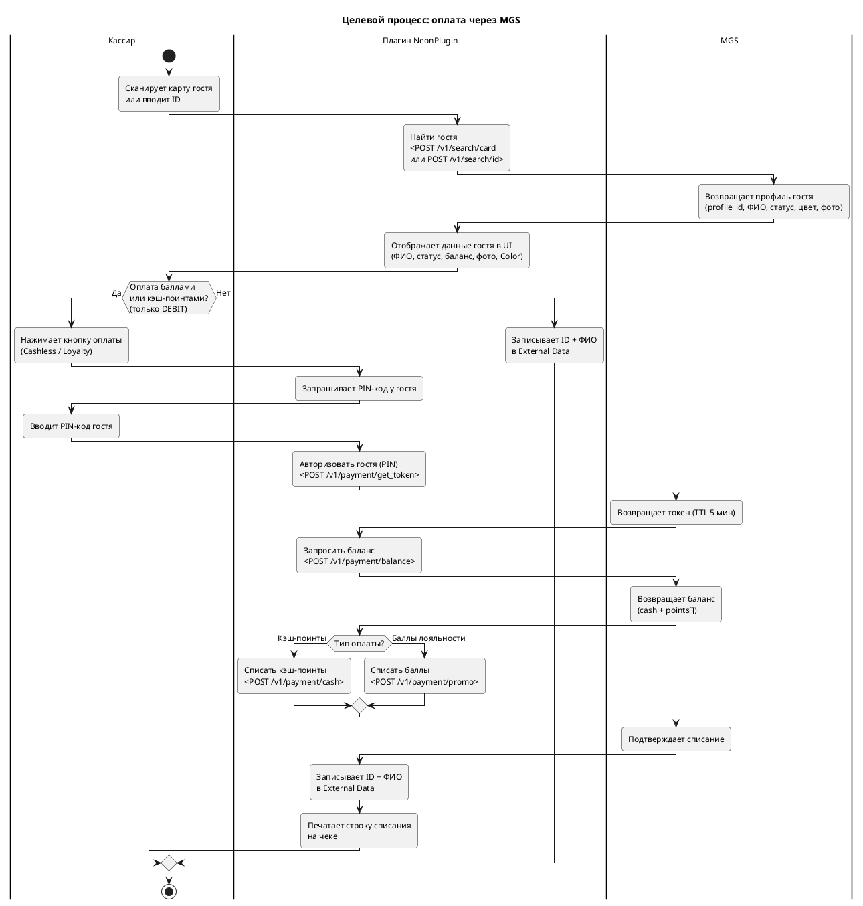
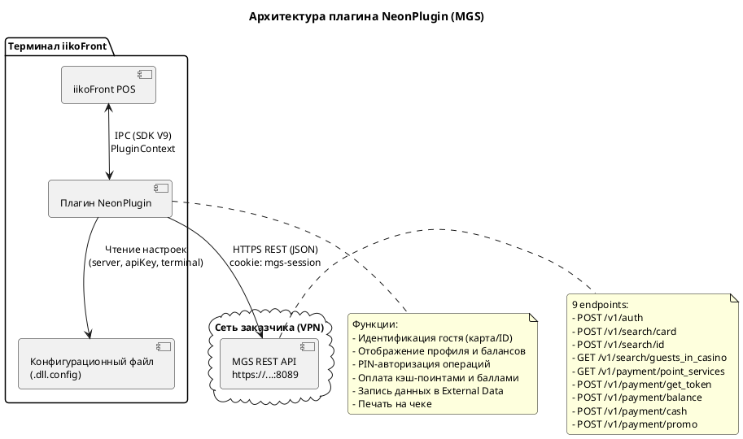
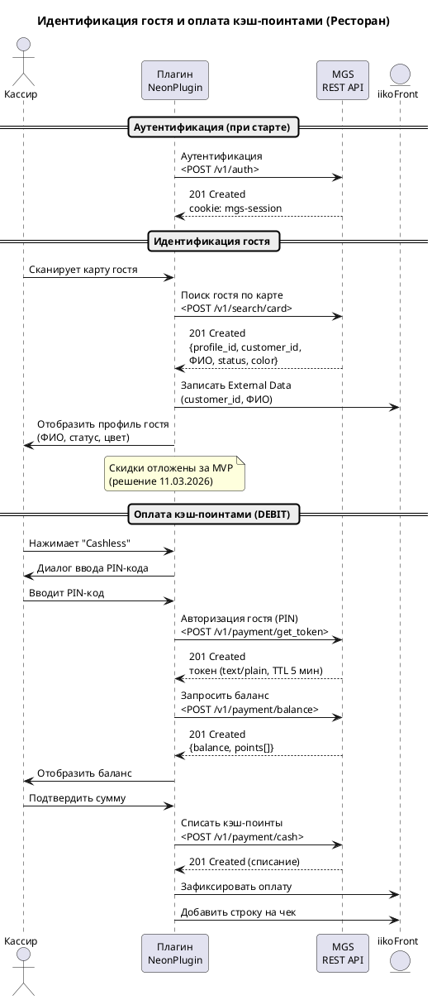
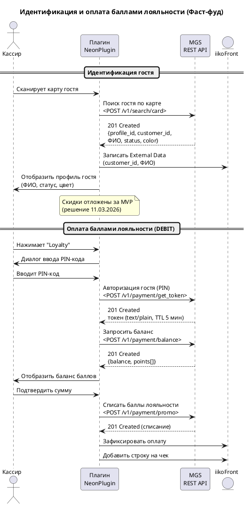

# MGS - Спецификация плагина iikoFront

| Связанные документы | |
|------|---|
| API-справочник | MGS-API-справочник |

---

## Содержание

1. [Введение и цель проекта](#1-введение-и-цель-проекта)
2. [Глоссарий](#2-глоссарий)
3. [Общие сведения о внешней системе](#3-общие-сведения-о-внешней-системе)
4. [Текущее состояние (as-is)](#4-текущее-состояние-as-is)
5. [Целевое состояние (to-be)](#5-целевое-состояние-to-be)
6. [Архитектура решения](#6-архитектура-решения)
7. [Пользовательские сценарии](#7-пользовательские-сценарии)
8. [Функциональные требования](#8-функциональные-требования)
9. [Интерфейс плагина (UI)](#9-интерфейс-плагина-ui)
10. [API-контракты](#10-api-контракты)
11. [Модель данных](#11-модель-данных)
12. [Конфигурация плагина](#12-конфигурация-плагина)
13. [Обработка ошибок](#13-обработка-ошибок)
14. [Ограничения](#14-ограничения)

---

## 1. Введение и цель проекта

### 1.1. Назначение документа

Cпецификация описывает требования к адаптации плагина NeonPlugin для кассового терминала iikoFront (API V9 LTS). Плагин адаптируется для работы с новой системой управления казино MGS.


### 1.2. Бизнес-цель

Заказчик управляет сетью казино, в ресторанах которых используется iikoFront (POS-терминал). Текущий плагин NeonPlugin обеспечивает:

- Идентификацию гостя казино на кассе (по карте или ID)
- Отображение профиля гостя (ФИО, статус лояльности, балансы, фото) в интерфейсе кассира
- Оплату заказа баллами лояльности и кэш-поинтами
- Применение статусных скидок
- Запись данных о госте в External Data заказа

Пользовательские сценарии на кассе остаются без изменений. Меняется API и состав полей данных.

### 1.3. Scope проекта

#### В scope

- Замена протокола взаимодействия: SOAP/WCF (Neon) ->> REST/JSON (MGS)
- Адаптация функций текущего плагина под API MGS: идентификация гостя, оплата кэш-поинтами, оплата баллами лояльности (только списание/DEBIT), получение баланса
- Отображение фото гостя (URL изображения) в интерфейсе кассира
- Реализация нового механизма авторизации сервиса: API-ключ + cookie mgs-session
- Реализация нового механизма авторизации операций гостя: PIN-код + токен (TTL 5 мин)
- Запись ФИО гостя в External Data заказа (сейчас записывается только ID)
- Параметризация типов баллов (point_id) и сервисов (point_service_id) в конфигурации плагина
- Адаптация конфигурационного файла под параметры MGS

#### Вне scope

- Начисление средств на баланс гостя (CREDIT) - запрещено через плагин; начисление выполняет только РКЦ казино
- Скидки по статусу гостя - отложены за пределы MVP; в текущей версии MGS скидки отсутствуют
- Возврат средств - вне MVP; возврат реализуется через систему заявок в кассу казино, не через API MGS. Endpoint возврата будет добавлен в MGS позднее
- SMS-подтверждение списания баллов (API MGS не предусматривает, авторизация через PIN-код)
- Интеграция с другими системами заказчика, кроме MGS
- Миграция данных из Neon в MGS

---

## 2. Глоссарий

| Термин | Определение |
|--------|------------|
| MGS | Новая система управления казино, заменяющая Neon. Предоставляет REST/JSON API для управления гостями и платежами |
| Neon | Устаревшая (legacy) система управления казино, работающая через SOAP/WCF |
| Кэш-поинты (Cashless) | Денежный эквивалент на счёте гостя казино (кошелёк). НЕ баллы лояльности - это деньги, которые гость принёс в казино и на которых играет. Курс 1:1 (рубль = рублю). В API MGS - тип WalletPayment (endpoint /v1/payment/cash). Одна из двух категорий баланса |
| Баллы лояльности (Loyalty) | Обобщённая категория баллов, зарабатываемых активностями в казино (не покупаемых). Включает любые типы point_id, настроенные в конфигурации плагина (в т.ч. комплиментарные). В API MGS - тип PointPayment (endpoint /v1/payment/promo). Одна из двух категорий баланса |
| Типы баллов (point_id) | В MGS баллы лояльности разделены на несколько типов: Complimentary (0), Gaming (1), Travel (3), Restaurant (4) и др. Плагин работает со всеми типами, настроенными в конфигурации (параметр LoyaltyPointIds). Конкретные числовые значения point_id параметризуются (на разных объектах казино могут отличаться) [ГИПОТЕЗА] |
| Комплиментарные баллы (comp) | Один из типов баллов лояльности (point_id=0, Complimentary). Начисляются менеджером казино вручную через интерфейс MGS. Входят в категорию Loyalty (списываются через POST /v1/payment/promo) |
| PIN-токен | Механизм авторизации операций гостя в MGS. Гость вводит PIN-код, MGS возвращает токен со сроком действия 5 минут. Токен передаётся в каждом платёжном запросе |
| mgs-session | Cookie-based сессия, получаемая после аутентификации плагина в MGS (POST /v1/auth). Используется во всех последующих запросах |
| point_service | Категория услуг для списания баллов лояльности в MGS. Каталог: Игра, Такси, Трансфер, Мерч, Билеты, Другое. Для ресторана используется "Другое" (id=6 по умолчанию, параметризуется в конфигурации) |
| Color | Цветовой код статуса гостя в MGS (формат HEX, например #f5eb27). Используется для визуальной подсветки окна профиля гостя - сотрудник визуально различает статус гостя без чтения текста |
| profile_id | Внутренний идентификатор профиля гостя в MGS (integer). Для авторизации операций (get_token) и запроса баланса (balance) используется customer_id (string), а не profile_id |
| customer_id | Клиентский идентификатор гостя в MGS. Аналог CustomerNumber в Neon |
| External Data | Механизм хранения дополнительных данных плагина в контексте заказа iikoFront (OrderExternalData) |

---

## 3. Общие сведения о внешней системе

### 3.1. Описание системы

MGS - система управления казино, заменяющая устаревшую систему Neon. Обеспечивает управление гостями, их балансами (кэш-поинты и баллы лояльности нескольких типов), статусами лояльности и платёжными операциями.

| Параметр | Значение |
|----------|----------|
| Назначение | Управление гостями казино, балансами, лояльностью и платежами |
| Тип интеграции | REST API (OpenAPI 3.0.3) |
| Формат данных | JSON |
| Транспорт | HTTPS |
| Документация | Предоставленное внешнее API (OpenAPI 3.0.3) |
| Версионирование | API версионировано (текущий префикс /v1), версия стабильна и не будет меняться без выпуска новой версии |

### 3.2. Среда и доступы

| Среда | URL | Назначение |
|-------|-----|-----------|
| Тестовая | https://192.168.90.19:8089 | Разработка и тестирование (доступ через L2TP VPN) |
| Продуктовая | [ТРЕБУЕТ УТОЧНЕНИЯ - см. вопрос З-2] | Боевая эксплуатация |

> Протокол авторизации и способы аутентификации подробно описаны в MGS-API-справочнике, раздел 1.

> [!NOTE]
> Доступ к тестовой среде осуществляется через L2TP VPN. Данные для подключения не предоставлены; текущая спецификация составлена на основе документации API MGS.

*На основе предоставленного API MGS.*

---

## 4. Текущее состояние (as-is)

В ресторанах при казино заказчика используется iikoFront с плагином NeonPlugin, который интегрирует кассу с системой управления казино Neon через SOAP/WCF.

### 4.1. Текущий протокол (Neon - SOAP/WCF)

| Параметр | Значение |
|----------|----------|
| Протокол | SOAP/WCF (BasicHttpBinding) |
| Формат данных | XML (SOAP Envelope) + вложенный JSON |
| Транспорт | HTTP |
| Безопасность | TLS 1.2, HMAC-SHA256 (X-Pos-Signature) |
| Даты | ISO-8601 |
| Суммы | decimal (Scale = 2) |

*На основе действующего плагина Neon и его конфигурации.*

### 4.2. Текущие сервисы Neon

| Сервис | Назначение |
|--------|-----------|
| HospitalityService | Идентификация гостя (CustomersInCasinoRequest) |
| CashlessService | Операции списания и возврата (Debit, Redeem, Return) |
| CustomerManagementService | Чтение данных о госте (GetCustomer) |

### 4.3. Текущий процесс работы кассира

1. Кассир сканирует карту гостя или вводит ID
2. Плагин отправляет запросы CustomersInCasinoRequest + GetCustomer в сервисы Neon
3. Ответ приходит асинхронно (двухступенчатый процесс): сначала Success=true с Customer=null, затем полный профиль
4. Плагин отображает ФИО, статус лояльности, балансы (Cashless, Loyalty, Comp), фото гостя
5. При необходимости кассир нажимает кнопку оплаты: Cashless / Loyalty / Comp
6. Плагин выполняет операцию списания через CashlessService
7. На чеке печатается строка списания

### 4.4. Дополнительные возможности текущего плагина

- Скидка по статусу гостя (Gold, Platinum и т.д. - процент задаётся в конфигурации плагина)
- Ролевая модель: разные роли iiko видят разные данные и имеют разные права (card_role, use_cashless_role, use_loyalty_role, return_cashless_role, return_loyalty_role, show_all_guests_role и др.)
- Фильтрация категорий позиций меню для списания (allowed_categories / restricted_categories)
- Настраиваемый текст предчека с подстановкой переменных (discount_percent, discount_sum, result_sum)
- Кастомизация UI: размеры окон, шрифты, цвета кнопок, расположение панели
- Запись ID гостя в External Data заказа

*На основе действующего плагина Neon и его конфигурации.*

---

## 5. Целевое состояние (to-be)

Плагин NeonPlugin адаптируется для работы с REST/JSON API системы MGS. Пользовательские сценарии на кассе остаются без изменений. Ниже описан целевой процесс и ключевые изменения.

### 5.1. Новый протокол (MGS - REST/JSON)

| Параметр | Значение |
|----------|----------|
| Протокол | REST API (OpenAPI 3.0.3) |
| Формат данных | JSON |
| Транспорт | HTTPS |
| Авторизация сервиса | API-ключ (POST /v1/auth) ->> cookie mgs-session |
| Авторизация операций гостя | PIN-код ->> токен (TTL 5 мин) |
| Даты | YYYY-MM-DD (birthday) |
| Суммы | number (double) для cash, integer для promo |

*На основе предоставленного API MGS.*

### 5.2. Endpoints MGS

| # | Метод | Path | Назначение |
|---|-------|------|-----------|
| 1 | POST | /v1/auth | Аутентификация сервиса (API-ключ ->> cookie mgs-session) |
| 2 | POST | /v1/search/card | Поиск гостя по номеру карты |
| 3 | POST | /v1/search/id | Поиск гостя по customer_id |
| 4 | GET | /v1/search/guests_in_casino | Список гостей, находящихся в казино |
| 5 | GET | /v1/payment/point_services | Каталог сервисов для списания баллов лояльности |
| 6 | POST | /v1/payment/get_token | Авторизация гостя по PIN-коду ->> токен (TTL 5 мин) |
| 7 | POST | /v1/payment/balance | Баланс гостя (cash + баллы по категориям) |
| 8 | POST | /v1/payment/cash | Оплата кэш-поинтами |
| 9 | POST | /v1/payment/promo | Оплата баллами лояльности |

Полное описание каждого метода: MGS-API-справочник

### 5.3. Целевой процесс работы

1. При старте плагин аутентифицируется в MGS (POST /v1/auth с API-ключом), получает cookie mgs-session
2. Кассир сканирует карту или вводит ID гостя
3. Плагин отправляет POST /v1/search/card или POST /v1/search/id
4. MGS возвращает профиль гостя: profile_id, customer_id, ФИО, статус, цвет, фото (URL), дата рождения
5. Плагин отображает данные гостя в UI (аналогично текущему)
6. При оплате баллами или кэш-поинтами (только списание/DEBIT):
    - a. Плагин запрашивает у гостя PIN-код
    - b. Отправляет POST /v1/payment/get_token, получает токен (TTL 5 мин)
    - c. Запрашивает баланс: POST /v1/payment/balance
    - d. Для кэш-оплаты: POST /v1/payment/cash
    - e. Для оплаты баллами лояльности: POST /v1/payment/promo
7. Плагин записывает ID и ФИО гостя в External Data заказа
8. На чеке печатается строка списания

*На основе предоставленного API MGS.*

### 5.4. Ключевые изменения по сравнению с as-is

| Аспект | Neon (as-is) | MGS (to-be) | Влияние |
|--------|-------------|-------------|---------|
| Протокол | SOAP/WCF (3 сервиса) | REST/JSON (9 endpoints) | Полная замена сетевого слоя |
| Авторизация сервиса | HMAC-SHA256 (X-Pos-Signature) | API-ключ ->> cookie mgs-session | Проще, но требуется управление сессией (cookie) |
| Авторизация операций | Нет дополнительной (или RedeemHold) | PIN-код гостя ->> токен (5 мин TTL) | Новый UI-элемент: ввод PIN-кода |
| Данные гостя | Один вызов (GetCustomer) ->> полный профиль + балансы | Два вызова: search ->> Customer + balance ->> балансы | Больше сетевых вызовов |
| Типы баллов | 3 отдельных баланса (Cashless, Loyalty, Comp) | 2 категории баланса: Cashless (кошелёк) + Loyalty (все типы point_id, настроенные в конфиге) | Упрощённая модель для кассира, гибкость через конфигурацию |
| Возврат средств | Есть (CashlessService) | Вне MVP. Возврат через систему заявок в кассу казино, не через API | Отложен; endpoint будет добавлен в MGS позднее |
| Направление операций | Списание + возврат (Debit, Return) | Только списание (DEBIT); начисление (CREDIT) запрещено | CREDIT выполняет только РКЦ казино |
| Скидки по статусу | Есть (конфигурация в плагине) | Вне MVP. Скидки отсутствуют в текущей версии MGS | Отложены за пределы MVP |
| External Data | Только ID гостя | ID + ФИО гостя | Расширение состава данных |
| Фото гостя | Передавалось в данных | URL (поле image) | Загрузка изображения по HTTPS |

### 5.5. Новые механизмы

**PIN-авторизация гостя**

Перед любой платёжной операцией гость ДОЛЖЕН ввести PIN-код. Плагин отправляет PIN-код в MGS (POST /v1/payment/get_token) и получает токен со сроком действия 5 минут. За это время кассир ДОЛЖЕН провести транзакцию; если токен истёк - требуется повторный ввод PIN-кода. Токен передаётся в каждом платёжном запросе (/v1/payment/cash, /v1/payment/promo, /v1/payment/balance).

*На основе предоставленного API MGS (endpoint /v1/payment/get_token).*

**Множественные типы баллов**

В MGS баллы лояльности разделены по типам (point_id): Complimentary (0), Gaming (1), Travel (3), Restaurant (4) и другие. Плагин объединяет все настроенные типы баллов в одну категорию - Loyalty. Конкретные point_id задаются в конфигурации плагина (параметр LoyaltyPointIds, массив через запятую). [ГИПОТЕЗА]

Таким образом, плагин оперирует двумя категориями баланса:
- **Cashless** - кошелёк гостя (endpoint /v1/payment/cash). Деньги, которые гость принёс в казино и на которых играет
- **Loyalty** - все баллы, заработанные активностями (endpoint /v1/payment/promo). Включает любые point_id из конфигурации (в т.ч. комплиментарные)

При запросе баланса (POST /v1/payment/balance) плагин отображает Cashless отдельно, а для Loyalty суммирует балансы всех point_id из конфигурации.

Каждый платёж баллами привязан к сервису (point_service_id). Для ресторана используется "Другое" (id=6 по умолчанию, параметризуется в конфигурации).

*На основе документации API MGS (схемы PointPayment, BalanceResponse), решений встречи 29.04.2026.*

##### UML-диаграмма



---

## 6. Архитектура решения

### 6.1. Компоненты

| Компонент | Описание | Ответственный |
|-----------|----------|---------------|
| iikoFront | Кассовый терминал (POS), хост для плагина. API V9 LTS | iiko |
| Плагин NeonPlugin | Расширение iikoFront (.NET), реализует интеграцию с MGS через REST/JSON API. Работает в отдельном процессе (IPC) | iiko |
| MGS | Система управления казино. Предоставляет REST API для идентификации гостей, управления балансами и проведения платёжных операций | Заказчик |

### 6.2. Взаимодействие компонентов

| Направление | Протокол | Описание |
|-------------|----------|----------|
| Плагин ->> MGS | HTTPS REST (JSON) | Все исходящие запросы: аутентификация, поиск гостя, платежи, баланс. Cookie mgs-session |
| iikoFront ->> Плагин | IPC (SDK V9) | Вызовы через PluginContext: операции (IOperationService), уведомления (INotificationService) |
| Плагин ->> iikoFront | IPC (SDK V9) | Запись External Data, управление UI, печать на чеке |

> [!NOTE]
> Входящих вызовов от MGS к плагину нет. Всё взаимодействие инициируется плагином (polling/on-demand).

### 6.3. Manifest.xml

```xml
<?xml version="1.0" encoding="utf-8"?>
<ManifestAttributes xmlns:xsi="http://www.w3.org/2001/XMLSchema-instance"
                    xmlns:xsd="http://www.w3.org/2001/XMLSchema">
  <FileName>Resto.Front.Api.NeonPlugin</FileName>
  <ApiVersion>V9</ApiVersion>
  <LicenseModuleId>{{MODULE_ID}}</LicenseModuleId>
</ManifestAttributes>
```

> [!NOTE]
> LicenseModuleId ДОЛЖЕН соответствовать текущему значению из Manifest.xml плагина Neon. Значение [ТРЕБУЕТ УТОЧНЕНИЯ - см. вопрос И-5].

*На основе документации iiko SDK.*

### 6.4. Области iiko SDK

Для реализации плагина потребуются следующие области SDK:

| Область SDK | Назначение в плагине | Приоритет |
|-------------|---------------------|-----------|
| Кнопки и UI на экране заказа | Встраивание кнопок оплаты (Cashless, Loyalty, Comp) и диалогов (ввод PIN-кода, отображение данных гостя). Конкретные интерфейсы SDK определяются разработчиком | Высокий |
| External Data заказа (AddOrderExternalData) | Хранение ID и ФИО гостя в контексте заказа (ключи с префиксом MGS_, isPublic=true) | Высокий |
| Пречек и фискальный чек | Печать строк списания и скидок на чеке | Высокий |
| HTTP-клиент | Все вызовы к MGS - REST/JSON через HTTPS. Управление cookie-сессией (mgs-session) | Высокий |
| Ролевая модель и права доступа | Разграничение доступа к функциям плагина (идентификация, списание, возврат, просмотр) | Средний |
| Скидки и модификации заказа | Автоматическое применение скидок по статусу гостя | Средний |
| Подписки на события (INotificationService) | Реакция на изменения заказа (добавление позиций, пречек, закрытие) | Средний |
| Manifest.xml и лицензирование | Декларация плагина, версия API V9 | Низкий |

> [!WARNING]
> Детальное исследование конкретных интерфейсов SDK (методы встраивания кнопок, запись в External Data) пока не проведено. Результаты будут зафиксированы в База_знаний_iiko.

*На основе документации iiko SDK.*

##### UML-диаграмма



---

## 7. Пользовательские сценарии

Все сценарии описаны для целевого состояния (MGS). Пользовательский опыт кассира остаётся без изменений по сравнению с текущим плагином Neon - меняется только внутренняя реализация (протокол, авторизация, API-вызовы).

### 7.1. Режим "Обслуживание столов" (Ресторан)

#### Сценарий 7.1.1: Идентификация гостя и отображение профиля

| Шаг | Действие пользователя | Реакция системы | Результат |
|:---:|----------------------|-----------------|-----------|
| 1 | Кассир открывает заказ и сканирует карту гостя или вводит ID вручную | Плагин определяет тип ввода (карта/ID) и отправляет POST /v1/search/card или POST /v1/search/id в MGS | Запрос отправлен |
| 2 | - | MGS возвращает профиль гостя: profile_id, customer_id, ФИО, статус, цвет, image (URL фото), birthday | Данные получены |
| 3 | - | Плагин отображает в UI: ФИО, статус лояльности (GOLD, PLATINUM и т.д.), цветовую маркировку | Кассир видит профиль гостя |
| 4 | - | Плагин записывает customer_id и ФИО гостя в External Data заказа | Данные сохранены в заказе |
| 5 | - | Шаг отложен за пределы MVP. Скидки по статусу гостя не реализуются в текущей версии | - |

> [!NOTE]
> Все платёжные операции плагина поддерживают только списание (DEBIT). Начисление (CREDIT) запрещено - эта функция доступна исключительно через РКЦ казино.

**Предусловия**
- Плагин успешно аутентифицирован в MGS (cookie mgs-session получен)
- Кассовая смена открыта, заказ создан
- Гость имеет карту или ID в системе MGS

**Постусловия**
- Профиль гостя отображается в UI кассира
- customer_id и ФИО записаны в External Data заказа

**Error path**

| Ситуация | Реакция системы |
|----------|-----------------|
| Гость не найден (MGS возвращает 404) | Плагин отображает сообщение "Гость не найден". Кассир МОЖЕТ повторить попытку или продолжить заказ без идентификации |
| Сессия истекла (MGS возвращает 401/403) [ДОПУЩЕНИЕ - коды не документированы в API MGS] | Плагин выполняет повторную аутентификацию (POST /v1/auth), затем повторяет запрос поиска |
| Сетевая ошибка (таймаут, нет связи с MGS) | Плагин отображает сообщение об ошибке. Кассир МОЖЕТ повторить попытку. Заказ продолжается без идентификации |

**Детальная логика обработки шагов**

**Шаг 1. Определение типа ввода и поиск гостя в MGS**

Кассир сканирует карту или вводит ID гостя. Плагин определяет тип ввода и выполняет поиск в MGS.

> **Проверка роли:** `card_role` (конфиг, раздел 12.2 "Роли"). Пустое значение = доступ всем (ФТ 8.10, п.2).

**Вариант А - ввод через сканер карт:**

- **API-вызов:** `POST /v1/search/card` (MGS REST API)
- **Заголовки:** cookie mgs-session (из CookieContainer HTTP-клиента, получен через `POST /v1/auth`)
- **URL сервера:** параметр `server` (конфиг)

| Поле запроса | Тип | Источник |
|-------------|-----|----------|
| value | string | Номер карты (сканер карт POS-терминала) |

**Вариант Б - ручной ввод:**

- **API-вызов:** `POST /v1/search/id` (MGS REST API)
- **Заголовки:** cookie mgs-session

| Поле запроса | Тип | Источник |
|-------------|-----|----------|
| value | string | customer_id (ручной ввод кассира, клавиатура POS) |

**Шаг 2. Получение и обработка профиля гостя**

MGS возвращает профиль гостя. Плагин десериализует ответ и сохраняет данные в оперативной памяти.

- **Ответ:** HTTP 201, Content-Type: application/json, объект `Customer`
- **Структура ответа:** схема Customer (API MGS), раздел 11.1 спецификации

| Поле ответа | Тип | Описание |
|-------------|-----|----------|
| profile_id | integer, int32 | Внутренний ID профиля в MGS |
| customer_id | string | Клиентский идентификатор гостя |
| forename | string | Имя |
| surname | string | Фамилия |
| middlename | string | Отчество (может отсутствовать) |
| status | string | Статус лояльности (GOLD, PLATINUM и др.) |
| color | string | HEX-цвет статуса (#RRGGBB) |
| image | string | URL фото (только в /v1/search/card и /v1/search/id) |
| birthday | string | Дата рождения (YYYY-MM-DD) |

**Шаг 3. Отображение профиля гостя в UI**

Плагин открывает окно профиля гостя (секция 9.2). Видимость данных определяется ролями текущего пользователя (ФТ 8.10). Если параметр роли пуст - данные видны всем.

- **Размеры окна:** `window_height_percent`, `window_width_percent` (конфиг, по умолчанию 80%)
- **Шрифты:** `title_font_size`, `font_size` (конфиг)

| Элемент UI | Источник данных (ответ MGS) | Роль видимости (конфиг) |
|------------|----------------------------|------------------------|
| ФИО | forename, middlename, surname | show_fio_role |
| Идентификатор | customer_id | show_id_role |
| Статус лояльности | status | show_state_role |
| Цветовая маркировка | color | (отображается всегда) |
| Фото гостя | image (загрузка по URL, для верификации личности) | show_photo_role |
| Дата рождения | birthday | show_birthday_role |

**Шаг 4. Запись данных в External Data заказа**

Плагин записывает данные гостя в External Data заказа (ФТ 8.8).

- **Метод SDK:** `IOperationService.AddOrderExternalData(key, ExternalDataItem, order, credentials)`
- **isPublic:** true (доступны в OLAP-отчётах и через iikoRMS API)

| Ключ External Data | Источник (поле из объекта Customer, ответ MGS) |
|--------------------|------------------------------------------------|
| MGS_customer_id | customer_id |
| MGS_forename | forename |
| MGS_middlename | middlename |
| MGS_surname | surname |
| MGS_passport | passport [ГИПОТЕЗА - поле пока отсутствует в API MGS] |

**Шаг 5. Применение скидки по статусу гостя [НЕ В MVP]**

> [!WARNING]
> Скидки по статусу гостя отложены за пределы MVP. В текущей версии API MGS механизм скидок отсутствует. MGS планирует добавить скидки после MVP. Шаг пропускается при выполнении сценария.

---

#### Сценарий 7.1.2: Оплата кэш-поинтами

| Шаг | Действие пользователя | Реакция системы | Результат |
|:---:|----------------------|-----------------|-----------|
| 1 | Кассир нажимает кнопку "Cashless" (оплата кэш-поинтами) | Плагин открывает диалог ввода PIN-кода | Диалог отображен |
| 2 | Гость вводит PIN-код | Плагин отправляет POST /v1/payment/get_token (customer, pin) в MGS | Запрос авторизации отправлен |
| 3 | - | MGS возвращает токен (TTL 5 мин) | Токен получен |
| 4 | - | Плагин запрашивает баланс: POST /v1/payment/balance (customer, token) | Баланс получен |
| 5 | - | Плагин отображает баланс кэш-поинтов (cash) и проверяет достаточность средств | Кассир видит баланс |
| 6 | Кассир подтверждает сумму списания | Плагин отправляет POST /v1/payment/cash (amount, token, service, items) | Запрос оплаты отправлен |
| 7 | - | MGS выполняет списание и возвращает подтверждение | Списание выполнено |
| 8 | - | Плагин фиксирует оплату в заказе iikoFront и добавляет строку списания на чек | Оплата зафиксирована, чек обновлён |

**Предусловия**
- Гость идентифицирован (сценарий 7.1.1 выполнен)
- У кассира есть роль, разрешающая оплату кэш-поинтами (use_cashless_role)
- У гостя достаточно кэш-поинтов для оплаты

**Постусловия**
- Кэш-поинты списаны с баланса гостя в MGS
- Оплата зафиксирована в заказе iikoFront
- На чеке напечатана строка списания

**Error path**

| Ситуация | Реакция системы |
|----------|-----------------|
| Неверный PIN-код (MGS возвращает ошибку авторизации) | Плагин отображает сообщение "Неверный PIN-код". Гость МОЖЕТ повторить ввод |
| Недостаточный баланс (MGS возвращает ошибку) | Плагин отображает сообщение "Недостаточно средств". Кассир МОЖЕТ выбрать другой тип оплаты или частичную оплату |
| Токен истёк (TTL 5 мин превышен) | Плагин отображает сообщение "Время авторизации истекло". Гость ДОЛЖЕН повторно ввести PIN-код |
| Счёт заблокирован (MGS возвращает 423 Locked) | Плагин отображает сообщение "Счёт заблокирован". Оплата невозможна |

**Детальная логика обработки шагов**

**Шаг 1. Нажатие кнопки и проверка доступа**

Кассир нажимает кнопку "Cashless" на панели кнопок плагина (секция 9.1). Плагин проверяет роль и открывает диалог PIN-кода.

> **Проверка роли:** `use_cashless_role` (конфиг, ФТ 8.10, п.3). Пустое значение = доступ всем.

- **Кнопка:** текст - `cashless_button` (конфиг, по умолчанию "Безналичная оплата")
- **Оформление:** фон - `cashless_button_background` (#ffffff), текст - `cashless_button_foreground` (#000000)
- **Далее:** открывается диалог ввода PIN-кода (секция 9.3)

**Шаг 2. PIN-авторизация гостя**

Гость вводит PIN-код через диалог на экране POS-терминала. Плагин отправляет запрос авторизации в MGS.

- **API-вызов:** `POST /v1/payment/get_token` (MGS REST API)
- **Заголовки:** cookie mgs-session

| Поле запроса | Тип | Источник |
|-------------|-----|----------|
| customer | string | `Customer.customer_id` (получен в сценарии 7.1.1, шаг 2) |
| pin | string | Ввод гостя через диалог PIN-кода (секция 9.3) |

**Шаг 3. Получение и сохранение токена**

MGS проверяет PIN-код и возвращает токен авторизации. Плагин сохраняет токен и отслеживает его TTL.

- **Ответ:** HTTP 201, Content-Type: text/plain, строка токена
- **Хранение:** в оперативной памяти + фиксация времени получения
- **TTL:** 5 минут. Плагин ДОЛЖЕН отслеживать срок и не использовать токен после истечения (ФТ 8.3, п.4)
- **Повторное использование:** если токен получен менее 5 минут назад, повторный запрос PIN-кода не требуется (ФТ 8.3, п.5)

**Шаг 4. Запрос баланса гостя**

Плагин запрашивает баланс гостя для проверки достаточности средств.

- **API-вызов:** `POST /v1/payment/balance` (MGS REST API)
- **Заголовки:** cookie mgs-session

| Поле запроса | Тип | Источник |
|-------------|-----|----------|
| customer | string | `Customer.customer_id` (сценарий 7.1.1) |
| token | string | Токен из шага 3 (`POST /v1/payment/get_token`) |

- **Ответ:** HTTP 201, объект `BalanceResponse`

| Поле ответа | Тип | Описание |
|-------------|-----|----------|
| balance | integer | Общий баланс кэш-поинтов |
| points | array | Профили с балансами баллов по типам |

> [!NOTE]
> Плагин ДОЛЖЕН обрабатывать оба варианта формата `points[].points`: нативный JSON-массив и JSON-строку (двуэтапная десериализация, см. раздел 11.2).

**Шаг 5. Отображение баланса и проверка достаточности средств**

Плагин отображает баланс и рассчитывает сумму к списанию.

> **Роль видимости:** `show_cashless_role` (конфиг, ФТ 8.10, п.10).

- **Отображение:** баланс кэш-поинтов (поле `balance` из `BalanceResponse`)
- **Расчет суммы списания:** на основе `IOrder.ResultSum` (iiko SDK, текущий заказ)
- **Фильтрация категорий** (конфиг, ФТ 8.5, п.5):
  - `category_list` (ArrayOfString) - список категорий
  - `category_type`: 0 = allowed (разрешены для списания), 1 = restricted (исключены из списания)
- **Проверка достаточности:** `balance` >= рассчитанная сумма списания (ФТ 8.5, п.2)

**Шаг 6. Формирование и отправка запроса списания**

Кассир подтверждает сумму. Плагин отправляет запрос списания кэш-поинтов.

- **API-вызов:** `POST /v1/payment/cash` (MGS REST API)
- **Заголовки:** cookie mgs-session

| Поле запроса | Тип | Источник |
|-------------|-----|----------|
| amount | number (double) | Расчет плагина: `IOrder.ResultSum` (iiko SDK) с учётом скидок и фильтрации. Преобразование: decimal ->> double, 2 знака [ТРЕБУЕТ УТОЧНЕНИЯ - И-4] |
| token | string | Токен из шага 3 (`POST /v1/payment/get_token`) |
| service | string | Конфиг плагина [ТРЕБУЕТ УТОЧНЕНИЯ - З-7] |
| items | array of string | Названия блюд из чека: `IOrder.Items` ->> `IOrderProductItem.Product.Name` (iiko SDK). Массив строк (без артикулов, количества, цен), для аналитики MGS. Фильтрация по `category_list` / `category_type` |

**Шаг 7. Обработка подтверждения списания**

MGS выполняет списание и подтверждает операцию.

- **Ответ:** HTTP 201 (формат тела не документирован в API MGS)
- Плагин фиксирует факт успешного списания

**Шаг 8. Фиксация оплаты в заказе iikoFront и печать на чеке**

Плагин фиксирует результат операции в iikoFront и печатает данные на чеке.

- **Фиксация оплаты:** в заказе iikoFront (ФТ 8.5, п.4)
- **Фискальный чек:** строка списания с информацией об операции (ФТ 8.9, п.1)
- **Пречек** (если настроен): шаблон `precheque_text` (конфиг, тип ArrayOfString, ФТ 8.9, п.2)
  - Переменные подстановки: `{result_sum}`
  - Переменные `{discount_percent}`, `{discount_sum}` недоступны в MVP (скидки отложены)

---

#### Сценарий 7.1.3: Оплата баллами лояльности

| Шаг | Действие пользователя | Реакция системы | Результат |
|:---:|----------------------|-----------------|-----------|
| 1 | Кассир нажимает кнопку "Loyalty" (оплата баллами лояльности) | Плагин проверяет наличие действующего токена (если нет - открывает диалог ввода PIN-кода) | Токен проверен/получен |
| 2 | - | Плагин запрашивает баланс: POST /v1/payment/balance (customer, token) | Баланс получен |
| 3 | - | Плагин отображает доступные баллы лояльности по типам (points[]) | Кассир видит баланс баллов |
| 4 | Кассир подтверждает сумму списания | Плагин отправляет POST /v1/payment/promo (point_id, point_service_id, description, amount, token) | Запрос списания отправлен |
| 5 | - | MGS выполняет списание баллов и возвращает подтверждение | Списание выполнено |
| 6 | - | Плагин фиксирует оплату в заказе iikoFront и добавляет строку списания на чек | Оплата зафиксирована, чек обновлён |

**Предусловия**
- Гость идентифицирован (сценарий 7.1.1 выполнен)
- У кассира есть роль, разрешающая оплату баллами лояльности (use_loyalty_role)
- PIN-авторизация пройдена (токен действителен)
- У гостя достаточно баллов лояльности

**Постусловия**
- Баллы лояльности списаны с баланса гостя в MGS
- Оплата зафиксирована в заказе iikoFront
- На чеке напечатана строка списания

**Error path**

| Ситуация | Реакция системы |
|----------|-----------------|
| Недостаточно баллов (MGS возвращает ошибку) | Плагин отображает сообщение "Недостаточно баллов". Кассир МОЖЕТ выбрать другой тип оплаты |
| Некорректный point_id / point_service_id [ТРЕБУЕТ УТОЧНЕНИЯ - см. вопрос З-7] | Плагин отображает сообщение об ошибке от MGS |
| Токен истёк | Плагин запрашивает повторный ввод PIN-кода |

**Детальная логика обработки шагов**

**Шаг 1. Проверка токена и PIN-авторизация**

Кассир нажимает кнопку "Loyalty". Плагин проверяет роль и наличие действующего токена.

> **Проверка роли:** `use_loyalty_role` (конфиг, ФТ 8.10, п.4). Пустое значение = доступ всем.

- **Кнопка:** текст - `loyalty_button` (конфиг, по умолчанию "Списать баллы лояльности")
- **Оформление:** фон - `loyalty_button_background` (#ffffff), текст - `loyalty_button_foreground` (#000000)

**Логика проверки токена** (ФТ 8.3, п.5):
- Если действующий токен существует (менее 5 мин с момента получения) ->> используется существующий
- Если токен отсутствует или истёк ->> открывается диалог PIN-кода (секция 9.3):
  - **API-вызов:** `POST /v1/payment/get_token` (MGS REST API)
  - Поля запроса: `customer` (из `Customer.customer_id`, сценарий 7.1.1), `pin` (ввод гостя)

**Шаг 2. Запрос баланса**

Плагин запрашивает баланс для отображения доступных баллов лояльности.

- **API-вызов:** `POST /v1/payment/balance` (MGS REST API)
- **Заголовки:** cookie mgs-session

| Поле запроса | Тип | Источник |
|-------------|-----|----------|
| customer | string | `Customer.customer_id` (сценарий 7.1.1) |
| token | string | Действующий токен (`POST /v1/payment/get_token`) |

- **Ответ:** HTTP 201, объект `BalanceResponse`

Плагин извлекает из `points[].points` массив объектов `PointBalance`:

| Поле PointBalance | Тип | Описание |
|-------------------|-----|----------|
| point_id | integer | ID типа баллов. Плагин работает со всеми типами, настроенными в конфигурации (параметр `LoyaltyPointIds`). Значения параметризованы, не захардкожены [ГИПОТЕЗА] |
| point_sum | integer | Текущий баланс данного типа |
| point_name | string | Название типа |

Структура ответа описана в разделе 11.2 спецификации (схема из API MGS).

**Шаг 3. Отображение баллов лояльности**

Плагин отображает баллы по типам из массива `points[]`.

> **Роль видимости:** `show_loyalty_role` (конфиг, ФТ 8.10, п.10).

- Каждый тип: название (`point_name`) + баланс (`point_sum`) из ответа MGS

**Шаг 4. Формирование и отправка запроса списания**

Кассир подтверждает сумму. Плагин отправляет запрос списания баллов лояльности.

- **API-вызов:** `POST /v1/payment/promo` (MGS REST API)
- **Заголовки:** cookie mgs-session

| Поле запроса | Тип | Источник |
|-------------|-----|----------|
| point_id | integer, int32 | Один из point_id из параметра конфига `LoyaltyPointIds` [ГИПОТЕЗА] |
| point_service_id | integer, int32 | Конфиг `point_service_id` (раздел 12.2, каталог `GET /v1/payment/point_services`) [ТРЕБУЕТ УТОЧНЕНИЯ - З-7] |
| description | string | Формируется плагином [ДОПУЩЕНИЕ - формат текста и источник номера заказа (`IOrder.Number` или `IOrder.Id`) не документированы] |
| amount | integer, int32 | Расчет на основе `IOrder.ResultSum` (iiko SDK). Преобразование: decimal ->> integer [ТРЕБУЕТ УТОЧНЕНИЯ - И-4] |
| token | string | Токен из `POST /v1/payment/get_token` |

**Шаг 5. Обработка подтверждения списания**

MGS выполняет списание и подтверждает операцию.

- **Ответ:** HTTP 201 (формат тела не документирован в API MGS)
- Плагин фиксирует факт успешного списания

**Шаг 6. Фиксация оплаты в заказе iikoFront и печать на чеке**

Плагин фиксирует результат операции в iikoFront и печатает данные на чеке.

- **Фиксация оплаты:** в заказе iikoFront (ФТ 8.6, п.3)
- **Фискальный чек:** строка списания баллов (ФТ 8.9, п.1)
- **Пречек** (если настроен): шаблон `precheque_text` (конфиг, ФТ 8.9, п.2)
  - Переменные подстановки: `{result_sum}`
  - Переменные `{discount_percent}`, `{discount_sum}` недоступны в MVP (скидки отложены)

---

#### Сценарий 7.1.4: Комбинированная оплата

| Шаг | Действие пользователя | Реакция системы | Результат |
|:---:|----------------------|-----------------|-----------|
| 1 | Кассир выбирает первый тип оплаты (Cashless или Loyalty) | Плагин отображает экран ввода суммы с текущим балансом | Кассир видит доступный баланс |
| 2 | Кассир вводит сумму первого списания и подтверждает | Плагин отправляет запрос в MGS (POST /v1/payment/cash или /v1/payment/promo) | Первое списание выполнено |
| 3 | - | Плагин фиксирует частичную оплату в заказе iikoFront и отображает остаток к оплате | Остаток к оплате обновлён |
| 4 | Кассир выбирает второй тип оплаты | Плагин отображает экран ввода суммы второго типа | Кассир видит доступный баланс |
| 5 | Кассир вводит сумму второго списания и подтверждает | Плагин отправляет второй запрос в MGS (другой endpoint) | Второе списание выполнено |
| 6 | - | Плагин фиксирует вторую частичную оплату в заказе iikoFront | Остаток к оплате обновлён |
| 7 | (Опционально) Кассир оплачивает остаток рублями (наличные / банковская карта) | Стандартная оплата iikoFront | Заказ полностью оплачен |

**Предусловие:** гость идентифицирован, PIN-код введён, токен действующий.

**Допустимые комбинации:**
- Cashless + рубли
- Loyalty + рубли
- Cashless + Loyalty
- Cashless + Loyalty + рубли

**Ограничения:**
- Два типа баллов нельзя списать одним API-запросом - плагин ДОЛЖЕН отправлять запросы последовательно (ФТ 8.6, п.6)
- Токен, полученный при идентификации, действует для всех операций в рамках 5 минут (TTL)
- После каждого частичного списания плагин ДОЛЖЕН отображать актуальный остаток к оплате (ФТ 8.6, п.7)

---

#### Сценарий 7.1.5: Просмотр списка гостей в казино

| Шаг | Действие пользователя | Реакция системы | Результат |
|:---:|----------------------|-----------------|-----------|
| 1 | Кассир нажимает кнопку просмотра списка гостей | Плагин отправляет GET /v1/search/guests_in_casino в MGS | Запрос отправлен |
| 2 | - | MGS возвращает список гостей с профилями (ФИО, статус, цвет) | Список получен |
| 3 | - | Плагин отображает список гостей в UI | Кассир видит список |
| 4 | Кассир выбирает гостя из списка | Плагин загружает полный профиль выбранного гостя | Гость идентифицирован (далее сценарий 7.1.1, шаг 3) |

**Предусловия**
- Плагин аутентифицирован в MGS
- У кассира есть роль, разрешающая просмотр списка гостей (show_all_guests_role)

**Постусловия**
- Выбранный гость идентифицирован и отображён в UI

**Error path**

| Ситуация | Реакция системы |
|----------|------------------|
| Список гостей пуст (MGS возвращает пустой массив) | Плагин отображает сообщение "Нет гостей в казино" |
| Сессия истекла (MGS возвращает 401/403) [ДОПУЩЕНИЕ] | Плагин выполняет повторную аутентификацию и повторяет запрос |
| Сетевая ошибка (таймаут, нет связи с MGS) | Плагин отображает сообщение об ошибке. Кассир МОЖЕТ повторить попытку |

**Детальная логика обработки шагов**

**Шаг 1. Отправка запроса списка гостей**

Кассир нажимает кнопку "Список гостей". Плагин проверяет роль и запрашивает список из MGS.

> **Проверка роли:** `show_all_guests_role` (конфиг, ФТ 8.10, п.6). Пустое значение = доступ всем.

- **API-вызов:** `GET /v1/search/guests_in_casino` (MGS REST API)
- **Заголовки:** cookie mgs-session (из CookieContainer HTTP-клиента, получен через `POST /v1/auth`)
- **Тело запроса:** отсутствует

**Шаг 2. Получение списка гостей**

MGS возвращает список гостей, находящихся в казино.

- **Ответ:** HTTP 201, Content-Type: application/json
- **Корневое поле:** `list` (array of `Customer`)
- **Структура ответа:** раздел 3.4 API-справочника (схема из API MGS)

| Поле элемента list | Тип | Описание |
|--------------------|-----|----------|
| profile_id | integer | Внутренний ID профиля |
| customer_id | string | Клиентский идентификатор |
| forename | string | Имя |
| surname | string | Фамилия |
| middlename | string | Отчество |
| status | string | Статус лояльности |
| color | string | HEX-цвет статуса |
| birthday | string | Дата рождения |

> [!NOTE]
> Поле `image` (URL фото) ДОЛЖНО возвращаться в этом методе для отображения фото в списке гостей [ГИПОТЕЗА - решение встречи 29.04.2026, требует подтверждения обновленным API MGS].

**Шаг 3. Отображение списка гостей в UI**

Плагин открывает окно списка гостей (секция 9.4).

- **Размеры окна:** `list_window_height_percent`, `list_window_width_percent` (конфиг, по умолчанию 80%)

| Элемент UI | Источник данных (ответ MGS) | Роль видимости (конфиг) |
|------------|----------------------------|------------------------|
| ФИО | forename, middlename, surname | show_fio_role |
| Статус лояльности | status | show_state_role |
| Цветовая маркировка | color | (отображается всегда) |
| Фото гостя | image | show_photo_role |

Видимость элементов определяется ролевыми параметрами, аналогично окну профиля гостя (сценарий 7.1.1, шаг 3).

**Шаг 4. Выбор гостя из списка**

Кассир выбирает гостя из списка. Плагин использует данные из ранее загруженного массива `list`.

- **Источник данных:** массив `list` из ответа `GET /v1/search/guests_in_casino`
- **Фото:** доступно через поле `image` из ответа `guests_in_casino` [ГИПОТЕЗА]
- **Далее выполняется логика сценария 7.1.1 начиная с шага 3:**
  - Отображение профиля гостя в окне профиля (секция 9.2)
  - Запись `customer_id` и ФИО в External Data заказа (`IOperationService.AddOrderExternalData()`, ФТ 8.8)
  - Шаг 5 (скидки) отложен за пределы MVP

##### UML-диаграмма



---

### 7.2. Режим "Фаст-фуд"

Логика плагина не зависит от режима работы iikoFront - все API-вызовы, параметры, источники данных и обработка ошибок идентичны режиму "Обслуживание столов" (раздел 7.1). Отличия касаются контекста использования. Текущий плагин Neon работает в обоих режимах без различий.

**Отличия в контексте использования:**

| Аспект | Ресторан | Фаст-фуд |
|--------|---------|-----------|
| Жизненный цикл заказа | Заказ открыт длительное время (официант обслуживает стол) | Заказ создается и закрывается быстро (очередь) |
| Момент идентификации | Кассир МОЖЕТ идентифицировать гостя в любой момент до закрытия заказа | Кассир идентифицирует гостя при создании заказа |
| Повторное списание | Возможно несколько списаний в рамках одного заказа (если заказ дополняется) | Как правило, одно списание на заказ |
| Истечение токена (5 мин) | Вероятно - заказ может обслуживаться дольше 5 минут. Плагин ДОЛЖЕН запросить повторный ввод PIN-кода | Маловероятно - заказ закрывается быстро |

> [!NOTE]
> Если при тестировании будут выявлены различия в поведении плагина между режимами, этот раздел будет дополнен отдельными сценариями.

#### Сценарий 7.2.1: Идентификация гостя и отображение профиля

| Шаг | Действие пользователя | Реакция системы | Результат |
|:---:|----------------------|-----------------|-----------|
| 1 | Кассир создает заказ и сканирует карту гостя или вводит ID вручную | Плагин определяет тип ввода (карта/ID) и отправляет POST /v1/search/card или POST /v1/search/id в MGS | Запрос отправлен |
| 2 | - | MGS возвращает профиль гостя: profile_id, customer_id, ФИО, статус, цвет, image (URL фото), birthday | Данные получены |
| 3 | - | Плагин отображает в UI: ФИО, статус лояльности (GOLD, PLATINUM и т.д.), цветовую маркировку | Кассир видит профиль гостя |
| 4 | - | Плагин записывает customer_id и ФИО гостя в External Data заказа | Данные сохранены в заказе |
| 5 | - | Шаг отложен за пределы MVP. Скидки по статусу гостя не реализуются в текущей версии | - |

**Предусловия**
- Плагин успешно аутентифицирован в MGS (cookie mgs-session получен)
- Кассовая смена открыта, заказ создан
- Гость имеет карту или ID в системе MGS

**Постусловия**
- Профиль гостя отображается в UI кассира
- customer_id и ФИО записаны в External Data заказа

**Error path**

| Ситуация | Реакция системы |
|----------|-----------------|
| Гость не найден (MGS возвращает 404) | Плагин отображает сообщение "Гость не найден". Кассир МОЖЕТ повторить попытку или продолжить заказ без идентификации |
| Сессия истекла (MGS возвращает 401/403) [ДОПУЩЕНИЕ - коды не документированы в API MGS] | Плагин выполняет повторную аутентификацию (POST /v1/auth), затем повторяет запрос поиска |
| Сетевая ошибка (таймаут, нет связи с MGS) | Плагин отображает сообщение об ошибке. Кассир МОЖЕТ повторить попытку. Заказ продолжается без идентификации |

**Детальная логика обработки шагов**

Логика идентична сценарию 7.1.1 со следующим отличием контекста: в фаст-фуде идентификация выполняется в начале обслуживания (кассир создает заказ и сразу сканирует карту), поскольку заказ закрывается быстро.

Описание шагов - см. сценарий 7.1.1 ("Детальная логика обработки шагов", шаги 1-4). Шаг 5 (скидки) отложен за пределы MVP. Все API-вызовы, параметры, источники данных и обработка ролей идентичны.

---

#### Сценарий 7.2.2: Оплата кэш-поинтами

| Шаг | Действие пользователя | Реакция системы | Результат |
|:---:|----------------------|-----------------|-----------|
| 1 | Кассир нажимает кнопку "Cashless" (оплата кэш-поинтами) | Плагин открывает диалог ввода PIN-кода | Диалог отображен |
| 2 | Гость вводит PIN-код | Плагин отправляет POST /v1/payment/get_token (customer, pin) в MGS | Запрос авторизации отправлен |
| 3 | - | MGS возвращает токен (TTL 5 мин) | Токен получен |
| 4 | - | Плагин запрашивает баланс: POST /v1/payment/balance (customer, token) | Баланс получен |
| 5 | - | Плагин отображает баланс кэш-поинтов (cash) и проверяет достаточность средств | Кассир видит баланс |
| 6 | Кассир подтверждает сумму списания | Плагин отправляет POST /v1/payment/cash (amount, token, service, items) | Запрос оплаты отправлен |
| 7 | - | MGS выполняет списание и возвращает подтверждение | Списание выполнено |
| 8 | - | Плагин фиксирует оплату в заказе iikoFront и добавляет строку списания на чек | Оплата зафиксирована, чек обновлен |

**Предусловия**
- Гость идентифицирован (сценарий 7.2.1 выполнен)
- У кассира есть роль, разрешающая оплату кэш-поинтами (use_cashless_role)
- У гостя достаточно кэш-поинтов для оплаты

**Постусловия**
- Кэш-поинты списаны с баланса гостя в MGS
- Оплата зафиксирована в заказе iikoFront
- На чеке напечатана строка списания

**Error path**

| Ситуация | Реакция системы |
|----------|-----------------|
| Неверный PIN-код (MGS возвращает ошибку авторизации) | Плагин отображает сообщение "Неверный PIN-код". Гость МОЖЕТ повторить ввод |
| Недостаточный баланс (MGS возвращает ошибку) | Плагин отображает сообщение "Недостаточно средств". Кассир МОЖЕТ выбрать другой тип оплаты или частичную оплату |
| Токен истек (TTL 5 мин превышен) | Плагин отображает сообщение "Время авторизации истекло". Гость ДОЛЖЕН повторно ввести PIN-код |
| Счет заблокирован (MGS возвращает 423 Locked) | Плагин отображает сообщение "Счет заблокирован". Оплата невозможна |

**Детальная логика обработки шагов**

Логика идентична сценарию 7.1.2 со следующим отличием контекста: в фаст-фуде истечение токена (TTL 5 мин) маловероятно, поскольку заказ закрывается быстро, однако плагин ДОЛЖЕН обрабатывать этот случай.

Описание шагов - см. сценарий 7.1.2 ("Детальная логика обработки шагов", шаги 1-8). Все API-вызовы, параметры, источники данных и обработка ролей идентичны. Ссылки на идентификацию гостя - сценарий 7.2.1 (вместо 7.1.1).

---

#### Сценарий 7.2.3: Оплата баллами лояльности

| Шаг | Действие пользователя | Реакция системы | Результат |
|:---:|----------------------|-----------------|-----------|
| 1 | Кассир нажимает кнопку "Loyalty" (оплата баллами лояльности) | Плагин проверяет наличие действующего токена (если нет - открывает диалог ввода PIN-кода) | Токен проверен/получен |
| 2 | - | Плагин запрашивает баланс: POST /v1/payment/balance (customer, token) | Баланс получен |
| 3 | - | Плагин отображает доступные баллы лояльности по типам (points[]) | Кассир видит баланс баллов |
| 4 | Кассир подтверждает сумму списания | Плагин отправляет POST /v1/payment/promo (point_id, point_service_id, amount, token) | Запрос списания отправлен |
| 5 | - | MGS выполняет списание баллов и возвращает подтверждение | Списание выполнено |
| 6 | - | Плагин фиксирует оплату в заказе iikoFront и добавляет строку списания на чек | Оплата зафиксирована, чек обновлен |

**Предусловия**
- Гость идентифицирован (сценарий 7.2.1 выполнен)
- У кассира есть роль, разрешающая оплату баллами лояльности (use_loyalty_role)
- PIN-авторизация пройдена (токен действителен)
- У гостя достаточно баллов лояльности

**Постусловия**
- Баллы лояльности списаны с баланса гостя в MGS
- Оплата зафиксирована в заказе iikoFront
- На чеке напечатана строка списания

**Error path**

| Ситуация | Реакция системы |
|----------|-----------------|
| Недостаточно баллов (MGS возвращает ошибку) | Плагин отображает сообщение "Недостаточно баллов". Кассир МОЖЕТ выбрать другой тип оплаты |
| Некорректный point_id / point_service_id [ТРЕБУЕТ УТОЧНЕНИЯ - см. вопрос З-7] | Плагин отображает сообщение об ошибке от MGS |
| Токен истек | Плагин запрашивает повторный ввод PIN-кода |

**Детальная логика обработки шагов**

Логика идентична сценарию 7.1.3 со следующим отличием контекста: в фаст-фуде повторное использование токена типично - если кэш-поинты уже списаны (сценарий 7.2.2), токен действует для списания баллов лояльности в рамках того же заказа.

Описание шагов - см. сценарий 7.1.3 ("Детальная логика обработки шагов", шаги 1-6). Все API-вызовы, параметры, источники данных и обработка ролей идентичны. Ссылки на идентификацию гостя - сценарий 7.2.1 (вместо 7.1.1).

---

#### Сценарий 7.2.4: Комбинированная оплата

Логика идентична сценарию 7.1.4 (комбинированная оплата). В фаст-фуде повторное использование токена типично - кассир последовательно применяет Cashless и/или Loyalty в рамках одного заказа, затем остаток оплачивается рублями.

Описание шагов, допустимые комбинации и ограничения - см. сценарий 7.1.4. Ссылки на идентификацию гостя - сценарий 7.2.1 (вместо 7.1.1).

---

#### Сценарий 7.2.5: Просмотр списка гостей в казино

| Шаг | Действие пользователя | Реакция системы | Результат |
|:---:|----------------------|-----------------|-----------|
| 1 | Кассир нажимает кнопку просмотра списка гостей | Плагин отправляет GET /v1/search/guests_in_casino в MGS | Запрос отправлен |
| 2 | - | MGS возвращает список гостей с профилями (ФИО, статус, цвет) | Список получен |
| 3 | - | Плагин отображает список гостей в UI | Кассир видит список |
| 4 | Кассир выбирает гостя из списка | Плагин загружает полный профиль выбранного гостя | Гость идентифицирован (далее сценарий 7.2.1, шаг 3) |

**Предусловия**
- Плагин аутентифицирован в MGS
- У кассира есть роль, разрешающая просмотр списка гостей (show_all_guests_role)

**Постусловия**
- Выбранный гость идентифицирован и отображен в UI

**Error path**

| Ситуация | Реакция системы |
|----------|------------------|
| Список гостей пуст (MGS возвращает пустой массив) | Плагин отображает сообщение "Нет гостей в казино" |
| Сессия истекла (MGS возвращает 401/403) [ДОПУЩЕНИЕ] | Плагин выполняет повторную аутентификацию и повторяет запрос |
| Сетевая ошибка (таймаут, нет связи с MGS) | Плагин отображает сообщение об ошибке. Кассир МОЖЕТ повторить попытку |

**Детальная логика обработки шагов**

Логика идентична сценарию 7.1.5 со следующим отличием контекста: после выбора гостя из списка дальнейшая обработка ведет к сценарию 7.2.1 (шаг 3) вместо 7.1.1 (шаг 3).

Описание шагов - см. сценарий 7.1.5 ("Детальная логика обработки шагов", шаги 1-4). Все API-вызовы, параметры, источники данных и обработка ролей идентичны.

##### UML-диаграмма



---

## 8. Функциональные требования

### 8.1. Аутентификация и управление сессией

| ID | Требование | Приоритет | Источник |
|----|-----------|-----------|----------|
| 1 | Плагин ДОЛЖЕН аутентифицироваться в MGS при запуске, отправляя POST /v1/auth с API-ключом из конфигурации | Must | API MGS |
| 2 | Плагин ДОЛЖЕН сохранять cookie mgs-session, полученный при аутентификации, и передавать его во всех последующих запросах к MGS | Must | API MGS |
| 3 | Плагин ДОЛЖЕН выполнять повторную аутентификацию при получении ответа 401/403 от MGS (истечение сессии) [ДОПУЩЕНИЕ - коды 401/403 не документированы в API MGS, но являются стандартной практикой для cookie-сессий] | Must | [ДОПУЩЕНИЕ] |
| 4 | Плагин ДОЛЖЕН читать параметры подключения (server, apiKey, terminal) из конфигурационного файла | Must | Действующий плагин Neon |

### 8.2. Идентификация гостя

| ID | Требование | Приоритет | Источник |
|----|-----------|-----------|----------|
| 1 | Плагин ДОЛЖЕН выполнять поиск гостя по номеру карты: POST /v1/search/card | Must | API MGS, действующий плагин Neon |
| 2 | Плагин ДОЛЖЕН выполнять поиск гостя по идентификатору (customer_id): POST /v1/search/id | Must | API MGS, действующий плагин Neon |
| 3 | Плагин ДОЛЖЕН отображать в UI данные гостя: ФИО (forename, middlename, surname), статус (status), цветовую маркировку (color) | Must | API MGS, действующий плагин Neon |
| 4 | Плагин ДОЛЖЕН предоставлять возможность просмотра списка гостей, находящихся в казино: GET /v1/search/guests_in_casino | Should | API MGS, действующий плагин Neon |
| 5 | Плагин ДОЛЖЕН отображать фото гостя, загружая изображение по URL из поля image. Назначение: верификация личности гостя. Для списка гостей используется image из ответа guests_in_casino [ГИПОТЕЗА] | Should | Встреча №4 (Максим), API MGS |

### 8.3. PIN-авторизация гостя

| ID | Требование | Приоритет | Источник |
|----|-----------|-----------|----------|
| 1 | Плагин ДОЛЖЕН запрашивать у гостя PIN-код перед любой платежной операцией. PIN-код четырехзначный по умолчанию, но поле ввода НЕ ДОЛЖНО ограничивать длину (maxlength не устанавливается) | Must | API MGS, встреча №4 (Максим) |
| 2 | Плагин ДОЛЖЕН отправлять PIN-код в MGS (POST /v1/payment/get_token) и получать токен авторизации | Must | API MGS |
| 3 | Плагин ДОЛЖЕН хранить полученный токен и использовать его во всех платёжных запросах и запросах баланса | Must | API MGS |
| 4 | Плагин ДОЛЖЕН отслеживать срок действия токена (TTL 5 минут) и запрашивать повторный ввод PIN-кода при его истечении | Must | API MGS |
| 5 | Плагин ДОЛЖЕН повторно использовать действующий токен, если с момента получения прошло менее 5 минут (не запрашивать PIN-код повторно) | Should | [ДОПУЩЕНИЕ] |

### 8.4. Получение баланса

| ID | Требование | Приоритет | Источник |
|----|-----------|-----------|----------|
| 1 | Плагин ДОЛЖЕН запрашивать баланс гостя: POST /v1/payment/balance (customer, token) | Must | API MGS |
| 2 | Плагин ДОЛЖЕН отображать баланс кэш-поинтов (поле balance) | Must | API MGS, действующий плагин Neon |
| 3 | Плагин ДОЛЖЕН отображать баллы лояльности по типам из массива points[] (point_id, point_name, point_sum). Отображаются только типы, перечисленные в конфигурации (LoyaltyPointIds) [ГИПОТЕЗА] | Must | API MGS |
| 4 | Плагин ДОЛЖЕН суммировать балансы всех point_id из LoyaltyPointIds для отображения общего баланса Loyalty [ГИПОТЕЗА] | Must | Решение встречи 29.04.2026 |

### 8.5. Оплата кэш-поинтами

| ID | Требование | Приоритет | Источник |
|----|-----------|-----------|----------|
| 1 | Плагин ДОЛЖЕН выполнять списание (DEBIT) кэш-поинтов: POST /v1/payment/cash (amount, token, service, items). Операция CREDIT запрещена - начисление выполняет только РКЦ казино | Must | API MGS, действующий плагин Neon |
| 2 | Плагин ДОЛЖЕН проверять достаточность баланса кэш-поинтов перед отправкой запроса списания | Must | [ДОПУЩЕНИЕ] |
| 3 | Плагин ДОЛЖЕН передавать список наименований блюд из заказа в поле items (массив строк - названия блюд без артикулов, количества и цен; используется для аналитики MGS) | Should | API MGS |
| 4 | Плагин ДОЛЖЕН фиксировать оплату в заказе iikoFront после успешного списания | Must | Действующий плагин Neon |
| 5 | Плагин ДОЛЖЕН учитывать ограничения по категориям позиций меню при расчёте суммы списания (allowed_categories / restricted_categories) | Should | Действующий плагин Neon |

### 8.6. Оплата баллами лояльности

| ID | Требование | Приоритет | Источник |
|----|-----------|-----------|----------|
| 1 | Плагин ДОЛЖЕН выполнять списание (DEBIT) баллов лояльности: POST /v1/payment/promo (point_id, point_service_id, amount, token). Операция CREDIT запрещена - начисление выполняет только РКЦ казино | Must | API MGS, действующий плагин Neon |
| 2 | Плагин ДОЛЖЕН определять корректный point_service_id для ресторанного списания [ТРЕБУЕТ УТОЧНЕНИЯ - см. вопрос З-7] | Must | API MGS |
| 3 | Плагин ДОЛЖЕН фиксировать оплату в заказе iikoFront после успешного списания | Must | Действующий плагин Neon |
| 4 | Плагин ДОЛЖЕН поддерживать списание любых типов баллов, настроенных в LoyaltyPointIds (в т.ч. комплиментарных). Кассир выбирает конкретный point_id при списании [ГИПОТЕЗА] | Must | Решение встречи 29.04.2026 |
| 5 | Плагин ДОЛЖЕН поддерживать комбинированную оплату: несколько последовательных списаний разных типов (Cashless + Loyalty) в рамках одного заказа | Must | Встреча №4 (Максим) |
| 6 | При комбинированной оплате плагин ДОЛЖЕН отправлять API-запросы поочередно: сначала один тип списания, затем следующий. Одновременная отправка двух запросов на списание разных типов запрещена | Must | Встреча №4 (Максим) |
| 7 | Плагин ДОЛЖЕН корректно отображать остаток к оплате после каждого частичного списания [ДОПУЩЕНИЕ] | Should | Следствие комбинированной оплаты |

### 8.7. Скидки по статусу гостя

> [!WARNING]
> Скидки отложены за пределы MVP. В текущей версии API MGS механизм скидок отсутствует. Функциональность будет реализована в последующих версиях при появлении механизма скидок на стороне MGS.

| ID | Требование | Приоритет | Источник |
|----|-----------|-----------|----------|
| 1 | Плагин ДОЛЖЕН автоматически применять скидку к заказу на основе статуса лояльности гостя (GOLD, PLATINUM и т.д.) | Won't (MVP) | Действующий плагин Neon |
| 2 | Плагин ДОЛЖЕН читать маппинг "статус - процент скидки" из конфигурационного файла (параметр discounts) | Won't (MVP) | Действующий плагин Neon |
| 3 | Плагин ДОЛЖЕН учитывать тип скидки из конфигурации (параметр discount_type) | Won't (MVP) | Действующий плагин Neon |

### 8.8. External Data заказа

| ID | Требование | Приоритет | Источник |
|----|-----------|-----------|----------|
| 1 | Плагин ДОЛЖЕН записывать customer_id гостя в External Data заказа | Must | Действующий плагин Neon |
| 2 | Плагин ДОЛЖЕН записывать ФИО гостя (forename, middlename, surname) в External Data заказа | Should | Действующий плагин Neon |
| 3 | Плагин ДОЛЖЕН записывать серию и номер паспорта гостя в External Data заказа (ключ MGS_passport). Источник данных: поле passport из Customer (MGS) [ГИПОТЕЗА - поле пока отсутствует в API MGS] | Should | Встреча №4 (Максим) |

### 8.9. Печать на чеке

| ID | Требование | Приоритет | Источник |
|----|-----------|-----------|----------|
| 1 | Плагин ДОЛЖЕН печатать строку списания на фискальном чеке при успешной оплате баллами или кэш-поинтами | Must | Действующий плагин Neon |
| 2 | Плагин ДОЛЖЕН печатать настраиваемый текст на пречеке с подстановкой переменных из конфигурации (параметр precheque_text). Доступные переменные: {result_sum}. Переменные {discount_percent}, {discount_sum} недоступны в MVP (скидки отложены) | Should | Действующий плагин Neon |

### 8.10. Ролевая модель

| ID | Требование | Приоритет | Источник |
|----|-----------|-----------|----------|
| 1 | Плагин ДОЛЖЕН проверять роль текущего пользователя iikoFront перед выполнением операций | Must | Действующий плагин Neon |
| 2 | Плагин ДОЛЖЕН разграничивать доступ к функции ввода карты/ID (card_role) | Must | Действующий плагин Neon |
| 3 | Плагин ДОЛЖЕН разграничивать доступ к функции оплаты кэш-поинтами (use_cashless_role) | Must | Действующий плагин Neon |
| 4 | Плагин ДОЛЖЕН разграничивать доступ к функции оплаты баллами лояльности (use_loyalty_role) | Must | Действующий плагин Neon |
| 5 | [УДАЛЕНО - объединено с п.4] Комплиментарные баллы входят в категорию Loyalty, отдельная роль не требуется | - | Решение встречи 29.04.2026 |
| 6 | Плагин ДОЛЖЕН разграничивать доступ к функции просмотра списка гостей (show_all_guests_role) | Should | Действующий плагин Neon |
| 7 | Плагин ДОЛЖЕН разграничивать видимость идентификационных данных гостя (show_id_role, show_card_role, show_fio_role, show_preferred_role). show_preferred_role НЕ имеет соответствующего поля в API MGS (Customer schema) [ТРЕБУЕТ УТОЧНЕНИЯ - см. вопрос З-12] | Should | Действующий плагин Neon |
| 8 | Плагин ДОЛЖЕН разграничивать видимость персональных данных гостя (show_age_role, show_gender_role, show_birthday_role). show_age_role и show_gender_role НЕ имеют соответствующих полей в API MGS (Customer schema не содержит age и gender). Возраст МОЖЕТ вычисляться из birthday [ТРЕБУЕТ УТОЧНЕНИЯ - см. вопрос З-12] | Should | Действующий плагин Neon |
| 9 | Плагин ДОЛЖЕН разграничивать видимость статусных данных гостя (show_state_role, show_photo_role) | Should | Действующий плагин Neon |
| 10 | Плагин ДОЛЖЕН разграничивать видимость финансовых данных гостя (show_cashless_role, show_loyalty_role). Отдельная роль show_comp_role не требуется - комплиментарные баллы входят в Loyalty | Should | Решение встречи 29.04.2026 |
| 11 | Плагин ДОЛЖЕН разграничивать доступ к функции возврата кэш-поинтов (return_cashless_role). В MVP возврат через плагин не реализуется - возврат выполняется через систему заявок в кассу казино | Won't (MVP) | Действующий плагин Neon |
| 12 | Плагин ДОЛЖЕН разграничивать доступ к функции возврата баллов лояльности (return_loyalty_role). В MVP возврат через плагин не реализуется - возврат выполняется через систему заявок в кассу казино | Won't (MVP) | Действующий плагин Neon |

### 8.11. Конфигурация

| ID | Требование | Приоритет | Источник |
|----|-----------|-----------|----------|
| 1 | Плагин ДОЛЖЕН читать все настройки из конфигурационного файла (.NET applicationSettings) при запуске | Must | Действующий плагин Neon |
| 2 | Плагин ДОЛЖЕН поддерживать настройку фильтрации категорий позиций (category_list, category_type) | Should | Действующий плагин Neon |
| 3 | Плагин ДОЛЖЕН поддерживать настройку текстов кнопок (cashless_button, loyalty_button). Кнопка comp_button не требуется - комплиментарные баллы входят в Loyalty | Could | Решение встречи 29.04.2026 |
| 4 | Плагин ДОЛЖЕН поддерживать настройку визуальных параметров UI (размеры окон, шрифты, цвета кнопок, координаты панели) | Could | Действующий плагин Neon |

### 8.12. Устойчивость и обработка ошибок

| ID | Требование | Приоритет | Источник |
|----|-----------|-----------|----------|
| 1 | Плагин ДОЛЖЕН выполнять повторные попытки при сетевых ошибках (количество попыток и интервал задаются в конфигурации: retryCount, retryInterval) | Must | Действующий плагин Neon |
| 2 | Плагин ДОЛЖЕН соблюдать таймаут HTTP-запроса, заданный в конфигурации (requestTimeout) | Must | [ДОПУЩЕНИЕ] |
| 3 | Плагин ДОЛЖЕН корректно обрабатывать HTTP-ошибки MGS: 404 (не найден), 406 (невалидные данные), 423 (заблокирован) | Must | API MGS |
| 4 | Плагин ДОЛЖЕН отображать понятные сообщения об ошибках кассиру (не технические HTTP-коды) | Should | [ДОПУЩЕНИЕ] |
| 5 | Плагин НЕ ДОЛЖЕН блокировать работу iikoFront при потере связи с MGS | Must | Действующий плагин Neon |
| 6 | Плагин ДОЛЖЕН позволять продолжить работу с заказом без функций плагина при недоступности MGS | Must | Действующий плагин Neon |

### 8.13. Возврат средств

| ID | Требование | Приоритет | Источник |
|----|-----------|-----------|----------|
| 1 | Возврат кэш-поинтов и баллов лояльности через плагин НЕ реализуется. В MGS возврат выполняется через систему заявок в кассу казино, а не через API | Won't | Действующий плагин Neon |

---

## 9. Интерфейс плагина (UI)

Плагин имеет пользовательский интерфейс, встроенный в экран заказа iikoFront. UI остается без изменений по сравнению с текущим плагином Neon (раздел 1.3, Вне scope). Добавляется один новый элемент: диалог ввода PIN-кода для авторизации операций гостя.

Ниже описаны требования к отображению: какие элементы ДОЛЖНЫ присутствовать на каждом экране, какие данные они выводят и откуда берутся. Конкретные интерфейсы SDK для встраивания элементов определяются разработчиком на этапе реализации.

### 9.1. Панель кнопок на экране заказа

| Параметр | Значение |
|----------|----------|
| Когда отображается | Постоянно на экране заказа (после открытия заказа) |
| Как вызывается | Автоматически при загрузке экрана заказа iikoFront |

#### Элементы экрана

| Элемент | Тип | Описание | Валидация |
|---------|-----|----------|-----------|
| Кнопка идентификации | Кнопка | Запуск идентификации гостя (сканирование карты или ввод ID). Доступна только пользователям с ролью card_role | Роль card_role |
| Кнопка "Cashless" | Кнопка | Запуск оплаты кэш-поинтами. Текст, фон и цвет шрифта настраиваются в конфигурации (cashless_button, cashless_button_background, cashless_button_foreground) | Роль use_cashless_role, гость идентифицирован |
| Кнопка "Loyalty" | Кнопка | Запуск оплаты баллами лояльности. Текст, фон и цвет шрифта настраиваются в конфигурации | Роль use_loyalty_role, гость идентифицирован |
| Кнопка "Список гостей" | Кнопка | Просмотр списка гостей, находящихся в казино | Роль show_all_guests_role |

#### Настройки расположения и размеров

Панель кнопок позиционируется на экране заказа через конфигурационные параметры:

| Параметр | Описание | Связь с ФТ |
|----------|----------|:----------:|
| X, Y | Координаты панели (px) | 8.11, п.4 |
| Height, Width | Размеры панели (px) | 8.11, п.4 |

#### Состояния экрана

| Состояние | Описание |
|-----------|----------|
| Гость не идентифицирован | Кнопки оплаты (Cashless, Loyalty) неактивны. Доступна только кнопка идентификации и список гостей |
| Гость идентифицирован | Все кнопки активны (в соответствии с ролевой моделью). Данные гостя отображаются |
| MGS недоступен | Кнопки оплаты заблокированы. Кассир МОЖЕТ продолжить работу с заказом без функций плагина |

*На основе действующего плагина Neon и его конфигурации.*

---

### 9.2. Окно профиля гостя

| Параметр | Значение |
|----------|----------|
| Когда отображается | После успешной идентификации гостя (сценарий 7.1.1) |
| Как вызывается | Автоматически после получения ответа от POST /v1/search/card или POST /v1/search/id |

#### Элементы экрана

| Элемент | Тип | Описание | Видимость (роль) |
|---------|-----|----------|:----------------:|
| ФИО | Текст | forename, middlename, surname гостя | show_fio_role |
| Статус лояльности | Текст + цвет | Статус (GOLD, PLATINUM и др.). Окно профиля подсвечивается цветовой рамкой (поле color, HEX-код) - сотрудник по цвету определяет статус гостя без чтения текста | show_state_role |
| Customer ID | Текст | Идентификатор гостя (customer_id) | show_id_role |
| Номер карты | Текст | Номер карты гостя (если поиск по карте) | show_card_role |
| Фото гостя | Изображение | Загружается по URL из поля image. Назначение: верификация личности гостя (сотрудник проверяет, что карта принадлежит гостю). В списке гостей используется image из ответа guests_in_casino [ГИПОТЕЗА] | show_photo_role |
| Дата рождения | Текст | Из поля birthday | show_birthday_role |
| Баланс кэш-поинтов | Число | Из поля balance (после запроса баланса) | show_cashless_role |
| Баллы лояльности (Loyalty) | Число (сумма) | Суммарный баланс всех point_id из LoyaltyPointIds. Включает комплиментарные и другие настроенные типы [ГИПОТЕЗА] | show_loyalty_role |

#### Настройки окна

| Параметр | Описание |
|----------|----------|
| window_height_percent | Высота окна (% от экрана) |
| window_width_percent | Ширина окна (% от экрана) |
| title_font_size | Размер шрифта заголовка (pt) |
| font_size | Размер основного шрифта (pt) |

#### Состояния экрана

| Состояние | Описание |
|-----------|----------|
| Загрузка | Отображается индикатор загрузки, пока запрос к MGS выполняется |
| Данные получены | Отображается полный профиль гостя (с учётом ролевой модели видимости) |
| Гость не найден | Отображается сообщение "Гость не найден" (MGS вернул 404) |
| Ошибка | Отображается сообщение об ошибке (сетевая ошибка, таймаут) |

*На основе действующего плагина Neon, его конфигурации и предоставленного API MGS (схема Customer).*

---

### 9.3. Диалог ввода PIN-кода

| Параметр | Значение |
|----------|----------|
| Когда отображается | Перед любой платёжной операцией (кэш-поинты, баллы лояльности), если действующий токен отсутствует или истёк |
| Как вызывается | Нажатие кнопки оплаты (Cashless, Loyalty) |

#### Элементы экрана

| Элемент | Тип | Описание | Валидация |
|---------|-----|----------|-----------|
| Поле ввода PIN-кода | Текстовое поле (маскированное) | Гость вводит свой PIN-код (четырехзначный по умолчанию). Символы отображаются как маскированные. Длина НЕ ограничивается (maxlength не устанавливается) | Непустое значение |
| Кнопка "Подтвердить" | Кнопка | Отправляет PIN-код в MGS (POST /v1/payment/get_token) | PIN-код введён |
| Кнопка "Отмена" | Кнопка | Закрывает диалог, отменяет операцию оплаты | - |

#### Состояния экрана

| Состояние | Описание |
|-----------|----------|
| Ожидание ввода | Поле ввода активно, кнопка подтверждения ожидает PIN-код |
| Проверка | PIN-код отправлен в MGS, отображается индикатор |
| Успех | Токен получен (TTL 5 мин), диалог закрывается, плагин переходит к запросу баланса |
| Ошибка | MGS вернул ошибку (406 - неверный PIN-код). Отображается сообщение "Неверный PIN-код", гость МОЖЕТ повторить ввод |

*На основе предоставленного API MGS (endpoint /v1/payment/get_token).*

---

### 9.4. Окно списка гостей в казино

| Параметр | Значение |
|----------|----------|
| Когда отображается | По запросу кассира |
| Как вызывается | Нажатие кнопки "Список гостей" (при наличии роли show_all_guests_role) |

#### Элементы экрана

| Элемент | Тип | Описание | Валидация |
|---------|-----|----------|-----------|
| Список гостей | Плитки (2 в ряд) | Каждая плитка содержит: слева - фото гостя (квадрат), справа - ФИО + статус + идентификатор. Контур (border) плитки окрашен цветом статуса гостя. Layout 2 в ряд (ограничение мониторов 4:3 - 3 в ряд не помещается). Данные из GET /v1/search/guests_in_casino | - |
| Фото гостя | Изображение (квадрат) | Фотография гостя в плитке. Источник: поле image из ответа guests_in_casino [ГИПОТЕЗА - поле пока отсутствует в API MGS] | - |
| Кнопка выбора | Кнопка (по плитке) | Выбор гостя из списка для идентификации | - |
| Кнопка "Закрыть" | Кнопка | Закрывает окно списка | - |

#### Настройки окна

| Параметр | Описание |
|----------|----------|
| list_window_height_percent | Высота окна списка (% от экрана) |
| list_window_width_percent | Ширина окна списка (% от экрана) |

#### Состояния экрана

| Состояние | Описание |
|-----------|----------|
| Загрузка | Запрос к MGS выполняется |
| Список загружен | Отображается список гостей |
| Пустой список | MGS вернул пустой массив. Отображается сообщение "Нет гостей в казино" |
| Ошибка | Сетевая ошибка или ошибка MGS |

*На основе действующего плагина Neon и предоставленного API MGS (endpoint /v1/search/guests_in_casino).*

---

## 10. API-контракты

### 10.1. Оценка API заказчика

| Параметр | Значение |
|----------|----------|
| Документация | Предоставленное внешнее API (OpenAPI 3.0.3) |
| Сценарий | Б - API заказчика покрывает основные функции, но документация имеет пробелы |
| API-изменения | Не требуются. Плагин адаптируется к существующему API |

Все 9 методов API покрывают ФТ из раздела 8 (аутентификация, идентификация, PIN-авторизация, баланс, оплата кэш-поинтами, оплата баллами). Выявленные документационные пробелы:

| Пробел | Влияние | Вопрос |
|--------|---------|--------|
| Тело ошибок не документировано (только HTTP-коды) | Плагин не может отображать детальные сообщения об ошибках от MGS | З-8 |
| Коды 401/403 для истечения сессии не описаны | Плагин не может корректно обрабатывать протухание cookie mgs-session | 8.1, п.3 [ДОПУЩЕНИЕ] |
| point_service_id для ресторана не определён | Нет сервиса "Ресторан" в каталоге point_services | З-7 |

### 10.2. Обзор API-методов

| # | Метод | URL | Направление | Описание | Связь с ФТ |
|---|-------|-----|-------------|----------|:----------:|
| 1 | POST | /v1/auth | Плагин ->> MGS | Аутентификация сервиса (API-ключ ->> cookie mgs-session) | 8.1 |
| 2 | POST | /v1/search/card | Плагин ->> MGS | Поиск гостя по номеру карты | 8.2 |
| 3 | POST | /v1/search/id | Плагин ->> MGS | Поиск гостя по customer_id | 8.2 |
| 4 | GET | /v1/search/guests_in_casino | Плагин ->> MGS | Список гостей, находящихся в казино | 8.2 |
| 5 | GET | /v1/payment/point_services | Плагин ->> MGS | Каталог сервисов для списания баллов лояльности | 8.6 |
| 6 | POST | /v1/payment/get_token | Плагин ->> MGS | Авторизация гостя по PIN-коду ->> токен (TTL 5 мин) | 8.3 |
| 7 | POST | /v1/payment/balance | Плагин ->> MGS | Баланс гостя (кэш-поинты + баллы по типам) | 8.4 |
| 8 | POST | /v1/payment/cash | Плагин ->> MGS | Оплата кэш-поинтами со счёта гостя | 8.5 |
| 9 | POST | /v1/payment/promo | Плагин ->> MGS | Оплата баллами лояльности со счёта гостя | 8.6 |

#### Направления

- **Плагин ->> MGS (outbound)** - все 9 методов вызываются плагином. MGS является сервером
- Входящих вызовов (inbound/webhook) от MGS к плагину нет

Полное описание каждого метода (параметры, тело запроса, заголовки, JSON-примеры, ошибки): MGS-API-справочник

---

## 11. Модель данных

Ниже описаны JSON-структуры ключевых объектов, которыми оперирует плагин при взаимодействии с MGS и iikoFront. Внутренние объекты iiko SDK не дублируются - даются ссылки на документацию.

### 11.1. Customer (профиль гостя)

Объект возвращается методами POST /v1/search/card, POST /v1/search/id и в массиве list[] метода GET /v1/search/guests_in_casino.

| Поле | Тип | Обязательное | Описание | Ограничения |
|------|-----|:------------:|----------|-------------|
| profile_id | integer (int32) | Да | Внутренний ID профиля гостя в MGS. Для запроса токена (get_token) и баланса (balance) используется customer_id, а не profile_id | Положительное целое число |
| customer_id | string | Да | Клиентский идентификатор гостя. Аналог CustomerNumber в Neon | - |
| forename | string | Да | Имя гостя | - |
| surname | string | Да | Фамилия гостя | - |
| middlename | string | Нет | Отчество гостя | Может отсутствовать |
| status | string | Да | Статус лояльности (GOLD, PLATINUM и др.) | - |
| color | string | Да | HEX-цвет статуса лояльности | Формат: #RRGGBB |
| image | string | Нет | URL фотографии гостя (HTTPS). Используется в профиле и в списке guests_in_casino [ГИПОТЕЗА] | Валидный URL |
| birthday | string | Нет | Дата рождения гостя | Формат: YYYY-MM-DD |

*На основе предоставленного API MGS (схема Customer).*

### 11.2. BalanceResponse (баланс гостя)

Объект возвращается методом POST /v1/payment/balance.

| Поле | Тип | Обязательное | Описание | Ограничения |
|------|-----|:------------:|----------|-------------|
| balance | integer | Да | Общий баланс кэш-поинтов гостя | Целое число (>=0) |
| points | array of PointProfile | Да | Массив профилей с балансами баллов лояльности | - |
| points[].profile_id | string | Да | ID профиля гостя | - |
| points[].points | array of PointBalance | Да | Массив типов баллов лояльности с балансами | Может приходить как JSON-строка (см. ниже) |

#### PointBalance (элемент points[].points[])

| Поле | Тип | Обязательное | Описание | Ограничения |
|------|-----|:------------:|----------|-------------|
| point_id | integer (int32) | Да | ID типа баллов. Плагин работает со всеми типами, настроенными в LoyaltyPointIds. Значения из документации API MGS: 0=Complimentary, 1=Игра, 3=Балл Путешественника, 4=Ресторан | Значения параметризованы в конфиге |
| point_sum | integer (int32) | Да | Текущий баланс данного типа баллов | Целое число (>=0) |
| point_name | string | Да | Название типа баллов | - |

> [!WARNING]
> В API MGS поле points[].points может быть представлено как JSON-строка внутри JSON-объекта (двуэтапная десериализация). Плагин ДОЛЖЕН корректно обрабатывать оба варианта: JSON-строку и нативный массив.

*На основе предоставленного API MGS (схема BalanceResponse).*

### 11.3. WalletPayment (запрос оплаты кэш-поинтами)

Тело запроса POST /v1/payment/cash.

| Поле | Тип | Обязательное | Описание | Ограничения |
|------|-----|:------------:|----------|-------------|
| amount | number (double) | Да | Сумма к списанию в кэш-поинтах | > 0, до 2 знаков после запятой |
| token | string | Да | Токен авторизации гостя (TTL 5 мин) | Строка, полученная через get_token |
| service | string | Да | Название сервиса | [ТРЕБУЕТ УТОЧНЕНИЯ - см. вопрос З-7] |
| items | array of string | Нет | Массив строк - названия блюд из чека (без артикулов, количества и цен). Для аналитики MGS | - |

*На основе предоставленного API MGS (схема WalletPayment).*

### 11.4. PointPayment (запрос оплаты баллами лояльности)

Тело запроса POST /v1/payment/promo.

| Поле | Тип | Обязательное | Описание | Ограничения |
|------|-----|:------------:|----------|-------------|
| point_id | integer (int32) | Да | ID типа баллов. Значение берётся из параметра конфигурации LoyaltyPointIds. Значения из документации API MGS: 0=Complimentary, 1=Игра, 3=Балл Путешественника, 4=Ресторан | Должен соответствовать типу из BalanceResponse |
| point_service_id | integer (int32) | Да | ID сервиса из каталога /v1/payment/point_services | [ТРЕБУЕТ УТОЧНЕНИЯ - см. вопрос З-7] |
| description | string | Да | Описание/комментарий к операции | Формирует плагин |
| amount | integer (int32) | Да | Количество баллов к списанию | > 0, целое число |
| token | string | Да | Токен авторизации гостя (TTL 5 мин) | Строка, полученная через get_token |

*На основе предоставленного API MGS (схема PointPayment).*

### 11.5. PointService (элемент каталога сервисов)

Элемент массива, возвращаемого методом GET /v1/payment/point_services.

| Поле | Тип | Обязательное | Описание | Ограничения |
|------|-----|:------------:|----------|-------------|
| id | string | Да | Уникальный идентификатор сервиса | - |
| name | string | Да | Название сервиса (Игра, Такси, Трансфер, Мерч, Билеты на концерт, Другое) | - |
| description | string | Да | Описание сервиса | - |
| is_gaming_service | string | Да | Является ли игровым сервисом | "1" - да, "0" - нет |
| points | string | Да | Тип баллов лояльности, привязанных к сервису (Игра, Балл Путешественника, Ресторан) | - |
| canBeRename | string | Нет | Можно ли переименовать | "0" - нет |
| date_create | string | Нет | Дата создания | Формат: YYYY-MM-DD HH:mm:ss |
| usr_id | string | Нет | ID пользователя-создателя | - |
| user_name | string | Нет | Имя пользователя-создателя | - |

> [!NOTE]
> В каталоге отсутствует сервис с явным типом баллов "Ресторан" для ресторанных списаний. Текущие сервисы с points="Ресторан": Мерч (4), Билеты на концерт (5), Другое (6). [ТРЕБУЕТ УТОЧНЕНИЯ - см. вопрос З-7]

*На основе предоставленного API MGS (ответ /v1/payment/point_services).*

### 11.6. GuestExternalData (данные в External Data заказа)

Данные, которые плагин записывает в OrderExternalData заказа iikoFront через метод SDK `AddOrderExternalData`.

**Механизм записи:** плагин вызывает extension-метод `IOperationService.AddOrderExternalData(key, ExternalDataItem, order, credentials)` для каждого поля отдельно. Каждая запись - пара "ключ-значение" с флагом публичности.

| Ключ (key) | Тип значения | isPublic | Описание | Источник данных |
|------------|-------------|----------|----------|-----------------|
| MGS_customer_id | string | true | Клиентский идентификатор гостя | Customer.customer_id (от MGS) |
| MGS_forename | string | true | Имя гостя | Customer.forename (от MGS) |
| MGS_middlename | string | true | Отчество гостя | Customer.middlename (от MGS) |
| MGS_surname | string | true | Фамилия гостя | Customer.surname (от MGS) |
| MGS_passport | string | true | Серия и номер паспорта гостя | Customer.passport (от MGS) [ГИПОТЕЗА - поле пока отсутствует в API MGS] |

**Ограничения SDK:**
- Ключ (key): макс. 256 символов
- Значение (value): макс. 32000 символов
- isPublic=true: данные отправляются на сервер iikoRMS, доступны в OLAP-отчетах и через iikoRMS API
- isPublic=false: данные хранятся локально в iikoFront только в течение жизни заказа
- Нельзя обновлять публичные данные для закрытого заказа

**Чтение данных:** метод `IOperationService.TryGetOrderExternalDataByKey(order, key)` возвращает строковое значение по ключу или null.

**Удаление данных:** extension-метод `IOperationService.DeleteOrderExternalData(key, order, credentials)`.

*На основе iiko SDK API Reference V9, ФТ 8.8.*

### 11.7. Маппинг данных: MGS <-> iiko SDK

Сводная таблица соответствия полей MGS и объектов iikoFront SDK.

#### Плагин формирует запрос (outbound: iiko ->> MGS)

| Поле MGS | Тип MGS | Объект iiko SDK | Поле iiko | Преобразование |
|----------|---------|-----------------|-----------|----------------|
| WalletPayment.amount | number (double) | IOrder | ResultSum | decimal ->> double. Пересчитывается с учётом фильтрации категорий [ТРЕБУЕТ УТОЧНЕНИЯ - см. вопрос И-4] |
| WalletPayment.items | array of string | IOrder.Items | IOrderProductItem.Product.Name | Массив строк - названия блюд (без артикулов, количества и цен, для аналитики MGS). Фильтруется по category_list/category_type | |
| PointPayment.amount | integer (int32) | IOrder | ResultSum | decimal ->> integer. Пересчитывается с учётом фильтрации категорий [ТРЕБУЕТ УТОЧНЕНИЯ - см. вопрос И-4] |
| PointPayment.description | string | IOrder | Number / Id | Формируется плагином: "Оплата заказа [номер]" |

#### Плагин обрабатывает ответ (inbound: MGS ->> iiko)

| Поле MGS | Тип MGS | Объект iiko SDK | Поле iiko | Преобразование |
|----------|---------|-----------------|-----------|----------------|
| Customer.customer_id | string | OrderExternalData | MGS_customer_id (isPublic=true) | Без преобразования. Записывается через AddOrderExternalData |
| Customer.forename | string | OrderExternalData | MGS_forename (isPublic=true) | Без преобразования. Записывается через AddOrderExternalData |
| Customer.middlename | string | OrderExternalData | MGS_middlename (isPublic=true) | Без преобразования. Записывается через AddOrderExternalData |
| Customer.surname | string | OrderExternalData | MGS_surname (isPublic=true) | Без преобразования. Записывается через AddOrderExternalData |
| Customer.passport | string | OrderExternalData | MGS_passport (isPublic=true) | Без преобразования. Записывается через AddOrderExternalData [ГИПОТЕЗА - поле пока отсутствует в API MGS] |
| Customer.status | string | UI плагина | - | Отображение текстового статуса в окне профиля. Скидки по статусу отложены за пределы MVP |
| Customer.color | string | UI плагина | - | HEX-цвет для подсветки окна профиля цветовой рамкой |
| BalanceResponse.balance | integer | UI плагина | - | Отображение баланса кэш-поинтов |
| BalanceResponse.points[].points[] | array of PointBalance | UI плагина | - | Отображение баллов лояльности по типам |
| Подтверждение оплаты (cash/promo) | - | IOperationService | - | Фиксация оплаты в заказе, добавление строки на чек |

> [!NOTE]
> Полный маппинг по каждому методу API с указанием источников данных для каждого поля см. в MGS-API-справочнике, раздел 6.

---

## 12. Конфигурация плагина

Конфигурационный файл плагина использует формат .NET applicationSettings. Все параметры считываются при запуске плагина. Конфигурация MGS-версии заменяет секцию system.serviceModel (SOAP/WCF Neon) на REST-параметры подключения (server, apiKey, terminal).

### 12.1. Расположение файлов

| Элемент | Путь |
|---------|------|
| DLL плагина | C:\Program Files\iiko\iikoRMS\Front.Net\Plugins\Resto.Front.Api.NeonPlugin\ |
| Конфигурационный файл | Resto.Front.Api.NeonPlugin.dll.config (рядом с DLL) |
| Логи плагина | ...\Plugins\Resto.Front.Api.NeonPlugin\Logs\ |

*На основе действующего плагина Neon и его конфигурации.*

### 12.2. Параметры конфигурации

#### Подключение к MGS

| Параметр | Тип | Обяз. | По умолч. | Описание | Связь с ФТ |
|----------|-----|:-----:|-----------|----------|:----------:|
| server | string | Да | - | URL сервера MGS (например, https://192.168.90.19:8089) | 8.1, п.4 |
| apiKey | string | Да | - | API-ключ для аутентификации в MGS (POST /v1/auth) | 8.1, п.1 |
| terminal | string | Да | - | Идентификатор терминала (POS), передаётся в контексте операций | 8.1, п.4 |

#### Таймауты и retry

| Параметр | Тип | Обяз. | По умолч. | Описание | Связь с ФТ |
|----------|-----|:-----:|-----------|----------|:----------:|
| requestTimeout | int | Нет | 30 | Таймаут HTTP-запроса к MGS (секунды) | 8.12, п.2 |
| retryCount | int | Нет | 3 | Количество повторных попыток при сетевой ошибке | 8.12, п.1 |
| retryInterval | int | Нет | 2 | Интервал между повторными попытками (секунды) | 8.12, п.1 |

#### Скидки по статусу гостя

> [!WARNING]
> Скидки отложены за пределы MVP. Параметры сохранены в конфигурации для будущей реализации, но не обрабатываются плагином в MVP.

| Параметр | Тип | Обяз. | По умолч. | Описание | Связь с ФТ |
|----------|-----|:-----:|-----------|----------|:----------:|
| discounts | ArrayOfString (Xml) | Нет | - | Маппинг статус-процент скидки. Формат элемента: "Статус\|Процент". **Не используется в MVP** | 8.7, п.1, п.2 (Won't) |
| discount_type | string | Нет | - | Тип скидки в iikoFront. **Не используется в MVP** | 8.7, п.3 (Won't) |

#### Роли - доступ к функциям

| Параметр | Тип | Обяз. | По умолч. | Описание | Связь с ФТ |
|----------|-----|:-----:|-----------|----------|:----------:|
| card_role | string | Нет | (пусто = все) | Роли iikoFront, которым разрешена идентификация гостя (ввод карты/ID). Несколько ролей через "\|" | 8.10, п.2 |
| use_cashless_role | string | Нет | (пусто = все) | Роли, которым разрешена оплата кэш-поинтами | 8.10, п.3 |
| use_loyalty_role | string | Нет | (пусто = все) | Роли, которым разрешена оплата баллами лояльности | 8.10, п.4 |
| show_all_guests_role | string | Нет | (пусто = все) | Роли, которым разрешён просмотр списка гостей в казино | 8.10, п.6 |
| return_cashless_role | string | Нет | (пусто = все) | Роли, которым разрешён возврат кэш-поинтов. **Не используется в MVP** - возврат через систему заявок в кассу казино | 8.10, п.11 (Won't) |
| return_loyalty_role | string | Нет | (пусто = все) | Роли, которым разрешён возврат баллов лояльности. **Не используется в MVP** - возврат через систему заявок в кассу казино | 8.10, п.12 (Won't) |

#### Роли - видимость данных гостя

| Параметр | Тип | Обяз. | По умолч. | Описание | Связь с ФТ |
|----------|-----|:-----:|-----------|----------|:----------:|
| show_id_role | string | Нет | (пусто = все) | Роли, которым видны идентификационные данные (customer_id) | 8.10, п.7 |
| show_card_role | string | Нет | (пусто = все) | Роли, которым виден номер карты | 8.10, п.7 |
| show_fio_role | string | Нет | (пусто = все) | Роли, которым видны ФИО гостя | 8.10, п.7 |
| show_preferred_role | string | Нет | (пусто = все) | Роли, которым видна отметка preferred guest. API MGS не содержит этого поля [ТРЕБУЕТ УТОЧНЕНИЯ - см. вопрос З-12] | 8.10, п.7 |
| show_age_role | string | Нет | (пусто = все) | Роли, которым виден возраст гостя. API MGS не содержит поля age (может вычисляться из birthday) [ТРЕБУЕТ УТОЧНЕНИЯ - см. вопрос З-12] | 8.10, п.8 |
| show_gender_role | string | Нет | (пусто = все) | Роли, которым виден пол гостя. API MGS не содержит поля gender [ТРЕБУЕТ УТОЧНЕНИЯ - см. вопрос З-12] | 8.10, п.8 |
| show_birthday_role | string | Нет | (пусто = все) | Роли, которым видна дата рождения | 8.10, п.8 |
| show_state_role | string | Нет | (пусто = все) | Роли, которым виден статус лояльности | 8.10, п.9 |
| show_photo_role | string | Нет | (пусто = все) | Роли, которым видно фото гостя | 8.10, п.9 |
| show_cashless_role | string | Нет | (пусто = все) | Роли, которым виден баланс кэш-поинтов | 8.10, п.10 |
| show_loyalty_role | string | Нет | (пусто = все) | Роли, которым виден баланс баллов лояльности | 8.10, п.10 |

#### Тексты кнопок и визуальное оформление

| Параметр | Тип | Обяз. | По умолч. | Описание | Связь с ФТ |
|----------|-----|:-----:|-----------|----------|:----------:|
| cashless_button | string | Нет | Безналичная оплата | Текст кнопки оплаты кэш-поинтами | 8.11, п.3 |
| loyalty_button | string | Нет | Списать баллы лояльности | Текст кнопки оплаты баллами лояльности | 8.11, п.3 |
| cashless_button_background | string | Нет | #ffffff | Цвет фона кнопки кэш-поинтов (HEX) | 8.11, п.4 |
| cashless_button_foreground | string | Нет | #000000 | Цвет текста кнопки кэш-поинтов (HEX) | 8.11, п.4 |
| loyalty_button_background | string | Нет | #ffffff | Цвет фона кнопки лояльности (HEX) | 8.11, п.4 |
| loyalty_button_foreground | string | Нет | #000000 | Цвет текста кнопки лояльности (HEX) | 8.11, п.4 |

#### Размеры и расположение UI

| Параметр | Тип | Обяз. | По умолч. | Описание | Связь с ФТ |
|----------|-----|:-----:|-----------|----------|:----------:|
| window_height_percent | int | Нет | 80 | Высота окна профиля гостя (% от экрана) | 8.11, п.4 |
| window_width_percent | int | Нет | 80 | Ширина окна профиля гостя (% от экрана) | 8.11, п.4 |
| list_window_height_percent | int | Нет | 80 | Высота окна списка гостей (% от экрана) | 8.11, п.4 |
| list_window_width_percent | int | Нет | 80 | Ширина окна списка гостей (% от экрана) | 8.11, п.4 |
| title_font_size | int | Нет | 16 | Размер шрифта заголовков в окнах плагина (pt) | 8.11, п.4 |
| font_size | int | Нет | 24 | Размер основного шрифта в окнах плагина (pt) | 8.11, п.4 |
| X | int | Нет | 0 | Координата X панели кнопок на экране заказа (px) | 8.11, п.4 |
| Y | int | Нет | 0 | Координата Y панели кнопок на экране заказа (px) | 8.11, п.4 |
| Height | int | Нет | 0 | Высота панели кнопок (px). 0 = авторазмер | 8.11, п.4 |
| Width | int | Нет | 0 | Ширина панели кнопок (px). 0 = авторазмер | 8.11, п.4 |

#### Фильтрация категорий

| Параметр | Тип | Обяз. | По умолч. | Описание | Связь с ФТ |
|----------|-----|:-----:|-----------|----------|:----------:|
| category_list | ArrayOfString (Xml) | Нет | - | Список категорий позиций меню для фильтрации при расчёте суммы списания | 8.11, п.2 |
| category_type | int | Нет | 0 | Режим фильтрации: 0 = allowed (разрешённые категории), 1 = restricted (запрещённые категории) | 8.11, п.2 |

#### Печать

| Параметр | Тип | Обяз. | По умолч. | Описание | Связь с ФТ |
|----------|-----|:-----:|-----------|----------|:----------:|
| precheque_text | ArrayOfString (Xml) | Нет | - | Шаблон строк пречека с подстановкой переменных. Доступна: {result_sum}. Переменные {discount_percent}, {discount_sum} недоступны в MVP (скидки отложены) | 8.9, п.2 |

#### MGS-специфичные параметры

| Параметр | Тип | Обяз. | По умолч. | Описание | Связь с ФТ |
|----------|-----|:-----:|-----------|----------|:----------:|
| point_service_id | int | Да | - | ID сервиса из каталога /v1/payment/point_services для ресторанного списания баллов [ТРЕБУЕТ УТОЧНЕНИЯ - см. вопрос З-7] | 8.6, п.2 |
| LoyaltyPointIds | string | Нет | 0,4 | Массив ID типов баллов лояльности (через запятую). Плагин суммирует балансы всех указанных типов и отображает как единый баланс Loyalty. По умолчанию: 0 (Complimentary) и 4 (Ресторан). НЕ хардкодить - на разных объектах казино значения могут отличаться [ГИПОТЕЗА] | 8.4, п.3 |
| hospitality_item | int | Нет | 2 | Идентификатор объекта (ресторана) в системе MGS [ДОПУЩЕНИЕ - параметр унаследован из конфигурации Neon, назначение в MGS требует проверки] | 8.1, п.4 |

#### Служебные

| Параметр | Тип | Обяз. | По умолч. | Описание | Связь с ФТ |
|----------|-----|:-----:|-----------|----------|:----------:|
| log_level | int | Нет | 0 | Уровень детализации логирования: 0 = минимальный, 1 = подробный, 2 = отладочный [ДОПУЩЕНИЕ - параметр унаследован из конфигурации Neon, отдельное ФТ отсутствует] | - |

### 12.3. Параметры, исключённые из конфигурации MGS

Следующие параметры из конфигурации Neon исключены, так как не относятся к интеграции с MGS:

| Параметр Neon | Причина исключения |
|---------------|--------------------|
| system.serviceModel (SOAP endpoints) | Заменены на server (REST). Секция WCF-биндингов (HospitalityService, CashlessService, CustomerManagementService) не нужна |
| computer | Заменён на terminal (идентификатор терминала для MGS) |
| sms_url | SMS-подтверждение вне scope проекта (раздел 1.3) |
| crm_url, crm_user, crm_pass | Интеграция с CRM вне scope проекта (раздел 1.3) |
| settings_path | URL для внешних правил скидок (Neon-специфичный). Скидки отложены за пределы MVP |
| writeoff_loyalty_without_conf_role | Списание без подтверждения - логика специфична для Neon [ДОПУЩЕНИЕ - при необходимости может быть восстановлена] |
| writeoff_comp_without_conf_role | Списание без подтверждения - логика специфична для Neon [ДОПУЩЕНИЕ - при необходимости может быть восстановлена] |

### 12.4. Пример конфигурационного файла

###### PluginConfig

```xml
<?xml version="1.0" encoding="utf-8" ?>
<configuration>
  <configSections>
    <sectionGroup name="applicationSettings"
                  type="System.Configuration.ApplicationSettingsGroup, System">
      <section name="Resto.Front.Api.NeonPlugin.Properties.Settings"
               type="System.Configuration.ClientSettingsSection, System" />
    </sectionGroup>
  </configSections>
  <applicationSettings>
    <Resto.Front.Api.NeonPlugin.Properties.Settings>

      <!-- Подключение к MGS -->
      <setting name="server" serializeAs="String">
        <value>https://192.168.90.19:8089</value>
      </setting>
      <setting name="apiKey" serializeAs="String">
        <value></value>
      </setting>
      <setting name="terminal" serializeAs="String">
        <value></value>
      </setting>

      <!-- Таймауты и retry -->
      <setting name="requestTimeout" serializeAs="String">
        <value>30</value>
      </setting>
      <setting name="retryCount" serializeAs="String">
        <value>3</value>
      </setting>
      <setting name="retryInterval" serializeAs="String">
        <value>2</value>
      </setting>

      <!-- Скидки по статусу гостя (Won't MVP - не обрабатываются в MVP) -->
      <!--
      <setting name="discounts" serializeAs="Xml">
        <value>
          <ArrayOfString xmlns:xsd="http://www.w3.org/2001/XMLSchema"
                         xmlns:xsi="http://www.w3.org/2001/XMLSchema-instance">
            <string>Gold|10</string>
            <string>Platinum|20</string>
          </ArrayOfString>
        </value>
      </setting>
      <setting name="discount_type" serializeAs="String">
        <value></value>
      </setting>
      -->

      <!-- Роли - доступ к функциям -->
      <setting name="card_role" serializeAs="String">
        <value></value>
      </setting>
      <setting name="use_cashless_role" serializeAs="String">
        <value></value>
      </setting>
      <setting name="use_loyalty_role" serializeAs="String">
        <value></value>
      </setting>
      <setting name="show_all_guests_role" serializeAs="String">
        <value></value>
      </setting>
      <setting name="return_cashless_role" serializeAs="String">
        <value></value>
      </setting>
      <setting name="return_loyalty_role" serializeAs="String">
        <value></value>
      </setting>

      <!-- Роли - видимость данных гостя -->
      <setting name="show_id_role" serializeAs="String">
        <value></value>
      </setting>
      <setting name="show_card_role" serializeAs="String">
        <value></value>
      </setting>
      <setting name="show_fio_role" serializeAs="String">
        <value></value>
      </setting>
      <setting name="show_preferred_role" serializeAs="String">
        <value></value>
      </setting>
      <setting name="show_age_role" serializeAs="String">
        <value></value>
      </setting>
      <setting name="show_gender_role" serializeAs="String">
        <value></value>
      </setting>
      <setting name="show_birthday_role" serializeAs="String">
        <value></value>
      </setting>
      <setting name="show_state_role" serializeAs="String">
        <value></value>
      </setting>
      <setting name="show_photo_role" serializeAs="String">
        <value></value>
      </setting>
      <setting name="show_cashless_role" serializeAs="String">
        <value></value>
      </setting>
      <setting name="show_loyalty_role" serializeAs="String">
        <value></value>
      </setting>

      <!-- Тексты кнопок -->
      <setting name="cashless_button" serializeAs="String">
        <value>Безналичная оплата</value>
      </setting>
      <setting name="loyalty_button" serializeAs="String">
        <value>Списать баллы лояльности</value>
      </setting>

      <!-- Визуальное оформление кнопок -->
      <setting name="cashless_button_background" serializeAs="String">
        <value>#ffffff</value>
      </setting>
      <setting name="cashless_button_foreground" serializeAs="String">
        <value>#000000</value>
      </setting>
      <setting name="loyalty_button_background" serializeAs="String">
        <value>#ffffff</value>
      </setting>
      <setting name="loyalty_button_foreground" serializeAs="String">
        <value>#000000</value>
      </setting>

      <!-- Размеры и расположение UI -->
      <setting name="window_height_percent" serializeAs="String">
        <value>80</value>
      </setting>
      <setting name="window_width_percent" serializeAs="String">
        <value>80</value>
      </setting>
      <setting name="list_window_height_percent" serializeAs="String">
        <value>80</value>
      </setting>
      <setting name="list_window_width_percent" serializeAs="String">
        <value>80</value>
      </setting>
      <setting name="title_font_size" serializeAs="String">
        <value>16</value>
      </setting>
      <setting name="font_size" serializeAs="String">
        <value>24</value>
      </setting>
      <setting name="X" serializeAs="String">
        <value>0</value>
      </setting>
      <setting name="Y" serializeAs="String">
        <value>0</value>
      </setting>
      <setting name="Height" serializeAs="String">
        <value>0</value>
      </setting>
      <setting name="Width" serializeAs="String">
        <value>0</value>
      </setting>

      <!-- Фильтрация категорий -->
      <setting name="category_list" serializeAs="Xml">
        <value>
          <ArrayOfString xmlns:xsd="http://www.w3.org/2001/XMLSchema"
                         xmlns:xsi="http://www.w3.org/2001/XMLSchema-instance">
            <string>cat1</string>
            <string>cat2</string>
          </ArrayOfString>
        </value>
      </setting>
      <setting name="category_type" serializeAs="String">
        <value>0</value>
      </setting>

      <!-- Печать -->
      <setting name="precheque_text" serializeAs="Xml">
        <value>
          <ArrayOfString xmlns:xsd="http://www.w3.org/2001/XMLSchema"
                         xmlns:xsi="http://www.w3.org/2001/XMLSchema-instance">
            <string>Итого к оплате - {result_sum}</string>
          </ArrayOfString>
        </value>
      </setting>

      <!-- MGS-специфичные параметры -->
      <setting name="point_service_id" serializeAs="String">
        <value></value>
      </setting>
      <setting name="LoyaltyPointIds" serializeAs="String">
        <value>0,4</value>
      </setting>
      <setting name="hospitality_item" serializeAs="String">
        <value>2</value>
      </setting>

      <!-- Служебные -->
      <setting name="log_level" serializeAs="String">
        <value>0</value>
      </setting>

    </Resto.Front.Api.NeonPlugin.Properties.Settings>
  </applicationSettings>
</configuration>
```

---

## 13. Обработка ошибок

### 13.1. Реестр ошибок и нестандартных ситуаций

| # | Ситуация | Категория | Ожидаемое поведение (кратко) | Подробнее |
|---|----------|-----------|-------------------------------|-----------|
| 1 | Сетевая ошибка (таймаут, отсутствие связи с MGS) | Сетевая | Повторные попытки (retryCount), сообщение кассиру, работа без плагина | 13.2.1 |
| 2 | Невалидный API-ключ (POST /v1/auth ->> 406) | Авторизация | Логирование ошибки, сообщение кассиру, кнопки плагина заблокированы | 13.2.2 |
| 3 | Истечение сессии (cookie mgs-session) | Авторизация | Автоматическая повторная аутентификация, retry исходного запроса | 13.2.3 |
| 4 | Гость не найден (POST /v1/search/* ->> 404) | Бизнес-логика | Сообщение "Гость не найден", возможность повторного ввода | 13.2.4 |
| 5 | Неверный PIN-код (POST /v1/payment/get_token ->> 406) | Авторизация | Сообщение "Неверный PIN-код", возможность повторного ввода | 13.2.5 |
| 6 | Истечение токена (TTL 5 мин) | Авторизация | Запрос повторного ввода PIN-кода | 13.2.6 |
| 7 | Невалидный токен (POST /v1/payment/balance ->> 406) | Авторизация | Сообщение об ошибке, запрос повторного ввода PIN-кода | 13.2.7 |
| 8 | Недостаточный баланс / счёт заблокирован (POST /v1/payment/cash ->> 423) | Бизнес-логика | Сообщение кассиру, выбор другого типа оплаты | 13.2.8 |
| 9 | Недостаточно баллов / счёт заблокирован (POST /v1/payment/promo ->> 423) | Бизнес-логика | Сообщение кассиру, выбор другого типа оплаты | 13.2.9 |
| 10 | Пустой список гостей в казино | Бизнес-логика | Сообщение "Нет гостей в казино" | 13.2.10 |
| 11 | MGS недоступен при запуске плагина | Сетевая | Плагин стартует, кнопки заблокированы, периодические попытки аутентификации | 13.2.11 |

> [!NOTE]
> Форматы ошибок API MGS стабильны и не изменятся в текущей версии. Плагин МОЖЕТ полагаться на задокументированные HTTP-коды ответов.

### 13.2. Подробное описание

#### 13.2.1. Сетевая ошибка (таймаут, отсутствие связи)

| Параметр | Значение |
|----------|----------|
| Триггер | HTTP-запрос к MGS не получает ответ в пределах requestTimeout (по умолчанию 30 сек) или соединение невозможно (DNS, TCP, TLS) |
| Затронутые endpoints | Все 9 endpoints |
| Связь с ФТ | 8.12 п.1, п.2, п.5, п.6 |

Плагин ДОЛЖЕН выполнить повторные попытки в количестве retryCount (по умолчанию 3) с интервалом retryInterval (по умолчанию 2 сек). Если все попытки исчерпаны, плагин ДОЛЖЕН:

- Отобразить кассиру сообщение "Нет связи с MGS. Повторите попытку позже"
- Не блокировать работу iikoFront - кассир МОЖЕТ продолжить работу с заказом без функций плагина
- Записать ошибку в лог (URL, тип ошибки, количество попыток)

*На основе ФТ 8.12, действующего плагина Neon.*

#### 13.2.2. Невалидный API-ключ (406)

| Параметр | Значение |
|----------|----------|
| Триггер | POST /v1/auth возвращает 406 с телом "error: invalid key" |
| Затронутые endpoints | POST /v1/auth |
| Связь с ФТ | 8.1 п.1 |

Плагин ДОЛЖЕН:

- Записать ошибку в лог (без логирования самого API-ключа)
- Отобразить кассиру сообщение "Ошибка аутентификации в MGS. Обратитесь к администратору"
- Заблокировать все кнопки плагина (Cashless, Loyalty, Comp, идентификация, список гостей)
- Не выполнять автоматических повторных попыток аутентификации (ошибка конфигурации, повтор бессмысленен)

*На основе предоставленного API MGS (POST /v1/auth, ответ 406).*

#### 13.2.3. Истечение сессии (cookie mgs-session)

| Параметр | Значение |
|----------|----------|
| Триггер | Любой запрос к MGS возвращает 401 или 403 [ДОПУЩЕНИЕ - коды не документированы в API MGS] |
| Затронутые endpoints | Все endpoints, кроме POST /v1/auth |
| Связь с ФТ | 8.1 п.3 |

Плагин ДОЛЖЕН:

- Выполнить повторную аутентификацию (POST /v1/auth)
- При успешной аутентификации - повторить исходный запрос с новым cookie
- При неуспешной аутентификации - обработать как ошибку 13.2.2

> [!NOTE]
> Срок жизни cookie mgs-session не документирован в API MGS [ТРЕБУЕТ УТОЧНЕНИЯ - см. вопрос З-8]. Плагин ДОЛЖЕН обрабатывать истечение сессии реактивно (по факту получения 401/403), а не проактивно (по таймеру).

*[ДОПУЩЕНИЕ] - стандартная практика для cookie-сессий.*

#### 13.2.4. Гость не найден (404)

| Параметр | Значение |
|----------|----------|
| Триггер | POST /v1/search/card или POST /v1/search/id возвращает 404 |
| Затронутые endpoints | POST /v1/search/card, POST /v1/search/id |
| Связь с ФТ | 8.2 п.1, п.2 |

Плагин ДОЛЖЕН:

- Отобразить кассиру сообщение "Гость не найден"
- Предоставить возможность повторного ввода номера карты или ID
- Не записывать данные в External Data
- Не выполнять автоматических повторных попыток (404 - бизнес-ответ, не сетевая ошибка)

*На основе предоставленного API MGS (ответ 404 для /v1/search/card, /v1/search/id).*

#### 13.2.5. Неверный PIN-код (406)

| Параметр | Значение |
|----------|----------|
| Триггер | POST /v1/payment/get_token возвращает 406 |
| Затронутые endpoints | POST /v1/payment/get_token |
| Связь с ФТ | 8.3 п.2 |

Плагин ДОЛЖЕН:

- Отобразить в диалоге PIN-кода сообщение "Неверный PIN-код"
- Предоставить гостю возможность повторного ввода PIN-кода
- Не закрывать диалог автоматически - гость МОЖЕТ нажать "Отмена" для возврата к заказу
- Не выполнять автоматических повторных попыток

*На основе предоставленного API MGS (POST /v1/payment/get_token, ответ 406).*

#### 13.2.6. Истечение токена (TTL 5 мин)

| Параметр | Значение |
|----------|----------|
| Триггер | Плагин определяет, что с момента получения токена прошло более 5 минут (локальная проверка) или MGS отклоняет запрос с просроченным токеном |
| Затронутые endpoints | POST /v1/payment/balance, POST /v1/payment/cash, POST /v1/payment/promo |
| Связь с ФТ | 8.3 п.4, п.5 |

Плагин ДОЛЖЕН:

- Отобразить сообщение "Время авторизации истекло"
- Открыть диалог ввода PIN-кода для повторной авторизации
- После получения нового токена - продолжить платёжную операцию

Плагин СЛЕДУЕТ проверять срок действия токена локально (по времени получения + 5 мин) перед отправкой запроса, чтобы минимизировать обращения к MGS с заведомо просроченным токеном.

*На основе предоставленного API MGS (TTL токена: 5 минут, endpoint /v1/payment/get_token).*

#### 13.2.7. Невалидный токен (406)

| Параметр | Значение |
|----------|----------|
| Триггер | POST /v1/payment/balance возвращает 406 (невалидный токен или customer_id) |
| Затронутые endpoints | POST /v1/payment/balance |
| Связь с ФТ | 8.4 п.1 |

Плагин ДОЛЖЕН:

- Отобразить сообщение об ошибке
- Если причина - истёкший токен, открыть диалог повторного ввода PIN-кода (аналогично 13.2.6)
- Если причина - невалидный customer_id, показать сообщение "Ошибка данных гостя" и предложить повторную идентификацию

> [!NOTE]
> MGS не различает причины ошибки 406 в ответе (истёкший токен vs невалидный customer_id) [ТРЕБУЕТ УТОЧНЕНИЯ - см. вопрос З-8]. Плагин СЛЕДУЕТ сначала проверить TTL токена локально: если токен не просрочен - вероятна ошибка данных.

*На основе предоставленного API MGS (POST /v1/payment/balance, ответ 406).*

#### 13.2.8. Недостаточный баланс / счёт заблокирован - кэш-поинты (423)

| Параметр | Значение |
|----------|----------|
| Триггер | POST /v1/payment/cash возвращает 423 (Locked) |
| Затронутые endpoints | POST /v1/payment/cash |
| Связь с ФТ | 8.5 п.1, п.2 |

Плагин ДОЛЖЕН:

- Отобразить кассиру сообщение "Оплата невозможна: недостаточно средств или счёт заблокирован"
- Предоставить возможность выбрать другой тип оплаты (Loyalty, Comp) или стандартную оплату через iikoFront
- Не выполнять автоматических повторных попыток (423 - бизнес-ответ)

> [!NOTE]
> MGS использует один HTTP-код 423 для двух разных ситуаций: недостаточный баланс и заблокированный счёт. Плагин не может различить эти случаи без дополнительной информации в теле ответа [ТРЕБУЕТ УТОЧНЕНИЯ - см. вопрос З-8].

*На основе предоставленного API MGS (POST /v1/payment/cash, ответ 423).*

#### 13.2.9. Недостаточно баллов / счёт заблокирован - баллы лояльности (423)

| Параметр | Значение |
|----------|----------|
| Триггер | POST /v1/payment/promo возвращает 423 (Locked) |
| Затронутые endpoints | POST /v1/payment/promo |
| Связь с ФТ | 8.6 п.1 |

Плагин ДОЛЖЕН:

- Отобразить кассиру сообщение "Оплата невозможна: недостаточно баллов или счёт заблокирован"
- Предоставить возможность выбрать другой тип оплаты
- Не выполнять автоматических повторных попыток

*На основе предоставленного API MGS (POST /v1/payment/promo, ответ 423).*

#### 13.2.10. Пустой список гостей в казино

| Параметр | Значение |
|----------|----------|
| Триггер | GET /v1/search/guests_in_casino возвращает 201 с пустым массивом list |
| Затронутые endpoints | GET /v1/search/guests_in_casino |
| Связь с ФТ | 8.2 п.4 |

Плагин ДОЛЖЕН:

- Отобразить сообщение "Нет гостей в казино"
- Предоставить возможность закрыть окно списка

*На основе предоставленного API MGS (GET /v1/search/guests_in_casino).*

#### 13.2.11. MGS недоступен при запуске плагина

| Параметр | Значение |
|----------|----------|
| Триггер | POST /v1/auth не получает ответ (сетевая ошибка) при старте плагина |
| Затронутые endpoints | POST /v1/auth |
| Связь с ФТ | 8.1 п.1, 8.12 п.5, п.6 |

Плагин ДОЛЖЕН:

- Завершить запуск без ошибки (не прерывать старт iikoFront)
- Заблокировать все кнопки плагина
- Записать ошибку в лог
- Периодически пытаться выполнить аутентификацию в фоновом режиме [ДОПУЩЕНИЕ - интервал повторных попыток определяется параметрами retryCount / retryInterval]
- При успешной аутентификации - разблокировать кнопки плагина

*На основе ФТ 8.12, действующего плагина Neon.*

### 13.3. Стратегия retry

| Код ошибки | Автоматический retry | Обоснование |
|:----------:|:--------------------:|-------------|
| Сетевая ошибка (таймаут, нет связи) | Да (retryCount раз, интервал retryInterval) | Временная проблема, может разрешиться |
| 401 / 403 [ДОПУЩЕНИЕ] | Да (1 раз: повторная аутентификация + retry) | Истечение сессии - штатная ситуация |
| 404 | Нет | Бизнес-ответ: объект не найден |
| 406 | Нет | Невалидные данные (ключ, PIN, токен) - повтор бессмысленен |
| 423 | Нет | Бизнес-ограничение (баланс, блокировка) - повтор бессмысленен |

### 13.4. Логирование

Общие правила логирования не описываются. Ниже указаны только требования к отдельным элементам, для которых логирование критично.

| Элемент | Что логировать | Что НЕ логировать |
|---------|---------------|-------------------|
| POST /v1/auth (ошибка 406) | Факт ошибки, URL сервера, HTTP-код | API-ключ (apiKey) |
| POST /v1/payment/get_token (ошибка 406) | Факт ошибки, customer_id | PIN-код гостя |
| POST /v1/payment/cash, /promo (ошибка 423) | Факт ошибки, customer_id, сумма, HTTP-код | Токен авторизации |
| Сетевые ошибки (retry) | URL, тип ошибки, номер попытки, общее количество | - |

---

## 14. Ограничения

- Плагин работает только с iikoFront API V9 (LTS). Более ранние версии API не поддерживаются. *(Требование iiko)*
- Замена Neon на MGS поэтапная, первый объект - март 2026. На переходном этапе разные объекты заказчика могут работать с разными системами (Neon или MGS).
- Доступ к тестовой среде MGS только через L2TP VPN.
- Токен авторизации гостя (PIN) действителен 5 минут. Если кассир или гость затягивает операцию, потребуется повторный ввод PIN-кода. *(API MGS, /v1/payment/get_token)*
- API MGS использует HTTPS с внутренним IP-адресом (192.168.90.19) - требуется VPN-подключение. Продуктовый URL [ТРЕБУЕТ УТОЧНЕНИЯ - см. вопрос З-2]. *(API MGS)*
- Endpoint возврата средств (refund) отсутствует в текущей версии API MGS. Возврат кэш-поинтов и баллов лояльности реализуется через систему заявок в кассу казино, а не через API плагина. Функция возврата отложена за пределы MVP. *(API MGS)*
- Формат тела ошибок не документирован в API MGS - плагин не может различить подтипы ошибок с одинаковым HTTP-кодом (например, 423: "недостаточно средств" vs "счёт заблокирован") [ТРЕБУЕТ УТОЧНЕНИЯ - см. вопрос З-8]. *(API MGS)*
- Формат ответа подтверждения списания (POST /v1/payment/cash, /v1/payment/promo) не документирован. Плагин интерпретирует любой ответ 201 как успешное списание [ДОПУЩЕНИЕ]. *(API MGS)*
- В каталоге point_services отсутствует сервис с явным названием "Ресторан". Корректный point_service_id для ресторанного списания [ТРЕБУЕТ УТОЧНЕНИЯ - см. вопрос З-7]. *(API MGS)*
- [ДОПУЩЕНИЕ] Пользовательские сценарии (UI, действия кассира) не меняются. Если окажется иначе - потребуется переработка разделов 7 и 9.
- [ДОПУЩЕНИЕ] Ролевая модель текущего плагина сохраняется без изменений. *(Следствие из сохранения пользовательских сценариев)*
- [ДОПУЩЕНИЕ] Логика скидок по статусу гостя отложена за пределы MVP. Параметры конфигурации сохранены для будущей реализации.
- [ДОПУЩЕНИЕ] Коды 401/403 для истечения сессии не документированы в API MGS, но используются в спецификации как стандартная практика для cookie-сессий. *(Стандартная практика HTTP)*
- API MGS поддерживает только списание баллов (DEBIT). Начисление баллов (CREDIT) через API невозможно - начисление выполняется только со стороны РКЦ (расчётно-кассовый центр казино). *(API MGS)*
- Форматы ошибок API MGS стабильны и не изменятся в текущей версии. Плагин МОЖЕТ полагаться на задокументированные HTTP-коды ответов. *(API MGS)*
- Значения point_id (LoyaltyPointIds) могут отличаться на разных объектах казино. Значения НЕ ДОЛЖНЫ быть захардкожены - настраиваются через конфигурационный файл. *(Решение встречи 29.04.2026, API MGS)*

---
